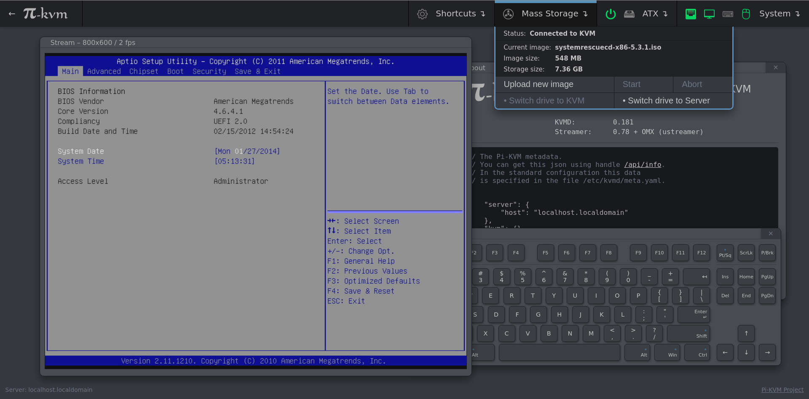
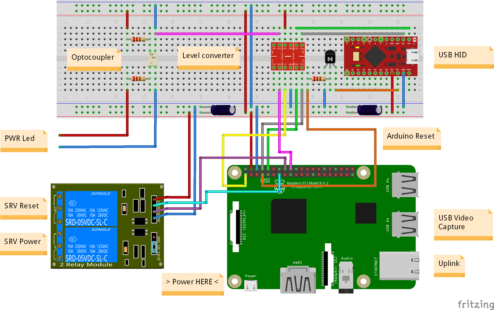

# DIY IP KVM System with WEB-interface using Raspberry Pi
Stand-alone IP KVM device with web interface with various video capture options and bunch of features like keyboard/mouse control, ATX control (power/reset/ HDD load), Mass-Storage Device. 



## List of implemented features

- Microservice architecture - the system consists of a some separated parts that perform a strictly defined task.
- Control backend with clear API that can be used for scripts and alternative UI (for example, you can make a desktop application);
- Own MJPG streamer written on C than can change the resolution in real time, report statistics about the video and much more (see details in README).
- Ability to use any video capture device.
- Extensible authorization methods - you can configure multiple KVMs so that they use a common password database.
- IPMI BMC support (you can use ipmitool for power management in your existing network infrastructure).
- Mass-storage device based on flash drive (but! I can implement OTG for backend). Now I use a regular USB drive whose contacts switch between PI and computer using relay.
- One arduino for keyboard and mouse. The firmware implements a protocol with a check for transmission errors - it can never just hang. Can be replaced by OTG.
- A ready-to-use operating system that can be assembled using make build and installed to flash using make install.
- All components in packages have their own repository. In addition, I developed a special tool that allows you to build the operating system as if it were a regular docker container. It is very convenient and makes debugging easier.


## Minimal hardware implementation
- Raspberry Pi 2, 3 or 4(work in progress)
- MicroSD card
- Raspberry Pi power supply

**Video capture side for lowcost S-Video**
- Easycap UTV007 device (https://www.amazon.com/dp/B0126O0RDC)
- HDMI to S-Video (not all options work, but these two have been tested) (https://www.amazon.com/dp/B012MDMWLM or https://www.amazon.com/gp/product/B01E56CV42)
  
**Video capture side for HDMI**
- B101 HDMI to CSI-2 Bridge (https://auvidea.eu/b101-hdmi-to-csi-2-bridge-15-pin-fpc/)

**HID Subsystem and ATX control**
- Arduino Pro Micro with hardware USB for HID sub-system
- GPIO cables for connections (Dupont or identical, suitable for PLS pins and breadboards)
- Logic level converter module https://www.sparkfun.com/products/12009
- 2-Channel Relay Module for Power and Reset buttons emulation (can be replaced with solid state relays or optocouples)
- Optocouplers for receive ATX Leds statuses (almost any NPN transistor optocouplers: PC817, PC123, etc)
- NPN transistor for HID reser (almost any NPN transistor: 2n2222 or similar) 
- Constant resistors, for transistor/optocoupler(to RaspberryPi) 220Ohm-1kOhm, from ATX to optocoupler need to be matchet for yours motherboard (supposedly 330-470 Ohm)
- Capacitors for compensation power loss by relays and for Arduino stability (10V and more, 220uF and more)


## Setting up the hardware
Here is a diagram of how you connect all of the pieces:



Or if you can made DIY PCB - made one!


The details in our Discord chat. Files in https://github.com/pikvm/hardware


## Building OS
Pi-KVM OS is based on Arch Linux ARM and contains all required packages and config for work. To build OS you will need any Linux machine with fresh Docker (we recommand >= 1:19) with privileged mode (for fdisk and some other commands, check Makefiles if you don't trust us :))

0. For clean OS (Like Ubuntu 18) you need to install and configure docker (after adding user in docker group relogin is needed), as well as git and make.
    ```shell
    $ sudo apt-get install curl -y
    $ curl -fsSL https://get.docker.com -o get-docker.sh
    $ sudo sh get-docker.sh
    $ sudo usermod -aG docker user
    $ sudo apt-get install git -y
    $ sudo apt-get install make -y
    ```

1. Checkout build toolchain:
    ```shell
    $ git clone https://github.com/pikvm/os
    $ cd os
    ```

2. Select the target hardware configuration (platform). If you are using an analog VGA video capture device, choose `v0-vga`. If you want to use HDMI with Auvidea B101, choose `v0-hdmi`. Other options are for specialized Pi-KVM boards (WIP).

3. Create config file `config.mk` for the target system. You must specify the path to SD card on your local computer (this will be used to format and install the system) and version of your Raspberry Pi and platform. You can change other parameters as you wish:
    ```Makefile
    $ cat config.mk
    # rpi3 for any Raspberry Pi 3, rpi2 for version 2.
    BOARD = rpi3
    
    # Hardware configuration
    PLATFORM = v0-vga
    
    # Target hostname
    HOSTNAME = pikvm
    
    # ru_RU, etc. UTF-8 only
    LOCALE = en_US
    
    # See /usr/share/zoneinfo
    TIMEZONE = Europe/Moscow
    
    # For SSH root user
    ROOT_PASSWD = root
    
    # Web UI credentials: user=admin, password=<this>
    WEBUI_ADMIN_PASSWD = admin
    
    # IPMI credentials: user=admin, password=<this>
    IPMI_ADMIN_PASSWD = admin
    
    # SD card device
    CARD = /dev/mmcblk0
    ```

4. Build OS. It may take about an hour depends on your Internet connection:
    ```shell
    $ make os
    ```
    
5. Put SD card into card reader and install OS:
    ```shell
    $ make install
    ```
    
6. After installation remove the SD card and insert it into Raspberry Pi. Turn on the power. Raspberry Pi will try to get the address using DHCP in your LAN. Congratulations! Your Pi-KVM will be available via SSH (`ssh root@<addr>`) and HTTPS (try to open using browser `https://<addr`). For HTTPS used a self-signed certificate by default.

7. If you cannot find the device address, try using the following command:
    ```shell
    $ make scan
    ```

Everything will be done on the Pi3 and Pi0 automatically with the video input defaulting to s-video.

Be sure to check the bottom of this README for [Tips](#tips) and [Troubleshooting](#troubleshooting)!

## Tips

## Troubleshooting

