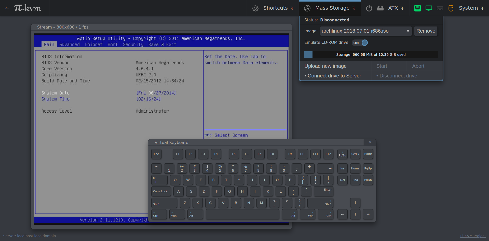
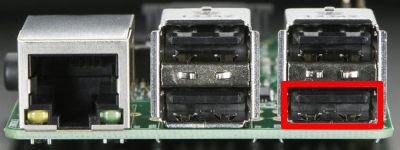
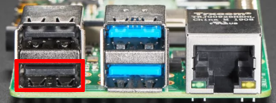
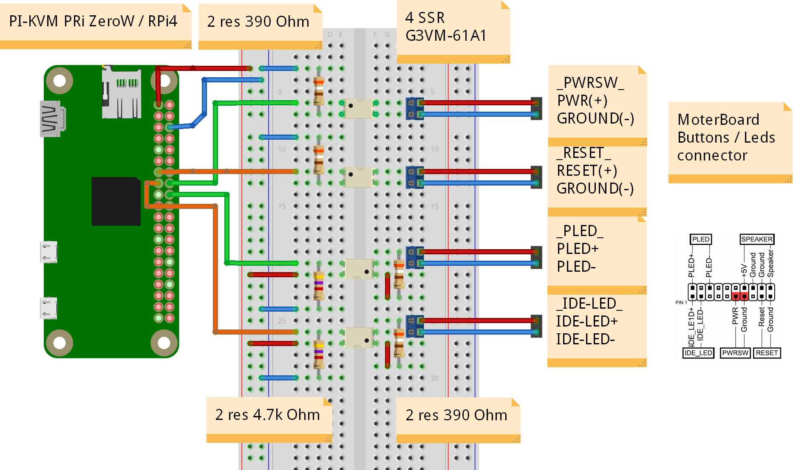
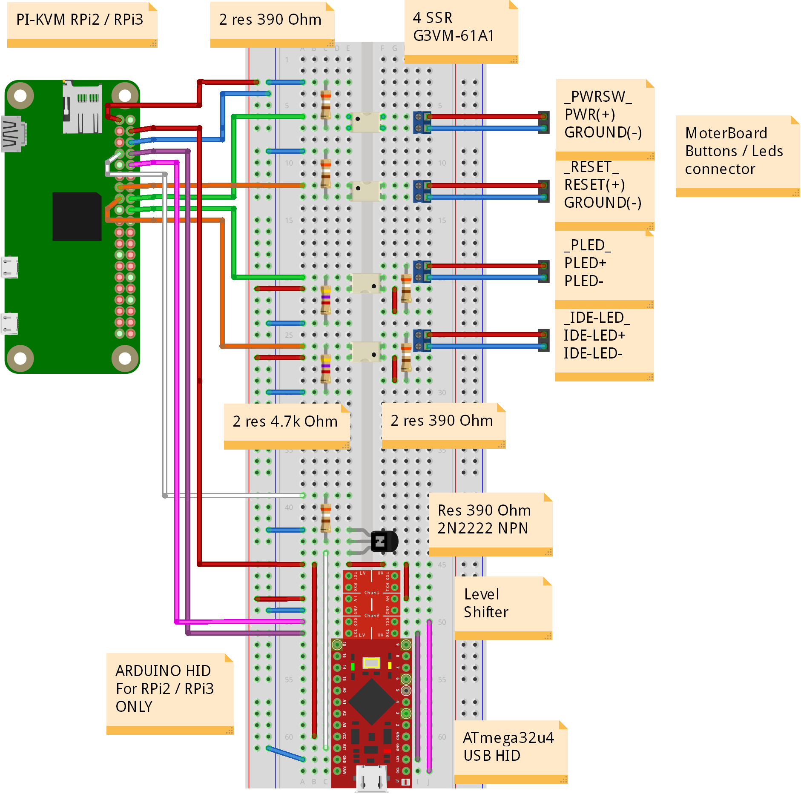
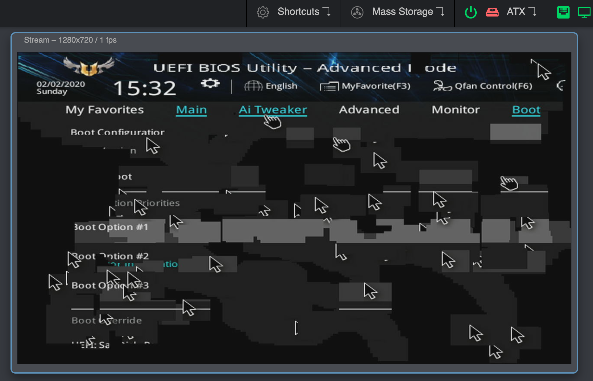

# Open and cheap DIY IP-KVM based on Raspberry Pi  
Join the comunity chat for questions and support!

[](https://discord.gg/bpmXfz5)

The official website: http://pikvm.org

-----

A very simple and fully functional Raspberry Pi-based IP-KVM that you can make with your own hands. This device helps to manage servers or workstations remotely, regardless of the health of the operating system or whether one is installed. You can fix any problem, configure the BIOS, or even reinstall the OS using the included CD-ROM or Flash Drive emulation.



-----

## Fully-featured and modern IP-KVM  
* **Cheaper, but better than commercial solutions**  
  Costs between $30 and $100 depending on the features desired. Even the most expensive configuration will be cheaper than a $500 commercial IP-KVM.
* **Easy to build**  
  A ready-to-use OS that can be created just by running `make build` and installed to an SD-card using `make install`. The hardware can be made in half an hour and without soldering.
* **The widest hardware support**  
  There are many ways to build a Pi-KVM. Video capture devices can be attached using the CSI-2 or USB interfaces. Raspberry Pi models 2, 3, 4, or ZeroW may be used. Any combination of hardware is supported, and Pi-KVM implements the maximum possible set of features.
* **Very low latency**  
  ~100 milliseconds of video latency. This is the smallest delay of all existing solutions.
* **Extra lightweight and fancy Web UI**  
  No weird proprietary clients. No ugly Java applets. Just use your favorite browser to connect to the Pi-KVM. No flash plugins either!
* **Keyboard and mouse**  
  Mouse usage works directly in the browser. The keyboard emulator supports displaying the state of the keyboard LEDs.
* **Mass Storage Drive**  
  On the Raspberry Pi 4 and ZeroW, Pi-KVM can emulate a virtual CD-ROM or Flash Drive. A live image can be uploaded to boot the attached server.
* **ATX power management**  
  With a very simple circuit that can be assembled on a breadboard, the power button of the attached server can be controlled using the ATX button headers on the motherboard.
* **Security**  
  Pi-KVM can be opened to the Internet and no one will get access without the password. SSL encryption is used to protect traffic from being intercepted by third parties.
* **Local monitoring**  
  Pi-KVM monitors the health of the Raspberry Pi board and will warn you if it's too hot or is not receiving enough power.

## Production-ready  
* **Linux-based embedded OS**  
  The Pi-KVM OS is based on [Arch Linux ARM](https://archlinuxarm.org) and can be customized for any needs. Thousands of pre-built binary packages are at your service and can be updated with a single command!
* **Read-only filesystem**  
  By default the OS runs in read-only mode, as an embedded system should. This prevents damage to the memory card due to a sudden power outage.
* **VNC server**  
  The managed server and its BIOS can be accessed using a regular VNC client which supports JPEG compression.
* **IPMI BMC**  
  Use `ipmitool`, `ipmiutil` or any existing network infrastructure that supports IPMI to monitor and manage the server's power.
* **Wake-on-LAN**  
  Pi-KVM can be configured to power up a managed server using WoL. This will be available in the Web menu.
* **Extensible authorization methods**  
  Multiple Pi-KVMs can be configured to use a [common authorization service](https://github.com/pikvm/kvmd-auth-server). PAM and its rich authorization mechanisms can also be used to integrate Pi-KVM into your existing authentication infrastructure.
* **Macro scripts**  
  If repetitive actions must be perfromed on the attached server (or on several different servers), a macro can be recorded with keyboard & mouse actions and can be played back mutiple times.


## Open Source
* **Community & support**  
  Pi-KVM has a large community. Join the [discord chat](https://discord.gg/bpmXfz5) if you have any questions.
* **Extensible**  
  Pi-KVM was designed as a set of microservices with a plug-in architecture. It's very easy to modify and maintain.
* **Comprehensive API**  
  Everything that can be done via the user interface can also be done via a powerful HTTP API.
* **Know-how**  
  We created [our very own MJPG video server](https://github.com/pikvm/ustreamer) written in C with multi-threading support and GPU video encoding - the fastest streaming solution available to provide the best video quality for Pi-KVM. We also tested a lot of hardware configurations so that you can be sure devices you assemble will work reliably.


# Note
This project is developed on a non-commercial basis by Open Source enthusiasts. If you find Pi-KVM useful or it has saved you a long trip to check on an unresponsive server, you can support the lead developer by donating a few dollars via [Patreon](https://www.patreon.com/pikvm) or [PayPal](https://www.paypal.me/mdevaev). With this money, he will be able to buy new hardware (Raspberry Pi boards and other components) to test and maintain various configurations of Pi-KVM, and generally devote significantly more time to the project. At the bottom of this page are the names of all the people who have helped this project develop with their donations. Our gratitude knows no bounds!

If you wish to use Pi-KVM in production, we accept orders to modify it for your needs or implement custom features you require. Contact us via live chat or email  the lead developer at: mdevaev@gmail.com

# FAQ
**Q**: **What is the status of this project?**  
**A:** Although this page is rarely updated, the project is actively maintained and developed. You can verify this by checking the activity in our other repositories.

**Q:** **Does this support the HDMI-USB dongle from [AliExpress](https://aliexpress.ru/item/4001043540669.html)?**  
**A:** Yes, and Pi-KVM works great with it. However, we recommend to use [HDMI-CSI bridge](https://aliexpress.ru/item/4000102166176.html) because the USB dongle has several major disadvantages compared to it: USB gives a lot of latency (200ms vs 100ms) and it doesn't support stream compression control (you won't be able to use Pi-KVM in a place with a poor internet connection). It also cannot automatically detect screen resolution. All this is caused by the hardware limitations of the dongle itself. **It may be used, but the loss of these features is probably not worth the ten dollars saved.**

**Q:** **Can I connect multiple servers to a single Pi-KVM?**  
**A:** Yes, but it will require additional work to set up. Pi-KVM can be connected to a multi-port HDMI/USB switch and the switch's buttons can be connected via optocouplers to the Pi's GPIO pins to switch channels. If your KVM switches channels using keyboard shortcuts, there is a chance that it will not be able to work with OTG (v2 platform, see bellow), since it does not fully implement the USB stack. In this case, you will have to use an Arduino board to emulate the keyboard & mouse. (Pi-KVM supports this configuration)

**Q:** **Can I use Pi-KVM with non-Raspberry Pi boards?**  
**A:** Yes, but you will have to prepare the board OS yourself. As for the Pi-KVM software, you will need to replace the RPi.GPIO module and some files (such as UDEV rules). If you are a developer or an experienced system administrator, you will not have any problems with this. In addition, we are open to patches. If you need help with this, please contact us via Discord: https://discord.gg/bpmXfz5

-----

# Limitations
* In very rare cases, old motherboards contain a buggy BIOS that does not understand the keyboard of the **v2** platform (bellow). The reason for this is that the BIOS doesn't fully implement the USB HID stack for composite devices correctly. Meanwhile, Mass Storage Drive will be detected. For this case, we suggest using the Arduino HID from the **v0** platform with **v2**. Thus the Pi-KVM will be connected by two USB cables to the motherboard: one of them will be responsible for the keyboard and mouse, the other for everything else. See [Tips](#tips) for details.
* A similar problem can be observed on devices with UEFI: the keyboard works fine, but the mouse does not work. This problem is much less significant, since all UEFI can be configured using the keyboard and hotkeys, without the mouse. If you want to get a mouse, the solution will be the same: using an Arduino HID, as in the advice above.

Our future [v3 platform](#the-future-v3-platform-work-in-progress) will contain an optional HID module for such cases, so you won't have to build anything yourself.

-----

# Required hardware
Pi-KVM supports several different hardware configurations, referred to as **platforms**. At the moment, there are two main ones: **v0** and **v2**.
* **v0** was designed to work with Raspberry Pi boards that do not have OTG (**Raspberry Pi 2** and **3**) and requires a few more components for a basic implementation. It also does not support the Mass Storage Drive feature.
* **v2** is the most modern implementation supporting all of the features of Pi-KVM. It was designed to work with the **Raspberry Pi 4** and **ZeroW**.

**It is recomended to buid v2 since it supports all features including the Mass Storage Drive feature. It's also the easiest to make.**

## Hardware for v2
* Raspberry Pi 4 (2 GB model is enough) or ZeroW. The Pi 4 is recomended because the ZeroW is very slow.
* MicroSD card (min 16 GB recommended).
* USB-A 3A charger (female socket) or power supply.
* Video capture device:
  * **Recommended**: [HDMI to CSI-2 bridge based on TC358743](https://aliexpress.com/item/4000102166176.html) - it supports the compression control, has a lowest video latency for ~100ms, and may determine the source resolution; see the FAQ above for the explanation.
  * An alternative (not available for ZeroW): [HDMI to USB dongle](https://aliexpress.ru/item/4001043540669.html) - high video latency ~200ms, no compression control, can't detect the source resolution.
* Only for Raspberry Pi 4:
  * Parts for Y-splitter cable:
    - 1x USB-A to USB-C cable (male-male).
    - 1x another cable USB-A to any (male-...).
* Only for Raspberry Pi ZeroW:
  * 2x USB A-to-micro cables (male-male, for power and keyboard & mouse emulator).
* For ATX control (optional):
  - [4x MOSFET relays OMRON G3VM-61A1](https://www.digikey.com/products/en?keywords=G3VM-61A1).
  - 4x 390 Ohm resistors.
  - 2x 4.7k Ohm resistors.
  - A breadboard and wires.
  
## Hardware for v0
* Raspberry Pi 2 or 3.
* MicroSD card (8 GB is enough).
* USB-A 3A charger (female socket) or power supply.
* For keyboard & mouse emulator (HID):
  - Arduino Pro Micro (based on an ATMega32u4).
  - [Logic level shifter](https://www.sparkfun.com/products/12009).
  - NPN transistor (almost any NPN transistor: 2n2222 or similar).
  - 1x 390 Ohm resistor.
  - A breadboard and wires.
* 2x USB A-to-micro cables (male-male, for power and HID).
* HDMI capture device: see v2 description.
* ATX control (optional): see v2 description.

## Addition
* If you want to capture VGA from your server instead of HDMI, buy the [VGA-to-HDMI converter](https://aliexpress.ru/item/4000553298530.html).
* Pi-KVM can be powered using PoE, but it is not recommend to use the official PoE HAT: it is unreliable and [not compatible with the HDMI bridge](https://github.com/pikvm/pikvm/issues/6). Use any other PoE hat without an I2C fan controller.
* **Don't use random relay modules or random optocouplers!** Some relays or optocouplers may not be sensitive enough for the Raspberry Pi, some others may be low-level controlled. Either use relays that are activated by a high logic level, or follow the design provided and buy an OMRON. See details [here](https://github.com/pikvm/pikvm/issues/13).  
  

-----

# The future v3 platform (work in progress)

</td>

We are also currently developing our own HAT for the Raspberry Pi 4. It will have all the features of the v2 platform, including:
* HDMI capture based on the TC358743 (extra low latency and many features like compression control).
* OTG Keyboard & mouse; Mass Storage Drive emulation.
* Ability to simulate "removal and insertion" for USB.
* Onboard ATX power control.
* An RTC clock.
* CISCO-style and USB serial console port (to manage Pi-KVM OS or to connect with the server).
* Optional AVR-based HID (for some rare and strange motherboards whose BIOS doesn't understand the OTG emulated keyboard).
* Optional OLED screen to display network status or other desired information.
* No need for soldering or other assembly. It's a ready-made, reliable board which you can use yourself or provide to your clients.
* Continued use of Pi-KVM OS - all the software will be fully open.
* It will cost about $100 - or less, we are working to make it as cheap as possible.

Sounds interesting? [Subscribe in this form](https://docs.google.com/forms/d/1LA6iEYVtbJULvMDNktyNQMI4N9SYdNG03Wh9WK-80cM) or join to https://discord.gg/bpmXfz5 and we will let you know when you can purchase the board. Prototypes will be ready in Q4 2020, and pre-orders will be available sooner. If you are considering ordering a wholesale lot, please email to mdevaev@gmail.com.

-----

# Setting up the hardware
## Connecting the video capture
#### For the HDMI-CSI bridge
Insert the flexible flat cable of the HDMI bridge into the narrow white connector on the Raspberry Pi (the closest one to big USB sockets). Use only the cable that was included with the device package, or make sure that the third-party cable has the correct pinout.

#### For the HDMI-USB dongle
Connect USB dongle to exactly this port. It is bound in the software so the OS does not confuse the video device with something else.
| Raspberry Pi 2 and 3 | Raspberry Pi 4 |
|----------------------|----------------|
|  |  |

## v2 Diagram
Here is a diagram shows that how to connect all of the pieces (click to full size).



**Raspberry Pi 4 note**: since one USB-C female connector is used to receive power and perform keyboard/mouse/drive emulation a special Y-cable must be made that splits the DATA and POWER lines of USB-C (see [reasons](https://github.com/pikvm/docs/issues/11)). It can be made from two suitable connecting cables, or soldered together from scratch. Be sure to check the circuit diagram below, otherwise you may damage your devices. The appropriate USB pinout(s) can easily be found on Google. Please note that if you make a Y-cable from two no-name cables, the colors of the wires may not match those shown. Use a multimeter to make sure the connections are correct.


See video howtos:
* [Making USB Y-splitter cable](https://www.youtube.com/watch?v=uLuBuQUF61o).
* [Soldering ATX controller](https://www.youtube.com/watch?v=hKnKOuH_f8M).

Also check out this small PCB for ATX (if you know how to make PCBs): https://easyeda.com/mark.gilbert/zerow-kvm-v1

## v0 Diagram


-----

# Building the OS
The Pi-KVM OS is based on Arch Linux ARM and contains all the required packages and configs for it to work. To build the OS you will need any Linux machine with a recent version of Docker (>= 1:19) with privileged mode enabled. (used for fdisk and some other commands, have a look through our Makefiles if you don't trust us :) )

0. When starting with a clean OS (Like Ubuntu 18) you need to install and configure docker (after adding your user to the docker group you must log out and log back in), as well as git and make.
    ```shell
    [user@localhost ~]$ sudo apt-get install git make curl binutils -y
    [user@localhost ~]$ curl -fsSL https://get.docker.com -o get-docker.sh
    [user@localhost ~]$ sudo sh get-docker.sh
    [user@localhost ~]$ sudo usermod -aG docker $USER
    ```
    Re-login to apply the changes.

1. Git checkout the build toolchain:
    ```shell
    [user@localhost ~]$ git clone https://github.com/pikvm/os
    [user@localhost ~]$ cd os
    ```

2. Determine the target hardware configuration (platform):
  * Choose the board: `BOARD=rpi4` for Raspberry Pi 4 or `BOARD=zerow`, `BOARD=rpi2`, `BOARD=rpi3` for other options.
  * Choose the platform:
    - `PLATFORM=v2-hdmi` for RPi4 or ZeroW with HDMI-CSI bridge.
    - `PLATFORM=v0-hdmi` for RPi 2 or 3 with HDMI-CSI bridge and Arduino HID.
    - `PLATFORM=v2-hdmiusb` for RPi4 with HDMI-USB dongle.
    - `PLATFORM=v0-hdmiusb` for RPi 2 or 3 with HDMI-USB dongle and Arduino HID.
    - Other options are for legacy or specialized Pi-KVM boards (WIP).

3. Create the config file `config.mk` for the target system. You must specify the path to the SD card on your local computer (this will be used to format and install the system) and the version of your Raspberry Pi and platform. You can change other parameters as you wish. Please note: if your password contains the # character, you must escape it using a backslash like `ROOT_PASSWD = pass\#word`.
    ```Makefile
    [user@localhost os]$ cat config.mk
    # rpi3 for Raspberry Pi 3; rpi2 for the version 2, zerow for ZeroW
    BOARD = rpi4
    
    # Hardware configuration
    PLATFORM = v2-hdmi
    
    # Target hostname
    HOSTNAME = pikvm
    
    # ru_RU, etc. UTF-8 only
    LOCALE = en_US
    
    # See /usr/share/zoneinfo
    TIMEZONE = Europe/Moscow
    
    # For SSH root user
    ROOT_PASSWD = root
    
    # Web UI credentials: user=admin, password=<this>
    WEBUI_ADMIN_PASSWD = admin
    
    # IPMI credentials: user=admin, password=<this>
    IPMI_ADMIN_PASSWD = admin
    
    # SD card device
    CARD = /dev/mmcblk0
    ```
    
    If you want to configure wifi (for ZeroW board for example) you must add these lines to `config.mk`:
    ```Makefile
    WIFI_ESSID = "my-network"
    WIFI_PASSWD = "P@$$word"
    ```

4. Build the OS. It may take about one hour depending on your Internet connection:
    ```shell
    [user@localhost os]$ make os
    ```
    
5. Put SD card into card reader and install OS (**you should disable automounting beforehand**: `systemctl stop udisk2` or something like that):
    ```shell
    [user@localhost os]$ make install
    ```
    
6. After installation remove the SD card and insert it into your RPi. Turn on the power. The RPi will try to get an IP address using DHCP on your LAN. It will then be available via SSH.

7. If you can't find the device's address, try using the following command:
    ```shell
    [user@localhost os]$ make scan
    ```

8. **Only for v0**. Now you need to flash the Arduino. This can be done using your RPi. **Before starting this operation, disconnect the RESET wire from the Arduino board, otherwise the firmware will not be uploaded.** Connect the Arduino and RPi with a suitable USB cable. Log in to the RPi and upload the firmware. Then connect the RESET wire, disconnect the USB cable, and reboot the RPi.
    ```
    [user@localhost os]$ ssh root@<addr>
    [root@pikvm ~]# rw
    [root@pikvm ~]# systemctl stop kvmd
    [root@pikvm ~]# cp -r /usr/share/kvmd/hid ~
    [root@pikvm ~]# cd ~/hid
    [root@pikvm hid]# make
    [root@pikvm hid]# make install
    [root@pikvm hid]# reboot
    ```
9. Congratulations! Your Pi-KVM will be available via SSH (`ssh root@<addr>` with user `root` and password `root` by default) and HTTPS (try to open it in a browser at `https://<IP addr>` with user `admin` and password `admin`). For HTTPS a self-signed certificate is used by default.

10. To change root password use command `passwd` via ssh or webterm. To change Pi-KVM web password use `kvmd-htpasswd set admin`.

-----

# Tips
* The Pi-KVM file system is always mounted in read-only mode. This prevents it from being damaged by a sudden power outage. To change the configuration you must first switch the filesystem to write mode using the command `rw` from root. After the changes, be sure to run the command `ro` to switch it back to read-only.

* **NEVER** edit `/etc/kvmd/main.yaml`. Use `/etc/kvmd/override.yaml` to redefine the system parameters. All other files that are also not recommended for editing have read-only permissions. If you edit any of these files, you will need to manually make changes to them when you upgrade your system. You can view the current configuration and all available KVMD parameters using the command `kvmd -m`.

* Almost all KVMD (the main daemon controlling Pi-KVM) configuration files use [YAML](https://docs.ansible.com/ansible/latest/reference_appendices/YAMLSyntax.html) syntax. Information on the format's syntax can be found at the link provided.

* If you want to disable the web terminal use these commands:
    ```yaml
    [root@pikvm ~]# systemctl disable kvmd-webterm
    [root@pikvm ~]# systemctl stop kvmd-webterm
    ```
    
* To disable authorization completely edit the file `/etc/kvmd/override.yaml`:
    ```yaml
    kvmd:
        auth:
            enabled: false
    ```
    then restart `kvmd`:
    ```
    [root@pikvm ~]# systemctl restart kvmd
    ```

* If you don't need ATX power control you can disable the relevant Web-UI menu in `/etc/kvmd/override.yaml`:
    ```yaml
    kvmd:
        atx:
            type: disabled
    ```
    then restart kvmd.
    
* To use Wake-on-LAN with your server you must define some options such as the server's MAC address and (optionaly) IP address. Use `/etc/kvmd/override.yaml`. The format is:
    ```yaml
    kvmd:
        wol:
            mac: ff:ff:ff:ff:ff:ff
    ```
    Replace `ff:ff:ff:ff:ff:ff` with the MAC of your server. By default, a packet is sent via a broadcast request to the entire IPv4 network (`255.255.255.255`, port `9`), but you can address it to a specific static address:
    ```yaml
    kvmd:
        wol:
            mac: ff:ff:ff:ff:ff:ff
            ip: 192.168.0.100
            # port: 9  # By default
    ```
    
* To use IPMI BMC you need to set up an appropriate account and run the `kvmd-ipmi` daemon (`systemctl start kvmd-ipmi` and `systemctl enable kvmd-ipmi`). Although Pi-KVM supports the IPMI protocol, we strongly recommend that you do not use it outside of trusted networks due to the protocol's [insecurity](https://github.com/NitescuLucian/nliplace.com.blog.drafts). Refer to the file `/etc/kvmd/ipmipasswd` to configure IPMI account.

* To use VNC you need to change the keyboard layout for non-US client keyboards using `/etc/kvmd/override.yaml`. For example:
  ```yaml
  vnc:
      keymap: /usr/share/kvmd/keymaps/ru
  ```
  By default username and password authentication is used. This is not supported by all clients (we recommend [TigerVNC](https://tigervnc.org)). To enable passphrase authentication, you need to edit the file `/etc/kvmd/vncpasswd` to set passphrases and enable this feature in `/etc/kvmd/override.yaml`:
  ```yaml
  vnc:
      auth:
          vncauth:
              enabled: true
  ```
  After that you can enable the `kvmd-vnc` daemon (`systemctl start kvmd-vnc` and `systemctl enable kvmd-vnc`). VNC will be available on port 5900 by default.  
  It is reccomended to disable the automatic quality adjust setting if there is one in your client (this is called "Auto-Select"in TigerVNC).  
  Please note: **we strongly discourage the use of VNC on untrusted networks.** The current implementation does not use encryption, and your passwords are transmitted over the network in a plain text. The existing anonymous TLS mode is also not secure enough.
  
* To use Arduino HID with **v2** platform:
  - Build and connect HID according to the [diagram](#v0-diagram) (the bottom part with transistor, level-shifter and Arduino).
  - Switch to RW-mode using command `rw`.
  - Add these lines to `/etc/kvmd/override.yaml` (remove `{}` in the file before):
    ```yaml
    kvmd:
        hid:
            type: serial
            reset_pin: 4
            device: /dev/kvmd-hid
    ```
  - Add this line to `/etc/udev/rules.d/99-kvmd.rules`:
    ```udev
    KERNEL=="ttyAMA0", SYMLINK+="kvmd-hid"
    ```
  - Run `systemctl disable getty@ttyGS0.service`.
  - Remove `console=ttyAMA0,115200` and `kgdboc=ttyAMA0,115200` from `/boot/cmdline.txt`.
  - Flash the Arduino (see [here](#building-the-os), step 8).
  - Run `reboot`.

-----

# Troubleshooting
* On step 8 (`make install`), you may encounter the following error:
    ```
    /root/.platformio/packages/tool-avrdude/avrdude: error while loading shared libraries: libtinfo.so.5: cannot open shared object file: No such file or directory
    ```
    Create a symlink for this library:
    ```bash
    [root@pikvm ~]# ln -s /usr/lib/libtinfo.so.6 /usr/lib/libtinfo.so.5
    ```
    And run `make install` again.
    
    
* **Unexpected interruption while loading the image for Mass Storage Drive**

    If problems occur when uploading even a small disk image it may be due to unstable network operation or antivirus software. It is well known that Kaspersky antivirus cuts off Pi-KVM connections during uploading, so you should add the Pi-KVM website to Kaspersky's list of exceptions or not filter web requests with the antivirus. Antivirus programs can also affect the performance of certain interface elements, for example the quality slider.

    For Kaspersky, the steps to add the network address of Pi-KVM's website to the exclusion list is: **Protection -> Private browsing -> Categories and exclusions -> Exclusions**


* **Glitchy/Wrong BIOS resolution**

    On some motherboards, the BIOS may be displayed at a lower resolution, or with some rendering issues/glitches, specially on newer ASUS ones.

    e.g

    

    This can be solved by enabling the **Compatibility Support Module (CSM)** in your BIOS, usually under the **Boot** options.

    If you can't or don't want to enable the CSM, you can try connecting a DisplayPort monitor, or a [dummy plug](http://amazon.com/s?k=displayport+dummy+plug). If you remove the DP cable/adapter the bug will reappear.

    If none of this works, try connecting the DP cable first, boot into the BIOS, disable the CSM and shutdown (do not restart) your PC. Then, boot into the BIOS and enable the CSM before shutting down your PC. Then connect the HDMI and turn your PC on again.
    
* **Awesome WM on Linux** sometimes can't recognize a video output change on a cable. That is, if the cable was first inserted into the monitor, and then you reconnected it to Pi-KVM - it may happen that you will not see the image. It seems that the problem is Awesome WM, since for example with KDE it does not reproducing. If you turn on your workstation with Pi-KVM already connected, everything will work fine.

* If you have any problems or questions, contact us using Discord: https://discord.gg/bpmXfz5

-----

# Special thanks
These kind people donated money to the Pi-KVM project and supported work on it. We are very grateful for their help, and commemorating their names is the least we can do in return.
* Aleksei Brusianskii
* Alucard
* Arthur Woimbée
* Ben Gordon
* Branden Shaulis
* Brian White
* Bryan Adams
* Christof Maluck
* Corey Lista
* David Howell
* Denis Yatsenko
* Dmitry Shilov
* Ge Men
* Grey Cynic
* Jacob Morgan
* Jason Toland
* Jeff Bowman
* John McGovern
* Jozef Riha
* Mark Gilbert
* Mark Robinson
* Mauricio Allende
* Michael Kovacs
* Michael Lynch
* Nils Orbat
* Samed Ozoglu
* Scott
* Steven Richter
* Truman Kilen
* Walter_Ego
* zgen
