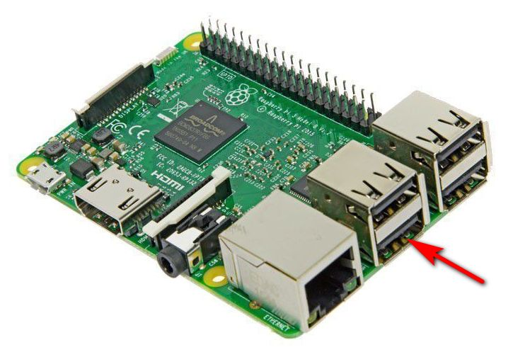

# DIY IP-KVM with Web-UI based on Raspberry Pi
Stand-alone IP KVM device with a web interface with various video capture options and a bunch of features like keyboard/mouse control, ATX control (power/reset/HDD activity), Mass-Storage Device emulation.


## Features
- Extra-lightweight and fancy Web-UI.
- Advanced HID emulator based on one Arduino board. It has mouse support; keyboard works perfectly in a BIOS. The firmware implements a protocol with a check for transmission errors, it will never just hang.
- Control the power of the server through the ATX button connectors on the motherboard and get the status of the power LEDs and hard drive activity.
- Mass-storage device based on a flash drive. Now we use a regular USB drive whose contacts switch between the Pi and server using a relay.
- The Ability to use any video capture device.
- [Our own MJPG streamer](https://github.com/pikvm/ustreamer) written on C with support for multi-threading and GPU video encoding. It can change the resolution in real time for an HDMI source, report statistics about the video and much more (see [README](https://github.com/pikvm/ustreamer/blob/master/README.md) for detalis).
- IPMI BMC support. You can use `ipmitool` for power management in your existing network infrastructure.
- Extensible authorization methods - you can configure multiple KVMs so that they use a common authorization service.
- Microservice architecture - the system consists of separated parts that each perform a strictly defined task.
- Plugin architecture to support a variety of hardware. In the future, we'll be able to support other HID, ATX, and MSD devices. For example, now we are planning to change HID from using the serial port to SPI.
- Backend with clear API that can be used for scripts and alternative UI (for example, you can make a desktop application);
- A ready-to-use operating system that can be assembled just using `make build` and installed to a memory card using `make install`.


## Minimal hardware implementation
- Raspberry Pi 2, 3 or 4 (work in progress)
- MicroSD card
- Raspberry Pi power supply

**Video capture side for lowcost S-Video**
- Easycap UTV007 device (https://www.amazon.com/dp/B0126O0RDC)
- HDMI to S-Video (not all options work, but these three have been tested) (https://aliexpress.com/item/32847786071.html (for PCB (see bellow)) or https://www.amazon.com/dp/B012MDMWLM or https://www.amazon.com/gp/product/B01E56CV42)
  
**Video capture side for HDMI**
- B101 HDMI to CSI-2 Bridge (https://auvidea.eu/b101-hdmi-to-csi-2-bridge-15-pin-fpc/)

**HID Subsystem and ATX control**
- Arduino Pro Micro (ATMega32u4) with hardware USB for HID sub-system
- GPIO cables for connections (Dupont or identical, suitable for PLS pins and breadboards; for example https://www.amazon.com/gp/product/B01BV2A54G)
- Logic level converter module https://www.sparkfun.com/products/12009
- 2-Channel Relay Module for Power and Reset buttons emulation (can be replaced with solid state relays or optocouplers)
- Optocouplers for receive ATX Leds statuses (almost any NPN transistor optocouplers: PC817, PC123, etc)
- NPN transistor for HID reset (almost any NPN transistor: 2n2222 or similar) 
- Constant resistors, for transistor/optocoupler(to RaspberryPi) 220Ohm-1kOhm, those from ATX to optocoupler need to be matched for your motherboard (supposedly 330-470 Ohm)
- Capacitors to prevent a power loss caused by the relays and for Arduino stability (rated for 10V or more, 220uF or more)


## Setting up the hardware
Here is a diagram of how you connect all of the pieces (click to full size):


Or if you can make a DIY PCB - make one!


The details are in our [Discord chat](https://discord.gg/bpmXfz5
). Files in https://github.com/pikvm/hardware

## ATTENTION!

The S-video capture device must be connected to the USB port shown, not anything else. It is bound in software.



## Building OS
Pi-KVM OS is based on Arch Linux ARM and contains all required packages and configs to work. To build the OS you will need any Linux machine with a fresh version of Docker (we recommand >= 1:19) with privileged mode (for fdisk and some other commands, check Makefiles if you don't trust us :) )

0. For a clean OS (Like Ubuntu 18) you need to install and configure docker (after adding user in the docker group a relogin is needed), as well as git and make.
    ```shell
    $ sudo apt-get install git make curl -y
    $ curl -fsSL https://get.docker.com -o get-docker.sh
    $ sudo sh get-docker.sh
    $ sudo usermod -aG docker user
    ```

1. Checkout build toolchain:
    ```shell
    $ git clone https://github.com/pikvm/os
    $ cd os
    ```

2. Determine the target hardware configuration (platform). If you are using an analog VGA video capture device, choose `v0-vga`. If you want to use HDMI with Auvidea B101, choose `v0-hdmi`. Other options are for specialized Pi-KVM boards (WIP).

3. Create config file `config.mk` for the target system. You must specify the path to the SD card on your local computer (this will be used to format and install the system) and the version of your Raspberry Pi and platform. You can change other parameters as you wish:
    ```Makefile
    $ cat config.mk
    # rpi3 for any Raspberry Pi 3, rpi2 for version 2.
    BOARD = rpi3
    
    # Hardware configuration
    PLATFORM = v0-vga
    
    # Target hostname
    HOSTNAME = pikvm
    
    # ru_RU, etc. UTF-8 only
    LOCALE = en_US
    
    # See /usr/share/zoneinfo
    TIMEZONE = Europe/Moscow
    
    # For SSH root user
    ROOT_PASSWD = root
    
    # Web UI credentials: user=admin, password=<this>
    WEBUI_ADMIN_PASSWD = admin
    
    # IPMI credentials: user=admin, password=<this>
    IPMI_ADMIN_PASSWD = admin
    
    # SD card device
    CARD = /dev/mmcblk0
    ```

4. Build OS. It may take about an hour depending on your Internet connection:
    ```shell
    $ make os
    ```
    
5. Put SD card into card reader and install OS:
    ```shell
    $ make install
    ```
    
6. After installation remove the SD card and insert it into your Raspberry Pi. Turn on the power. Raspberry Pi will try to get ad IP address using DHCP on your LAN. Congratulations! Your Pi-KVM will be available via SSH (`ssh root@<addr>`) and HTTPS (try to open it in a browser at `https://<addr>`). For HTTPS a self-signed certificate is used by default.

7. If you cannot find the device's address, try using the following command:
    ```shell
    $ make scan
    ```

Everything will be done for the Pi3 and Pi0 automatically with the video input defaulting to s-video.

Be sure to check the bottom of this README for [Tips](#tips) and [Troubleshooting](#troubleshooting)!

## Tips
...

## Troubleshooting
If you have any problems or questions, you can contact us using Discord: https://discord.gg/bpmXfz5

