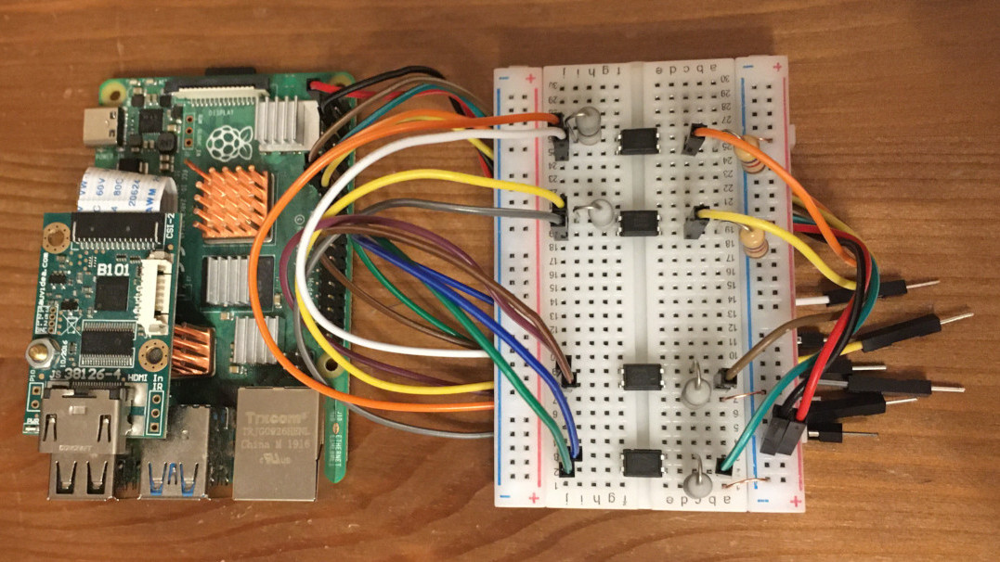

# Open and cheap DIY IP-KVM based on Raspberry Pi  
[](https://discord.gg/bpmXfz5) [](https://www.reddit.com/r/pikvm)

A very simple and fully functional Raspberry Pi-based KVM over IP that you can make with your own hands. This device helps to manage servers or workstations remotely, regardless of the health of the operating system or whether one is installed. You can fix any problem, configure the BIOS, and even reinstall the OS using the virtual CD-ROM or Flash Drive.

The website: [pikvm.org](https://pikvm.org). Also join to the [Discord Community Chat](https://discord.gg/bpmXfz5) for news, questions and support!

* **[>>> DIY Getting Started <<<](#diy-getting-started)**
* **Great project review by Novaspirit Tech**: https://youtu.be/plP9Y1likRg
* Boring technical details from the developer: https://youtu.be/9YhPWjWv5gw
* [Pro Series v3 Preorder Today!](#the-future-v3-platform-work-in-progress)
* [Limitations](#limitations)
* [Tips](#tips)
* [FAQ](#faq)
* [Donate](#donate)

### Features
* Supported **Raspberry Pi 2**, **3**, **4** and **ZeroW**;
* **FullHD video** using advanced **HDMI-to-CSI bridge** or **USB dongle**;
* Extra low **100ms video latency** (for CSI bridge);
* Bootable **Virtual CD-ROM** and **Flash Drive**;
* USB **Keyboard** and **mouse** (with leds and the wheel), PS/2 keyboard, Bluetooth HID;
* **Control the server power** using ATX functions;
* Access via **Web UI** or **VNC**;
* Ability to use **IPMI BMC**, **IPMI SoL**, **Redfish** and **Wake-on-LAN** to control the server;
* **The ready-made OS** with read-only filesystem;
* **Extensible authorization** and SSL encryption;
* **Health monitoring** of the Pi;
* Control **GPIO** ports and **USB relays**;
* It only costs between $30 and $100 for parts!
* 100% Open Source!

<details>
  <summary><b>Detailed about the Pi-KVM features</b></summary>

## Fully-featured and modern IP-KVM
* **Cheaper, but better than commercial solutions**  
  Costs between $30 and $100 depending on the features desired. Even the most expensive configuration will be cheaper than a $500 commercial IP-KVM.
* **Easy to build**  
  A ready-to-use OS that can be created just by running `make build` and installed to an SD-card using `make install`. The hardware can be made in half an hour and without soldering.
* **The widest hardware support**  
  There are many ways to build a Pi-KVM. Video capture devices can be attached using the CSI-2 or USB interfaces. Raspberry Pi models 2, 3, 4, or ZeroW may be used. Any combination of hardware is supported, and Pi-KVM implements the maximum possible set of features.
* **Very low latency**  
  ~100 milliseconds of video latency. This is the smallest delay of all existing solutions.
* **Extra lightweight and fancy Web UI**  
  No weird proprietary clients. No ugly Java applets. Just use your favorite browser to connect to the Pi-KVM. No flash plugins either!
* **Keyboard and mouse**  
  Mouse usage works directly in the browser. The keyboard emulator supports displaying the state of the keyboard LEDs.
* **Mass Storage Drive**  
  On the Raspberry Pi 4 and ZeroW, Pi-KVM can emulate a virtual CD-ROM or Flash Drive. A live image can be uploaded to boot the attached server.
* **ATX power management**  
  With a very simple circuit that can be assembled on a breadboard, the power button of the attached server can be controlled using the ATX button headers on the motherboard.
* **Security**  
  Pi-KVM can be opened to the Internet and no one will get access without the password. SSL encryption is used to protect traffic from being intercepted by third parties.
* **Local monitoring**  
  Pi-KVM monitors the health of the Raspberry Pi board and will warn you if it's too hot or is not receiving enough power.
* **GPIO management**
  You can control GPIO and USB relays via the web interface. The extensible interface allows you to make anything out of it.

## Production-ready  
* **Linux-based embedded OS**  
  The Pi-KVM OS is based on [Arch Linux ARM](https://archlinuxarm.org) and can be customized for any needs. Thousands of pre-built binary packages are at your service and can be updated with a single command!
* **Read-only filesystem**  
  By default the OS runs in read-only mode, as an embedded system should. This prevents damage to the memory card due to a sudden power outage.
* **VNC server**  
  The managed server and its BIOS can be accessed using a regular VNC client which supports JPEG compression.
* **IPMI BMC and Redfish**  
  Use `ipmitool`, `ipmiutil` or any existing network infrastructure that supports IPMI to monitor and manage the server's power. Redfish and `redfishtool` supported too.
* **Wake-on-LAN**  
  Pi-KVM can be configured to power up a managed server using WoL. This will be available in the Web menu.
* **Extensible authorization methods**  
  Multiple Pi-KVMs can be configured to use a [common authorization service](https://github.com/pikvm/kvmd-auth-server). PAM and its rich authorization mechanisms can also be used to integrate Pi-KVM into your existing authentication infrastructure.
* **Macro scripts**  
  If repetitive actions must be performed on the attached server (or on several different servers), a macro can be recorded with keyboard & mouse actions and can be played back multiple times.


## Open Source
* **Community & support**  
  Pi-KVM has a large community. Join the [discord chat](https://discord.gg/bpmXfz5) if you have any questions.
* **Extensible**  
  Pi-KVM was designed as a set of microservices with a plug-in architecture. It's very easy to modify and maintain.
* **Comprehensive API**  
  Everything that can be done via the user interface can also be done via a powerful HTTP API.
* **Know-how**  
  We created [our very own MJPG video server](https://github.com/pikvm/ustreamer) written in C with multi-threading support and GPU video encoding - the fastest streaming solution available to provide the best video quality for Pi-KVM. We also tested a lot of hardware configurations so that you can be sure devices you assemble will work reliably.
</details>

| DIY Device | Web UI |
|------------|--------|
|  |  |

-----

# DIY Getting Started
## Required hardware
Pi-KVM supports several different hardware configurations, referred to as **platforms**. Now available: **v2** and **v0**.
* **Recommended**: **v2** is the most modern implementation for **Raspberry Pi 4** and **ZeroW** supporting all of the features of Pi-KVM including the **Mass Storage Drive**. **It's also the easiest to make**
* v0 was designed to work with Raspberry Pi 2 and 3 that do not have OTG and requires a few more components for a basic implementation. It also does not support the Mass Storage Drive feature.

## Hardware for v2
* Raspberry Pi board:
  - **Recommended**: Raspberry Pi 4 (2 GB model is enough) for the best performance.
  - ... or Raspberry Pi ZeroW (slower alternative, no ethernet).
* MicroSD card (min 16 GB recommended).
* USB-A 3A charger (female socket) or power supply.
* Video capture device:
  - **Recommended**: [HDMI to CSI-2 bridge based on TC358743](https://aliexpress.com/item/4000102166176.html) - low latency ~100ms, more reliable.
  - ... or [HDMI to USB dongle](https://aliexpress.com/item/4001043540669.html) (not available for ZeroW) - high latency ~200ms, [not very reliable](#a-few-words-about-hdmi-usb-dongle)).
* Only for Raspberry Pi 4: parts for Y-splitter cable (**one variant at your choice**):
  * <details><summary>Variant #1: DIY for soldering or twist.</summary>
    <ul>
      <li>1x USB-A to USB-C cable (male-male).</li>
      <li>1x another cable USB-A to any (male-any).</li>
      <li>1x appropriate Power Supply (USB-A or USB-C) depending on what cable you choose above.<li>
    </ul>
    </details>
  * <details><summary>Variant #2: Ready-made using USB-micro splitter.</summary>
    <ul>
      <li>1x USB/Power Splitter Module (<a href="https://www.tindie.com/products/8086net/usbpwr-splitter">UK</a>/<a href="https://www.pishop.us/product/usb-pwr-splitter/">US</a>/<a href="https://www.buyapi.ca/product/usb-pwr-splitter/">CA</a>).</li>
      <li>1x USB-A to USB-C cable (male-male) for connecting the Raspberry Pi to the splitter.</li>
      <li>1x USB-A to micro USB-B cable (male-male) for connecting the server to the splitter.</li>
      <li>1x USB-A to micro USB-B cable (male-male) to connect into a USB-A wall charger. Or you also can buy the official Raspberry Pi Power Supply with micro USB-B instead.</li>
    </ul>
    </details>
  * <details><summary>Variant #3: Ready-made using USB-C splitter.</summary>
    <ul>
      <li>1x USB-C/Power Splitter Module (<a href="https://www.tindie.com/products/8086net/usb-cpwr-splitter">UK</a>/<a href="https://www.pishop.us/product/usb-c-pwr-splitter/">US</a>/<a href="https://www.buyapi.ca/product/usb-c-pwr-splitter/">CA</a>).</li>
      <li>1x USB-C to USB-C cable (male-male) for connecting the Raspberry Pi to the splitter.</li>
      <li>1x USB-A to USB-C cable (male-male) for connecting the server to the splitter.</li>
      <li>1x USB-A to USB-C cable (male-male) to connect into a USB-A wall charger. Or 1x USB-C to USB-C cable to connect into a USB-C wall charger. Or you also can buy the official Raspberry Pi Power Supply with USB-C instead.</li>
    </ul>
    </details>
* Only for Raspberry Pi ZeroW:
  * 2x USB A-to-micro cables (male-male, for power and keyboard & mouse emulator).
  * 1x [Raspberry Pi Zero Camera Cable](https://aliexpress.com/item/32953696917.html) (if using HDMI to CSI-2 Bridge, but not compatible with Auvidea B101, check pinout).
* For ATX control (optional):
  - [4x MOSFET relays OMRON G3VM-61A1](https://www.digikey.com/products/en?keywords=G3VM-61A1).
  - 4x 390 Ohm resistors.
  - 2x 4.7k Ohm resistors.
  - A breadboard and wires.
  
#### A few words about HDMI-USB dongle
It's completely supported and Pi-KVM works great with it. But it has some disadvantages compared with recommended [HDMI-CSI bridge](https://aliexpress.com/item/4000102166176.html): USB gives a lot of latency (200ms vs 100ms) and it doesn't support stream compression control (you won't be able to use Pi-KVM in a place with a poor internet connection). It also cannot automatically detect screen resolution. All this is caused by the hardware limitations of the dongle itself. In addition, some users report hardware problems: the dongle may not work in the BIOS or simply stop working after a while. It's a black box, and no one knows what's inside it. If you have problems with it, it will not be possible to fix them.
  
## Hardware for v0
* Raspberry Pi 2 or 3.
* MicroSD card (8 GB is enough).
* USB-A 3A charger (female socket) or power supply.
* For keyboard & mouse emulator (HID):
  - Arduino Pro Micro (based on an ATMega32u4).
  - [Logic level shifter](https://www.sparkfun.com/products/12009).
  - 1x NPN transistor (almost any NPN transistor: 2n2222 or similar).
  - 1x 390 Ohm resistor.
  - A breadboard and wires.
* 2x USB A-to-micro cables (male-male, for power and HID).
* HDMI capture device: [see v2 description](#hardware-for-v2).
* ATX control (optional): [see v2 description](#hardware-for-v2).

#### Addition
* If you want to capture VGA from your server instead of HDMI, buy the [VGA-to-HDMI converter](https://aliexpress.com/item/4000553298530.html).
* Pi-KVM can be powered using PoE, but it is not recommend to use the official PoE HAT: it is unreliable and [not compatible with the HDMI bridge](https://github.com/pikvm/pikvm/issues/6). Use any other PoE hat without an I2C fan controller.
* **Don't use random relay modules or random optocouplers!** Some relays or optocouplers may not be sensitive enough for the Raspberry Pi, some others may be low-level controlled. Either use relays that are activated by a high logic level, or follow the design provided and buy an OMRON. See details [here](https://github.com/pikvm/pikvm/issues/13).  
  

-----

# The future v3 platform (work in progress)

</td>

We are also currently developing our own HAT for the Raspberry Pi 4. It will have all the features of the v2 platform, including:
* HDMI capture based on the TC358743 (extra low latency and many features like compression control).
* OTG Keyboard & mouse; Mass Storage Drive emulation.
* Ability to simulate "removal and insertion" for USB.
* Onboard ATX power control.
* Onboard fan controller.
* A real-time clock.
* CISCO-style and USB serial console port (to manage Pi-KVM OS or to connect with the server).
* Optional AVR-based HID (for some rare and strange motherboards whose BIOS doesn't understand the OTG emulated keyboard).
* Optional OLED screen to display network status or other desired information.
* No need for soldering or other assembly. It's a ready-made, reliable board which you can use yourself or provide to your clients.
* Continued use of Pi-KVM OS - all the software will be fully open.
* It will cost about $100 - or less, we are working to make it as cheap as possible.

**Sounds interesting? [Subscribe in this form](https://docs.google.com/forms/d/1LA6iEYVtbJULvMDNktyNQMI4N9SYdNG03Wh9WK-80cM)** or join to [Discord](https://discord.gg/bpmXfz5) and we will let you know when you can purchase the board.

**Status as of January 2021**: We have ready-made samples and **we are starting production**! **Sales are expected to start in February 2021**.

-----

# Setting up the hardware
## Connecting the video capture
#### For the HDMI-CSI bridge
<details>
  <summary>Click to show the instructions</summary>
Insert the flexible flat cable of the HDMI bridge into the narrow white connector on the Raspberry Pi (the closest one to big USB sockets). It is labeled CAMERA. To insert you need to open the connector first. On the Raspberry Pi side you can gently lift the black part up and a little bit sideways:

| Opening the MIPI CSI-2 slot on the Raspberry Pi |
|------------------------------------------------------|
|  |

For the HDMI-CSI bridge it depends on the version you bought. Either pull it gently up as on the Raspberry or push it sideways. Make sure that the cable is inserted on the correct side and until it stops, and then push the black latch back. Never connect or disconnect the flat cable from a powered device. This is not Plug-and-Play, and you can damage it. Also use only the cable that was included with the device package, or make sure that the third-party cable has the correct pinout.

| HDMI-CSI-2 bridge connected to Raspberry Pi 4 |
|------------------------------------------------------|
| |

</details>

#### For the HDMI-USB dongle
<details>
  <summary>Click to show the instructions</summary>
Connect USB dongle to exactly this port. It is bound in the software so the OS does not confuse the video device with something else.

| Raspberry Pi 2 and 3 | Raspberry Pi 4 |
|----------------------|----------------|
|  |  |

There are many revisions of the Raspberry Pi boards and you may come across one that we haven't tested. If the binding fails, the device will be available for all ports. Everything will work, but if you use a webcam and Linux mistakes it for a dongle, [write to us](https://discord.gg/bpmXfz5) and we will fix it.
</details>

## Setting up the v2
<details>
  <summary>Click to show the instructions</summary>
Here is a diagram shows that how to connect all of the pieces (click to full size).

| ATX control board | USB splitter cable (only for Raspberry Pi 4) |
|-------------------|--------------------------|
|  |  |

**Raspberry Pi 4 note**: since one USB-C female connector is used to receive power and perform keyboard/mouse/drive emulation a special Y-cable must be made that splits the DATA and POWER lines of USB-C (see [reasons](https://github.com/pikvm/docs/issues/11)). It can be made from two suitable connecting cables, or soldered together from scratch. Be sure to check the circuit diagram below, otherwise you may damage your devices. The appropriate USB pinout(s) can easily be found on Google. Please note that if you make a Y-cable from two no-name cables, the colors of the wires may not match those shown. Use a multimeter to make sure the connections are correct.

See video how-tos:
* [Making USB Y-splitter cable](https://www.youtube.com/watch?v=uLuBuQUF61o).
* [Soldering ATX controller](https://www.youtube.com/watch?v=hKnKOuH_f8M).

</details>

## Setting up the v0
<details>
  <summary>Click to show the instructions</summary>

| ATX control board and Arduino HID (keyboard & mouse) |
|------------------------------------------------------|
|  |

</details>

-----

# Installing the OS
Here the final steps. There are two ways to get the Pi-KVM OS:
  * We provide the ready-made images for **Raspberry Pi 4** for platforms **v2-hdmi** (the CSI-2 bridge) and **v2-hdmiusb** (the USB dongle). [Follow these instructions](pages/flashing_os.md) to install the OS quickly.
  * For the other boards and platforms, you need to build the operating system manually. Don't worry, it's very simple! [Just follow these instructions](pages/building_os.md). You can also build the OS for RPi4 manually if you really want to :)

# You're amazing!
Congratulations! Your Pi-KVM will be available via SSH (`ssh root@<addr>` with password `root` by default) and HTTPS (try to open in a browser the URL `https://<addr>`, the login `admin` and password `admin` by default). For HTTPS a self-signed certificate is used by default.

To change the root password use command `passwd` via SSH or webterm. To change Pi-KVM web password use `kvmd-htpasswd set admin`. As indicated on the login screen use `rw` to make the root filesystem writable, before issuing these commands. After making changes, make sure to run the command `ro`.

# Access to Pi-KVM from the Internet
You can use port forwarding for port 443 on your router if it has an external IP address. In all other cases, you can use the excellent free VPN service [Tailscale](pages/tailscale.md), which is configured on Pi-KVM with a [few simple commands](pages/tailscale.md).

If you have any problems or questions, contact us using Discord: https://discord.gg/bpmXfz5

Subscribe to our Subreddit to follow news and releases: https://www.reddit.com/r/pikvm

Happy using of Pi-KVM :)

-----

# Limitations
* In very rare cases, some motherboards contain a buggy BIOS that does not understand the keyboard of the **v2** platform (below). The reason for this is that the BIOS doesn't fully implement the USB HID stack for composite devices correctly. Meanwhile, Mass Storage Drive can be detected. For this case, we suggest using the Arduino HID from the **v0** platform with **v2**. Thus the Pi-KVM will be connected by two USB cables to the motherboard: one of them will be responsible for the keyboard and mouse, the other for everything else. See [here](pages/arduino_hid.md).
* A similar problem can be observed on devices with UEFI: the keyboard works fine, but the mouse does not work. This situation occurs when UEFI does not support absolute mouse mode, which prefers to use Pi-KVM. To solve this problem, [you can enable relative mouse mode](pages/mouse.md).
* To use Pi-KVM with Apple UEFI, use the [Arduino HID](pages/arduino_hid.md) even with **v2**. Apple UEFI wants the most blunt keyboard possible.

Our future [v3 platform](#the-future-v3-platform-work-in-progress) will contain an optional HID module for such cases, so you won't have to build anything yourself.

-----

# Tips
* The Pi-KVM file system is always mounted in read-only mode. This prevents it from being damaged by a sudden power outage. To change the configuration you must first switch the filesystem to write mode using the command `rw` from root. After the changes, be sure to run the command `ro` to switch it back to read-only.

* **NEVER** edit `/etc/kvmd/main.yaml`. Use `/etc/kvmd/override.yaml` to redefine the system parameters. All other files that are also not recommended for editing have read-only permissions. If you edit any of these files, you will need to manually make changes to them when you upgrade your system. You can view the current configuration and all available KVMD parameters using the command `kvmd -m`.

* Almost all KVMD (the main daemon controlling Pi-KVM) configuration files use [YAML](https://docs.ansible.com/ansible/latest/reference_appendices/YAMLSyntax.html) syntax. Information on the format's syntax can be found at the link provided.

* If you want to disable the web terminal use this command:
    ```yaml
    [root@pikvm ~]# systemctl disable --now kvmd-webterm
    ```
    
* To disable authorization completely edit the file `/etc/kvmd/override.yaml`:
    ```yaml
    kvmd:
        auth:
            enabled: false
    ```
    then restart `kvmd`:
    ```
    [root@pikvm ~]# systemctl restart kvmd
    ```

* If you don't need ATX power control you can disable the relevant Web-UI menu in `/etc/kvmd/override.yaml`:
    ```yaml
    kvmd:
        atx:
            type: disabled
    ```
    then restart kvmd.
    
* To use Wake-on-LAN with your server you must define some options such as the server's MAC address and (optionally) IP address. Use `/etc/kvmd/override.yaml`. The format is:
    ```yaml
    kvmd:
        wol:
            mac: ff:ff:ff:ff:ff:ff
    ```
    Replace `ff:ff:ff:ff:ff:ff` with the MAC of your server. By default, a packet is sent via a broadcast request to the entire IPv4 network (`255.255.255.255`, port `9`), but you can address it to a specific static address:
    ```yaml
    kvmd:
        wol:
            mac: ff:ff:ff:ff:ff:ff
            ip: 192.168.0.100
            # port: 9  # By default
    ```

* [Video modes of HDMI CSI brodge (if no video in UEFI)](pages/edid.md).

* [Mouse modes (if the mouse doesn't work in UEFI)](pages/mouse.md).

* [Recording screen video](pages/video.md).

* [Multiport KVM over IP](pages/multiport.md).

* [Using IPMI and Redfish](pages/ipmi.md).
  
* [Using VNC](pages/vnc.md).
  
* [Using Arduino HID (for USB or PS/2) on v2 platform](pages/arduino_hid.md).

* [Using Bluetooth HID](pages/bluetooth_hid.md).

* [Wi-Fi configuration after install](pages/wifi_config.md).

* [Export monitoring metrics to Prometheus](pages/prometheus.md).

* [Control GPIO ports and USB relays](pages/gpio.md).

* [Centralized authorization for multiple Pi-KVMs](https://github.com/pikvm/kvmd-auth-server).

* [Cookbook](pages/cookbook.md).
    - [Take a HDMI screenshot via console on Pi-KVM](pages/cookbook.md#take-a-hdmi-screenshot-via-console-on-pi-kvm).
    - [Get installed KVMD version via console](pages/cookbook.md#get-installed-kvmd-version-via-console).
    - [Upload .ISO images manually](pages/cookbook.md#upload-iso-images-manually).
    - [Enable Serial-over-USB connection](pages/cookbook.md#enable-serial-over-usb-connection).
    - [Enable Ethernet-over-USB network](pages/cookbook.md#enable-ethernet-over-usb-network).
    - [Create a Microsoft Windows based flash disk image](pages/cookbook.md#create-a-microsoft-windows-based-flash-disk-image).

-----

# Troubleshooting
If you encounter any problems, take a look at [this page](pages/troubleshooting.md). We've probably already found a solution for it :)

For any help, you can contact our discord chat: https://discord.gg/bpmXfz5

-----

# FAQ
**Q:** **Can I connect multiple servers to a single Pi-KVM?**  
**A:** Yes, but it will require additional work to set up. See [this page](pages/multiport.md).

**Q:** **Can I use Pi-KVM with non-Raspberry Pi boards?**  
**A:** Yes, but you will have to prepare the operating system yourself. As for the Pi-KVM software, you will need to replace some config files (such as UDEV rules). If you are a developer or an experienced system administrator, you will not have any problems with this. In addition, we are open to patches. If you need help with this, please contact us via Discord: https://discord.gg/bpmXfz5

-----

# Donate
This project is developed on a non-commercial basis by Open Source enthusiasts. If you find Pi-KVM useful or it has saved you a long trip to check on an unresponsive server, you can support the lead developer by donating a few dollars via [Patreon](https://www.patreon.com/pikvm) or [PayPal](https://www.paypal.me/mdevaev). With this money, he will be able to buy new hardware (Raspberry Pi boards and other components) to test and maintain various configurations of Pi-KVM, and generally devote significantly more time to the project. At the bottom of this page are the names of all the people who have helped this project develop with their donations. Our gratitude knows no bounds!

If you wish to use Pi-KVM in production, we accept orders to modify it for your needs or implement custom features you require. Contact us via [live chat](https://discord.gg/bpmXfz5) or email the lead developer at: mdevaev@gmail.com

-----

# Special thanks
These kind people donated money to the Pi-KVM project and supported work on it. We are very grateful for their help, and commemorating their names is the least we can do in return.

<details>
  <summary>View all people!</summary>

* Accalia
* adipisicing
* Alberto Bassi
* Aleksei Brusianskii
* Alexandre Jablonski
* Alucard
* Andrew Reusch
* Andrew Ruan
* Andrzej V
* Anish Patel
* Anix
* Anton Kovalenko
* Aron Perelman
* Arthur Woimbée
* Ashlesh Chaudhari
* Augusto Becciu
* AVS Computer
* baddog
* Bao Tin Hoang
* Ben Gordon
* Ben Scott
* Benedikt Heine
* Benjamin Melancon
* Bernhard Fitzke
* bitjoe
* Bits and Bytes Computers LLC
* Bootstrapper - Programmierung erklärt
* Bradford King
* Brainspore Networks
* Branden Shaulis
* Brian Moses
* Brian Vecchiarelli
* Brian White
* Bruno Gomes
* Bryan Adams
* C P ELSE
* Carl Mercier
* Chris Burton
* Chris Rizio
* Christian Schlögl
* Christoph Dette
* Christof Maluck
* Christoffer Lund
* Clifford Coleman
* Clinton Lee Taylor
* Cole Imhoff
* Corey Layton
* Corey Lista
* ctag
* DeMentor
* Damon Meledones
* Dan Berkowitz
* Dan Brakeley
* David
* David Howell
* David York
* Denis
* Denis Andreev
* Denis Yatsenko
* Derek Yap
* dixon wong
* dizztrukshin
* Dmitry Shilov
* Eric Phenix
* ewook
* Fergus McKay
* fo0bar
* Foamy
* Francisco Pavon
* Fredrik Idréus
* Ge Men
* Genkinger Andreas
* Georgy Brodsky
* Gregory Treantos
* Grey Cynic
* Guido Bernacchi
* Gustin Johnson
* Heikki Tiittanen
* Henrik Ählström
* Henry Hood
* HimKo
* Icculus
* iks
* Ivan Shapovalov
* J L
* Jacob Morgan
* James Cadd
* James Cobb
* James Kocher
* Jamie Murphy
* Jan Niehusmann
* Jari Hiltunen
* Jason Downey
* Jason Toland
* Jay Davis
* Jeff Bowman
* Jeff Urlwin
* Jennifer Rowlett
* Jerremy Holland
* Joachim Bruening
* Joe Ventura
* Joel Jacobs
* John F Glenn
* John Kelley
* John McGovern
* Jonathan Vaughn
* Josh Ricker
* Joshua Futterer
* Jordi Pakey-Rodriguez
* Joris van Embden
* Jozef Riha
* Julian Forero
* Justin Waters
* Ken Lee
* Kenny Hui
* Kevin Schwartz
* Krzysztof Żelaśkiewicz
* Lars
* LeeNX
* Lordbob75
* Lothar Schweikle-Droll
* Lukas Söder
* Malcolm Cameron
* Marcos Wolf
* Mark Gilbert
* Mark Robinson
* Markus Halm
* Markus Schicker
* Markus Sobczack
* Marten Hermans
* Martin Gasser
* Mateusz Grabowski
* Matthew Cameron
* Mauricio Allende
* Mehmet Aydoğdu
* Michael Kovacs
* Michael Lynch
* Michael Pennington
* Michael Sage
* Milan Múčka
* Miles Davis
* Morgan Helton
* Nicholas Jeppson
* Nick Leffler
* Nick Roethemeier
* Nils Orbat
* Nithin Philips
* Nod Swal
* nybble
* Oh Be
* Oliver Schwarz
* Oliver Zimmer
* Paul Bishop
* Peter Farrelly
* Petri Heiskanen
* Philip Merricks
* posicat
* pozitron03
* Qteal
* Quentin Peten
* Ralph Borchers
* Ranc1d
* Richard Bernarts
* Richard Freemantle
* Rob Tongue
* Robin Gfatter
* Rolfs 3D UG
* rotx
* Samed Ozoglu
* Satish Alwani
* Scott
* Scott Spicola
* Scott Tusing
* Sean
* Seonwoo Lee
* Sergey Lukjanov
* Shichun Chen
* Simon Evans
* Simplistic Realities
* Stefan Bautz
* Stefan Müller
* Stefan Stemmer
* Steve Ovens
* Steven Richter
* sudo34
* Tejun Heo
* Thomas Price
* Thomas Søfteland
* Timothee Besset
* Tom York
* Tomas Kuchta
* Tomáš hrubý
* Tobias Schafferhans
* Tristan Schoening
* Truman Kilen
* Tyler
* Udo Schroeter
* Uli Fahrer
* Walter_Ego
* William Hooper
* William Stearns
* Yethal
* Yevgeniy Kuksenko
* Yigal Dar
* YURI LEE
* Yurii Ostapchuk
* zgen
* Zsombor Vari
</details>
