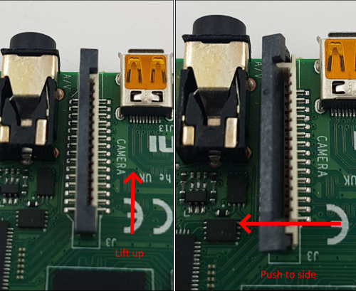

---
search:
    exclude: true
---

Insert the flexible flat cable of the HDMI-CSI bridge into the narrow white connector on the Raspberry Pi
(the closest one to big USB sockets). It is labeled `CAMERA`. To insert you need to open the connector first.
On the Raspberry Pi side you can gently lift the black part up and a little bit sideways:

| Opening the MIPI CSI slot on the Raspberry Pi |
|-----------------------------------------------|
|  |

For the HDMI-CSI bridge this operation depends on the version you bought.
Either pull it gently up as on the Raspberry or push it sideways.
Make sure that the cable is inserted on the correct side and until it stops, and then push the black latch back.
Avoid using force when pushing the cable in, as the slots bond to the PCB is quite fragile.
Never connect or disconnect the flat cable from a powered device. This is not Plug-and-Play, and you can damage it.
Also use only the cable that was included with the device package, or make sure that the third-party cable has the correct pinout.

| HDMI-CSI bridge connected to Raspberry Pi 4 |
|---------------------------------------------|
|  |

| HDMI-CSI bridge connected to Raspberry Pi 2 W (using the adapter cable) |
|-------------------------------------------------------------------------|
|                 |
