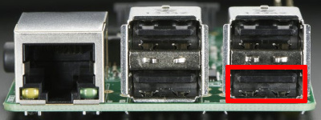
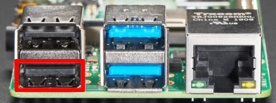

---
search:
    exclude: true
---

Connect USB dongle to exactly this port. It is bound in the software so the OS does not confuse the video device with something else.

| Raspberry Pi 2 and 3 | Raspberry Pi 4 |
|----------------------|----------------|
|  |  |

There are many revisions of the Raspberry Pi boards and you may come across one that we haven't tested.
If the binding fails, the device will be available for all ports.
Everything will work, but if you use a webcam and Linux mistakes it for a dongle,
[write to us](https://pikvm.org/support/) and we will fix it.
