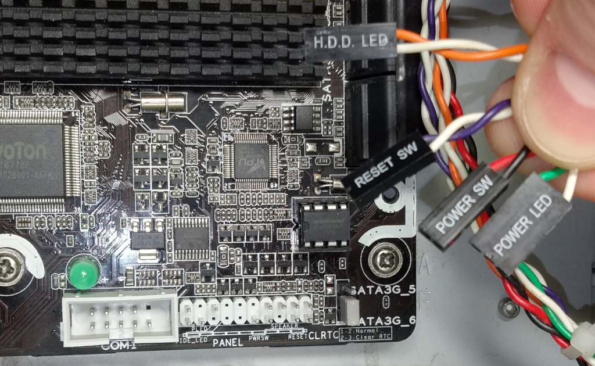
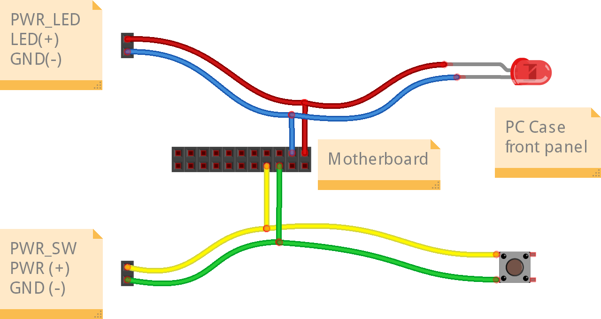

---
search:
    exclude: true
---

To control the power, two display LEDs (power and HDD activity) and two buttons (power and reset) are provided
on the front panel of the computer case. They are connected by wires to pins on the motherboard.

All you have to do is connect the PiKVM ATX controller to their wires by making a parallel connection.
Please note that the pinout differs on different motherboards, so before you continue,
check the documentation on your motherboard for correct pinout.

The following illustration shows how the connection between the power LED and the power button should be performed:

On the left are the wires from the PiKVM ATX controller, the pad in the middle indicates the pins on the motherboard,
and on the right are the LED and button of the target host. The implementation of this scheme is left to your discretion
and can be performed, for example, by cutting wires and performing twisting, followed by insulation with duct tape.

Be careful and respect the polarity of the LEDs. The polarity of the button does not matter (they have no polarity at all).
The connection of HDD LED and reset switch is performed in the same way.
