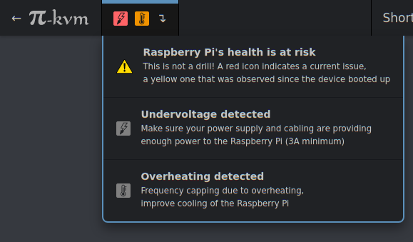

Today's big release KVMD 1.75 includes several important features.

1) Hardware health monitoring. If your Pi-KVM suffers from overheating or lack of power, you will see the corresponding icons and messages in the interface. Don't ignore them! The problems, if any, are not caused by the update, they have always been there, but you have not seen them before, because they were hidden in the kernel logs.

<!-- more -->

2) Partially fixed an issue with the jumping stream quality slider in the Web UI. This is sometimes found on FireFox. The slider still jumps, but it doesn't lose your settings.

3) Hand-written HTML has finally been eradicated in favor of Pug templates ([here](https://github.com/pikvm/kvmd/blob/master/web/login/index.pug) is one example. Future commiters will find it easier to live.

4) Reworked streamer settings—preparing for official support of the USB-HDMI dongle. Since it does not know how to adjust the stream quality and determine resolutions, the corresponding submenus will be and added to the Web UI.

5) Fixed a bug that caused the mouse to work incorrectly on the Arduino HID. Update the firmware (see https://github.com/pikvm/pikvm).

6) Added a handler for the Power key, which is sometimes found on the keyboard. There is no such button in the interface (yet?) it is not necessary, but if necessary, you can call it via the websocket API.

