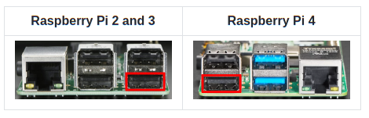

The main change is to add support for an HDMI-USB dongle out of the box.

<!-- more -->

For the dongle, the quality settings option was removed from the interface (does not supported by the device) and dropdown was added with manual resolution selection.

The best way to use a dongle is to rebuild the operating system with `PLATFORM=v2-hdmiusb`. This way you will get a configuration that can be easily updated. The use of HDMI-CSI bridge and USB dongle is also available for RPi and RPi3 (with Arduino HID).

Please note that the video capture device is linked to a strictly defined USB port. This is necessary so that the OS does not confuse the USB device with something else.

Check the updated [instructions](https://docs.pikvm.org/v1/?h=dongle#...%20or%20HDMI-USB%20dongle).

