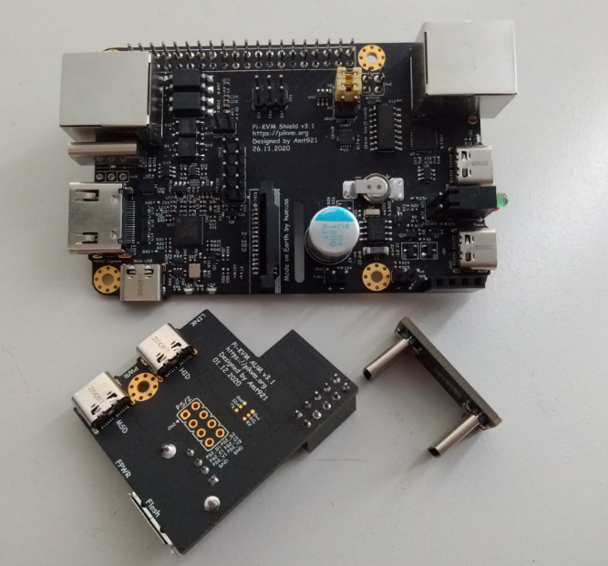

We have some news about v3. The prototypes are almost ready. Since the last release, they have included several changes and additional features.

<!-- more -->

In addition to the ones we announced earlier, we added:

- **HDMI Audio**. Practice has shown that all existing CSI bridges except for the expensive Auvidea B101 model have a hardware circuit error, due to which they are not able to capture sound. Our v3 does not have this drawback. This feature is already implemented in hardware, and the software will be ready a little later. Most likely, we will offer h264 video compression + audio.

- **Built-in fan controller**. Since RPi has some cooling issues, we thought it would be great to solve this somehow.

- **Arduino HID with USB and PS/2 keyboard and mouse**. The software for PS/2 mouse will be completed later, the hardware is already ready. Also, this thing is necessary to work with Apple UEFI.

- The board uses **only USB-C connectors** (standardization!) and fully compatible with the official RPi power supply, which we will recommend for use.

A limited batch of 30 pieces will be sold to commercial customers and some interested parties in this chat. We'll probably sell to the first applicants, but we haven't decided yet. The kit will include: the v3 board, arduino HID board, adapter boards, small fan, and (probably) a 3D-printed case. RPi and power supply will NOT be included.

Since this is a trial batch of manual assembly, the cost of one set will be $200-250 (we have not yet calculated exactly). The sale of prototypes should start before the new year. In January, we will start selling production models much cheaper (~$100).

PS: Discussing welcome in the ⁠chat!