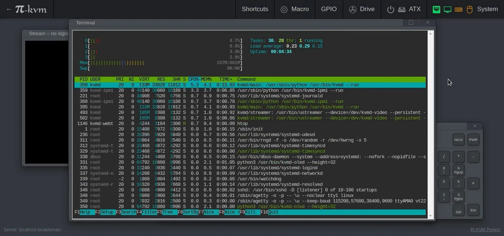
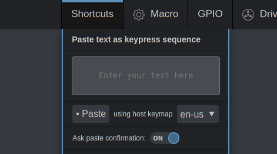

You can now have the web terminal in a window above the video stream if you like. The focus works a little strange, but it is quite functional and even supports changing the size.

<!-- more -->



Another recent change is that you can now select the keyboard layout of the target machine in the paste-as-keys menu, so this solves the problem of German, British, and other layouts.



And a few more changes:

* You can disable confirmation in the paste-as-keys menu
* Full-screen mode now works in Safari on Mac.
* Some minor UI fixes and improvements.

To update: 

```console
rw
pacman -Syu
reboot
```