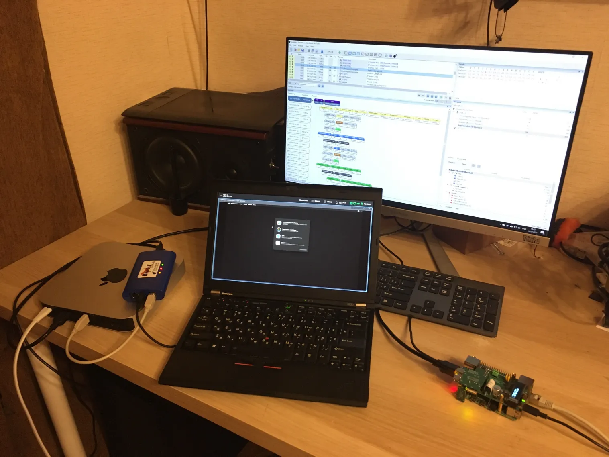

For a long time, Pi-KVM had several problems related to the mouse and keyboard on Apple. Previously, you could not use the mouse in the boot menu, and recovery mode also required you to connect the mouse, despite the fact that the cursor was functioning. Because of these bugs, it was impossible to fully remotely control your Mac. Now all this is fixed!

<!-- more -->

- For an Intel-based Mac, you can use the [Arduino HID](https://github.com/pikvm/pikvm/blob/master/pages/arduino_hid.md) to enter different boot menus (Option or Cmd+R). In boot manager, a relative mouse now works, and in recovery mode, both relative and absolute work.

- For Mac with M1, you can use default OTG HID. You will no longer be shown a screen with an absurd requirement to connect another mouse in recovery mode.

Since this problem was hidden somewhere inside the Apple drivers, I needed to buy a hardware USB protocol analyzer to understand how to get around it (because Mac is a closed source and there is no other way to find out what is happening there). Fixing this cost me almost $1500. So if it will be useful to someone, you can support me with a donation, because developing Pi-KVM software as Open Source is my main and only job.

- https://patreon.com/pikvm
- https://www.paypal.me/mdevaev

To update:

```console
rw
pacman -Syu
reboot 
```

And don't forget reflash your Arduino HID! 

