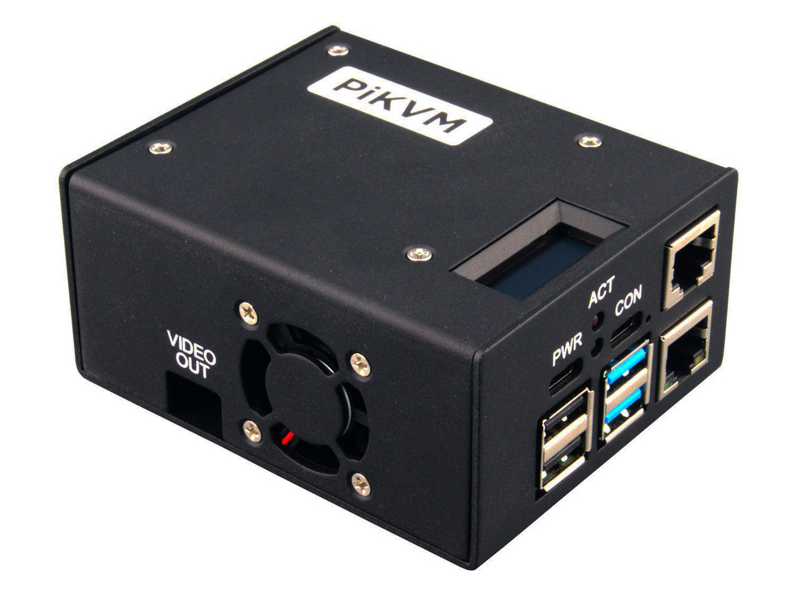

A “Pre-Assembled” version of PiKVM has just been released!

<!-- more -->

It includes the PiKVM board, a Raspberry Pi 4B 2GB, and a pre-programmed 32GB SanDisk card. Each unit has been carefully built and tested ❤️ 

A limited quantity is available for this launch. We are expecting a high demand and will be doing our best to keep up! It’s already in stock at PiShop.us and PiShop.ca and will be soon available at other resellers.

- US: https://www.pishop.us/product/pikvm-v3-pre-assembled/
- Canada: https://www.pishop.ca/product/pikvm-v3-pre-assembled/
- Other: https://www.pikvm.io/#where-to-buy