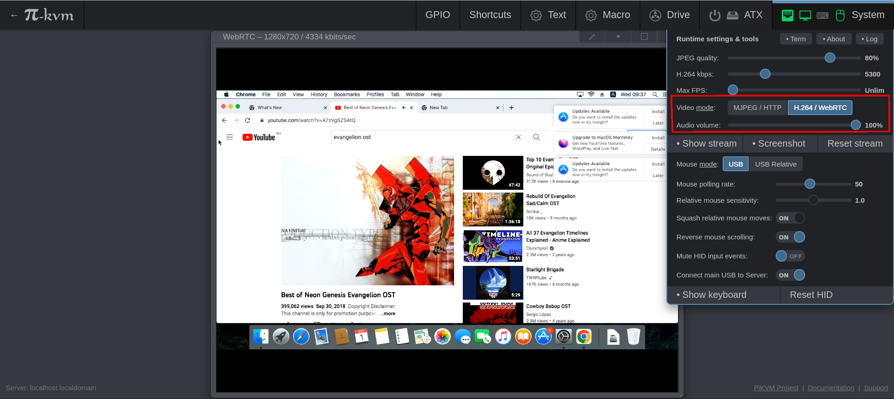

This moment has come! We are finally ready to provide audio for testing by all V3 users. 

<!-- more -->

Right now everything is working pretty stable, so if you really wanted to watch a movie on KVM or something like that—this is your chance!

To start using audio, follow the simple instructions here: https://docs.pikvm.org/audio.

