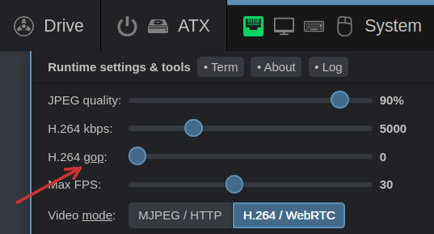

This is the second part of an experiment to improve the video streaming.

<!-- more -->

There is such a thing in H.264—keyframes. In a normal situation, they are sent approximately once per second in order to ensure the stability of the video. If you were faced with the fact that your stream turned black, and then started working again after a couple of seconds, then you had a flow failure, but the keyframe fixed this.

So, the keyframe is our friend. But keyframes contain an entire frame of the screen, and unlike intermediate frames, which fill the entire remaining stream, they have a huge size. Next comes blah-blah-blah about WebRTC theory and flow correction algorithms in browsers, but in general, if we disable keyframes and send them only when the flow fails, you can make the stream faster, smoother and consuming less traffic.

You can test this mode in the new update. I've added the H.264 gop parameter that adjusts the interval between keyframes.



If you reduce it to zero, then keyframes will be sent only in exceptional cases. This mode is best suited for slow wired channels, but I will be interested in how well it will work in wireless communication.

I would appreciate if someone would test this and share their experience for me in ⁠dev 🙏 

To update:

```console
rw
pacman -Syu
reboot
```