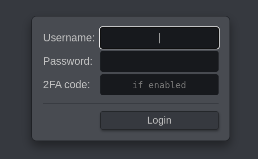

Many have asked for this, so now you have the opportunity to increase the security of your PiKVM.

<!-- more -->

By the way, this is a great chance to see how the QR code is rendered in the terminal using ASCII 😄

Have fun: https://docs.pikvm.org/auth/#two-factor-authentication



To update:

```console
rw
pacman -Syu
reboot
```
