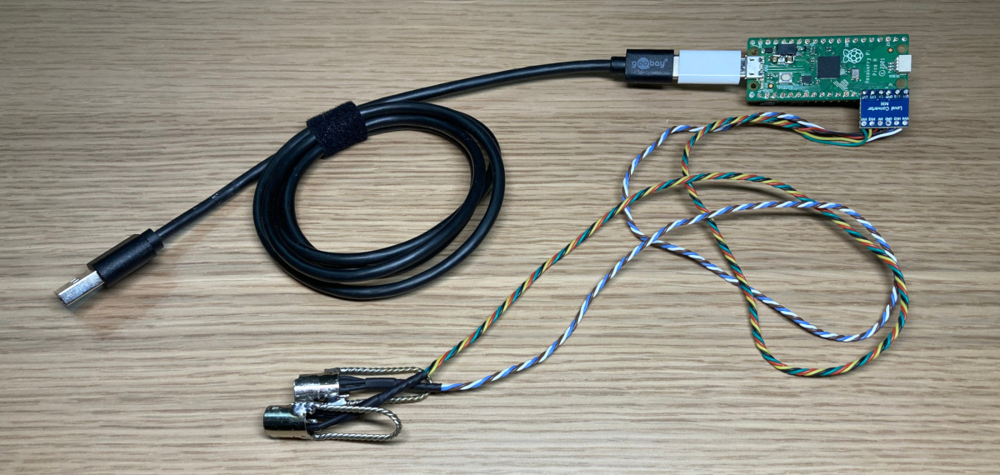

Previously, to support PS/2 keyboards (only), it was necessary to assemble a complex circuit on Arduino. With the transition to Raspberry Pi Pico, we finally have full support for both keyboard and mouse. The design has been greatly simplified, and is now compatible with V4 Plus.

<!-- more -->

HOWTO: https://docs.pikvm.org/pico_hid_bridge/

Let me know if you need a native support of the Sun SPARCstation Keyboard & Mouse!