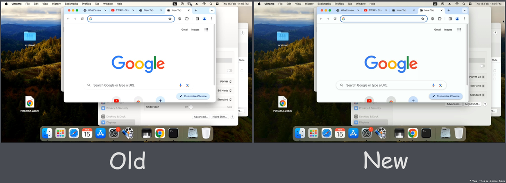

In this release, you will get many improvements regarding video quality and EDID.

<!-- more -->

## PiKVM V4

- Default resolution is 1920×1080@60Hz.
- Added native support of 1920×**1200**@60Hz!
- Fixed broken audio on Linux hosts.

## PiKVM V3

- Default resolution now is 1280×720@60Hz, it should improve BIOS compatibility.
- Supported resolutions up to 1920×1080@**50Hz**.
- Fixed broken audio on Linux hosts.

## For V4 + V3 + DIY based on CSI bridges

- The color rendering quality has been significantly improved. Now the colors are bright and juicy, and not overexposed, see the attached picture.
- Presumably, this release should put an end to shamanic dancing with EDID settings for different BIOSes.
- Added several new supported resolutions like 1600×YYYY.
- kvmd-edidconf --set-audio=1 now allows you to automatically add audio blocks for PiKVM, which are required by some particularly finicky OS.

To update:

```console
$ curl https://files.pikvm.org/update-os.sh | bash
```

Important: if you are using a custom EDID, you will need to manually replace it with a new one after update. For example: rw; kvmd-edidconf --restore-default=v4plus; reboot (available: v0, v1, v2, v3, v4mini and v4plus)


