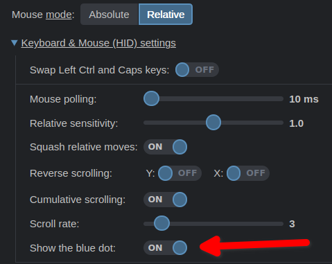

Now you can disable the blue mouse dot.

<!-- more -->

But I still don't recommend doing this, because using the blue dot you can not wait for the real cursor. Click events are instantly transmitted to where the blue dot points, not the lagging real cursor.
