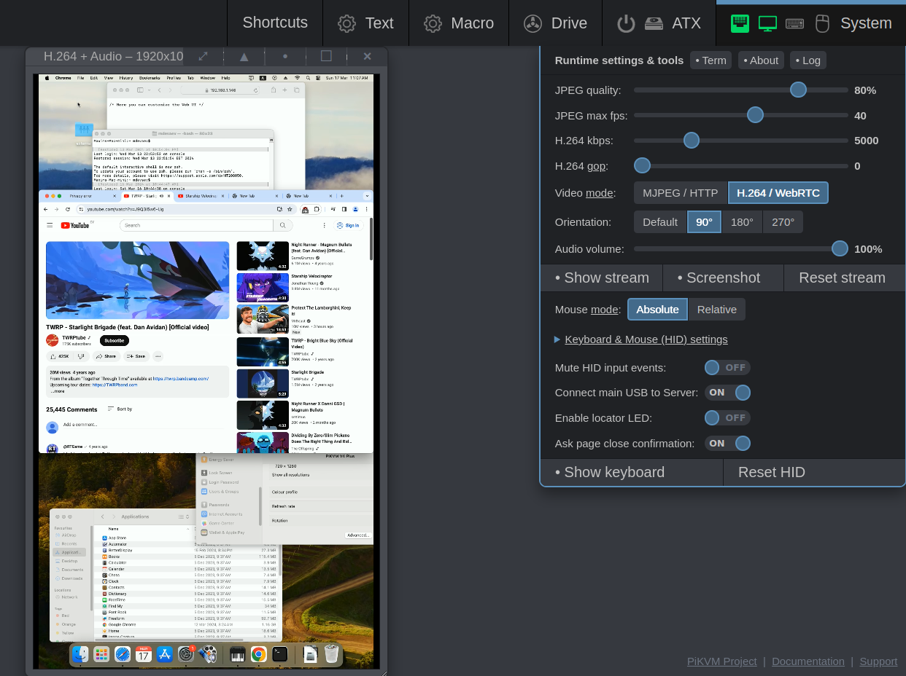

For the H.264 stream, there are now options to rotate the virtual screen.

<!-- more -->

Rotation is done in 90° increments. The toggles are in the System menu in the web UI.



To update:

```
# pikvm-update`
```

If this command is not available, please use:

```console
# curl https://files.pikvm.org/update-os.sh | bash`
```