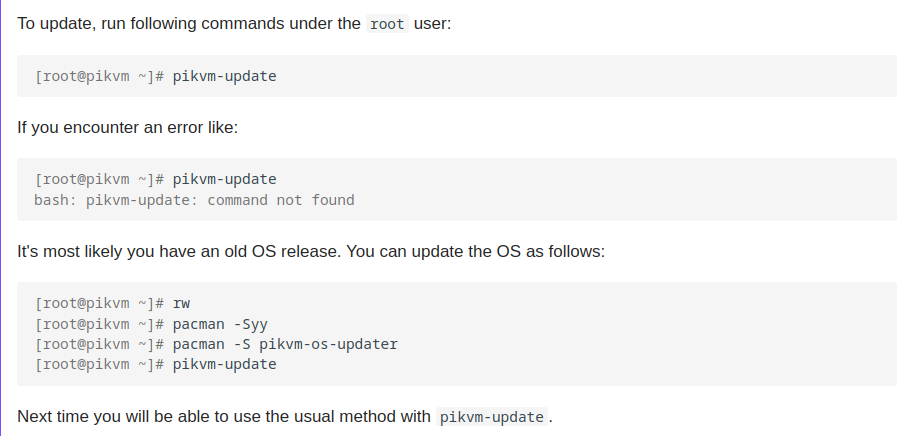

Thanks to the work of the Raspberry kernel team, a bug related to incorrect colors in H.264 was finally fixed while working with passthrough.

<!-- more -->

With the new release, this feature is now enabled by default, and you will get great juicy colors both in the stream and on the external physical monitor. See [the documentation](https://docs.pikvm.org/pass) for details on setting this up.

