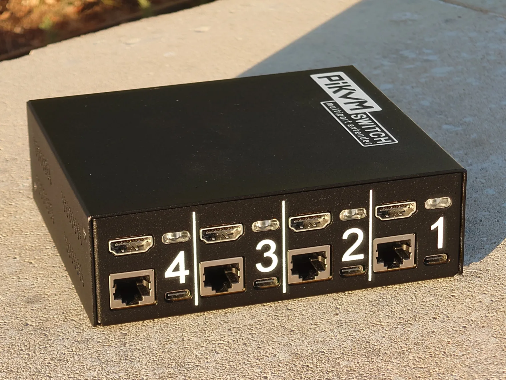

The PiKVM team is excited to present its new PiKVM Switch Multiport Extender - the most full-featured switch for PiKVM devices. After much anticipation, the PiKVM Switch is now available for order! The switch allows you to connect up to four target hosts to a single PiKVM and provides full control over them.

<!-- more -->

- ATX control on each port.
- Per-port EDID configuration.
- HDMI dummy plug functionality.
- True Plug-n-Play with no need for override.yaml setups and complete control via Web UI.
- Multifunctional RGB LEDs with beacon mode and customizable color schemes.
- Firmware update directly from PiKVM and ready for future hardware extensions.
- Compatible with V4 Plus, V3 and DIY devices based on Pi2-Pi4 except Zero and V4 Mini.

And now the best part: **the switches can be chained**! Need four ports? Get a PiKVM Switch Multiport Extender. As your server fleet expands to eight, simply add another switch and link it to the first one. Need even more? No worries — **connect up to five switches and enjoy 20 fully functional ports on your PiKVM**. Say goodbye to replacing your entire KVM system!

You can order PiKVM Switch Multiport Extender from our [international store](https://shop.hipi.io/product/pikvm-switch-multiport-extender).

Canadian customers can place an order at [PiShop.ca](https://www.pishop.ca/product/pikvm-switch-multiport-extender/).

See also the detailed technical descriptions and documentation on [docs.pikvm.org](https://docs.pikvm.org/switch/).

The first batch will start shipping at the end of December 2024, and the second batch will be at the end of January 2025. 
