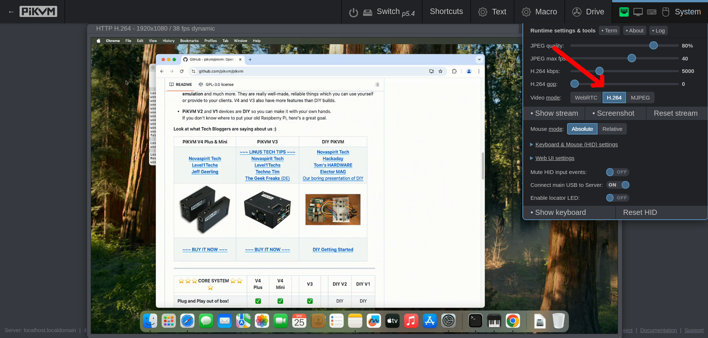

I know that some people have a problem using H.264 and WebRTC with firewalls, NAT, Tailscale and other things. Until recently, the only alternative was MJPEG, which consumes a lot of traffic. So I was constantly researching whether something could be done about it, and finally found a way.

Starting with KVMD 4.29, in addition to WebRTC, a new method of **direct transmission of H.264 over HTTP** will be available to you. Is the Web UI working? Then direct video transmission will also work. This completely solves the problem of WebRTC unavailability.

<!-- more -->

**This new feature is available for free not only to PiKVM V4 and V3 users, but also to all DIY users with HDMI-CSI devices**. Merry Christmas to everyone! 🥳 

A little tip: use **H.264 gop 0** in settings.

To update just run `pikvm-update`. As usual, I advise you not to upgrade without physical access to the device. Also, you should not update PiKVM if the amount of alcohol in the blood on the occasion of the holiday is not zero or at least does not correspond to the level of the peak Ballmer.

PS: Our work on the open development of PiKVM is possible only through sales of hardware and donations. So if you want to support us, please consider [buying(https://pikvm.org/buy/) our official PiKVM or a Switch.

