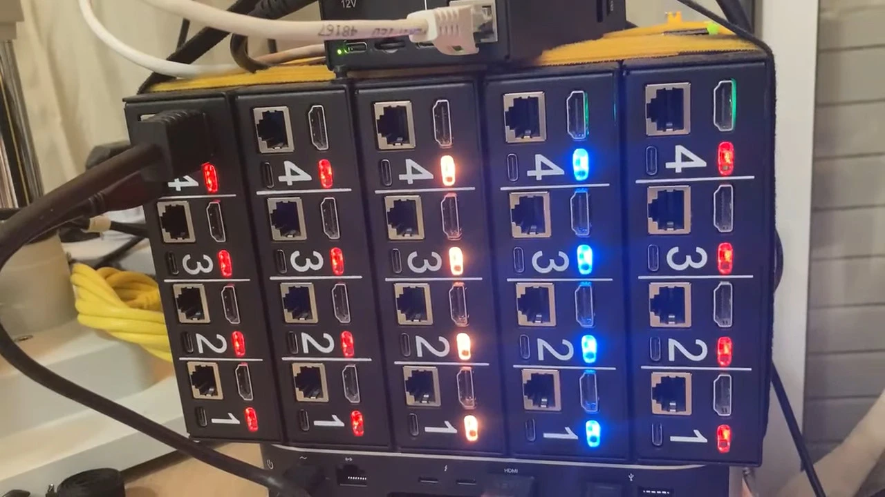

An announcement for happy PiKVM Switch owners. We have released a firmware update that improves compatibility with some HDMI sources + audio. 

<!-- more -->

You need to update the PiKVM OS using `pikvm-update`, and the firmware will be delivered with it. Next, follow the instructions in the Switch menu.

This is another cool feature of the PiKVM Switch: you don't need to take any complicated steps to update the firmware. A switch connected to PiKVM receives an update from PiKVM, and then updates all other switches in the chain automatically.

