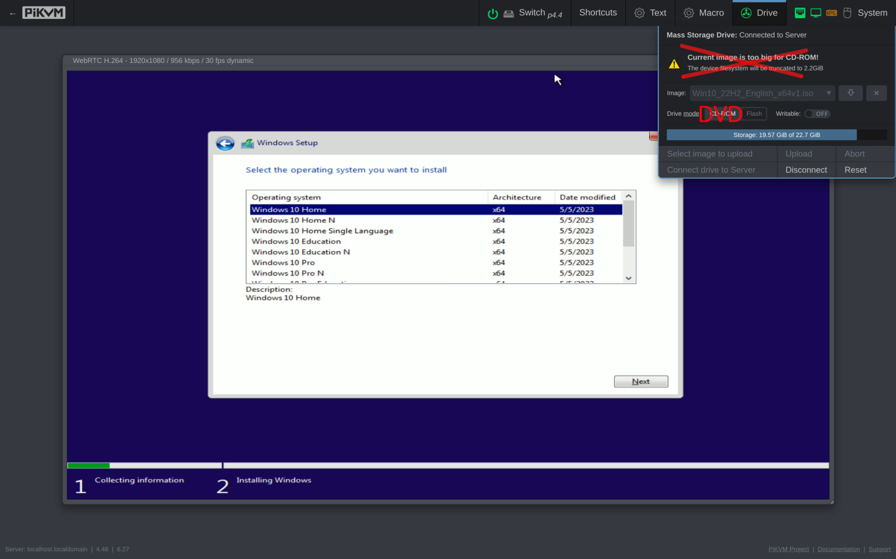

Starting with KVMD 4.49, **the old 2.2 GB CD limit is now removed**.

<!-- more -->

PiKVM just learned how to support large DVD images natively, which means that **you no longer need Ventoy to prepare Flash images for PiKVM**. You can even use the official Windows ISO to install the OS! Small ISO images will be handled as CD as before, but for big images PiKVM will switch emulation to DVD mode automatically.

How to update: `pikvm-update`, as usual.

If you've been dreaming of getting DVD emulation, then your wish has been fulfilled 🙂
