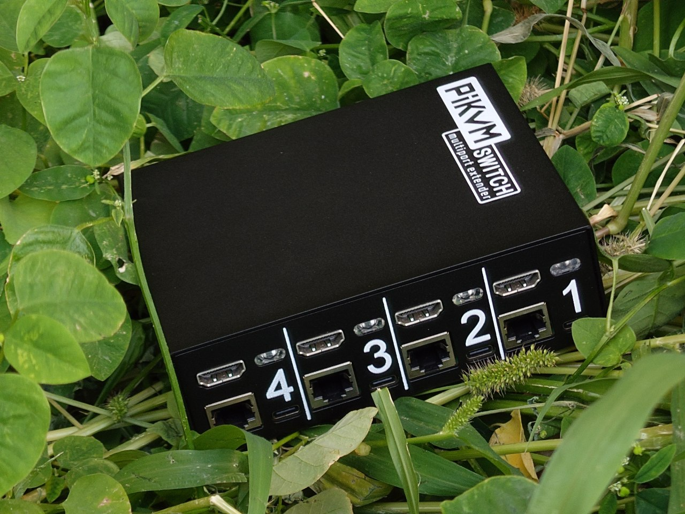

??? note
    V4 MINI can ONLY be used with the TESmart or other KVMs with LAN control, the TESmart has a convenience driver for easier setup

If you need to connect multiple hosts to a single PiKVM, then the best way to do this is to use our [PiKVM Switch](switch.md). It is designed specifically for PiKVM and has many advantages and features compared to regular desktop multiport switches.

* ATX control on each port.
* Per-port EDID configuration.
* HDMI dummy plug functionality.
* True Plug-n-Play with no need for override.yaml setups and complete control via Web UI.
* Multifunctional RGB LEDs with beacon mode and customizable color schemes.
* Firmware update directly from PiKVM and ready for future hardware extensions.
* Compatible with V4 Plus, V3 and DIY devices based on Pi2-Pi4 except Zero and V4 Mini.

And now the best part: **the switches can be chained!** Need four ports? Get a PiKVM Switch.
As your server fleet expands to eight, simply add another switch and link it to the first one.
Need even more? No worries — **connect up to five switches and enjoy 20 fully functional ports on your PiKVM**.

[Just take a look!](switch.md).

You can order PiKVM Switch Multiport Extender from our [international store](https://shop.hipi.io/product/pikvm-switch-multiport-extender).

Canadian customers can place an order at [PiShop.ca](https://www.pishop.ca/product/pikvm-switch-multiport-extender/).

----- 
## List of tested third-party KVMs

There are many ways to do this with third-party switches. For example you can choose a switch with USB control connection like [ezCoo KVM switch](ezcoo.md).

Also, PiKVM can be connected to a multi-port HDMI/USB switch and the switch's buttons can be connected via optocouplers to [the Pi's GPIO to switch channels](gpio.md).

If your KVM switches channels using keyboard shortcuts, there is a chance that it will not be able to work with OTG (v2+ platform, see below), since it does not fully implement the USB stack. In this case, you will have to [use the Pico HID](pico_hid.md) to emulate the keyboard & mouse (PiKVM supports this configuration).

!!! warning
    If you choose AIMOS, be aware that it has a back powering issue that you need to use work arounds for. Limitations are are listed below. Also please be aware that Pico's will not work with the AIMOS KVM's.

Here the status is:

* ✔ - Everything is working as expected. There may be some subtleties.
* ☹ - Not everything works. Additional work is needed for some functions to work, like MSD.
* ✘ - The keyboard or mouse does not work at all, the switch loses the image, etc.

| Model | Status | Notes |
|:------|:-------|:------|
| [ezCoo EZ-SW41HA-KVMU3L 4x1 switch](https://www.easycoolav.com/products/hdmi20-switch-4x1-with-usb30-kvm-3-port-usbsupport-4k60hz-444-and-hdr-audio-breakout-36) ~~[ezCoo SW41HA HDMI 4x1 switch](https://www.easycoolav.com/products/hdmi20-switch-4x1-with-usb20-kvm-4-port-usbsupport-4k60hz-444-and-hdr-audio-breakout)~~ (legacy) | ✔ | [Using with PiKVM](ezcoo.md) - 4 Port is the ONLY supported KVM, 2 Port does not work the same and is not supported, the same can be said about any of the HDMI splitters 1-in-2 Out |
| [eccoo EZ-SW41HA-KVMU3P 4x1 switch](https://www.amazon.com/gp/product/B09ZKZK7ZB) |  ✔ | [Using with PiKVM](ezcoo.md). Make sure you buy the with hotkey version as that has the control port | 
| [ezcoo EZ-SW41H21-KVMU3P 8K 4x1 switch](https://www.easycoolav.com/products/8k-hdmi-kvm-switch-4x1-with-usb30-kvm-4k120hz-hotkey-switch) |  ✔ | Does NOT have a control port. MSD Works. Can be managed through key combo (ctrl+ctrl+#)
| [Level1Techs KVM switches](https://www.store.level1techs.com/products/hardware) |  ✔ | [Just working pretty good](https://www.youtube.com/watch?v=P6qdXpucm0Q) |
| [TESmart 8 or 16 PORT - HDMI KVM SWITCH](https://www.tesmart.com/collections/for-8-16-pcs-1-monitor) |  ✔ | Use OTG with USB 2.0 Hub only, limited hotkey support on certain models, but MSD only works through Hub ports. Switching available with serial (DIY/v4Plus) or IP-to-serial interface using fixed IP (v4mini et al) (/31 peer-to-peer addressing supported). Can be managed [via WebUI](tesmart.md) or [CLI tool](https://github.com/bbeaudoin/bash/tree/master/tesmart) |
| [XH-HK4401 4-port HDMI USB KVM Switch](https://www.aliexpress.com/item/4000849336545.html) | ✔ | [Using with PiKVM](xh_hk4401.md) - USB MSD works, requires the HDMI backpower solutions found below |
| [AIMOS 8-port HDMI USB-C KVM Switch](https://www.amazon.de/AIMOS-Umschalter-Tastatur-unterst%C3%BCtzen-verbunden/dp/B08FR5K111/) | ☹ | Similar to Ali's noname model, available in 4/8port editions, has same HDMI bridge boot problem/solution using a Marmitek 312 UHD HDMI splitter. ONLY supports HotKey switching.  Limitations are are listed below |
| [Aten CS1758 8-port PS/2 / USB VGA KVM switch](https://www.aten.com/global/en/products/kvm/rack-kvm-switches/cs1758/) | ☹ | Older Aten switches can be had for cheap and can be a viable alternative. Devices are connected via PS/2 so USB media support does not work. The setup relies on a VGA-> HDMI adapter to make the video signal work and there can be issues with unsupported VGA resolutions with some adapters. KVM hotkeys and switching all work and so does mouse and keyboard. |

Limitations:

* HDMI backpower solutions:
    * See [here](https://github.com/pikvm/pikvm/issues/128)
    * See [here](https://github.com/pikvm/pikvm/issues/382) - Advanced soldering required
    * [This loop capture device](https://www.amazon.com/gp/product/B08B346353)
    * v3 HAT v3.3 (Kickstarter model and later) also takes care of the back power issue
* Mass Storage Device (MSD) workaround (will not work OOB)
    * RPi4 OTG needs to be in the KB port for mouse and KB funtionality, ZeroW is required and needs to be connected to the HUB port for MSD functionality - ✔**KNOWN WORKING**✔
    * AIMOS 4/8-port: See [here](https://github.com/pikvm/pikvm/issues/371) - Advanced soldering required - allows use of GPIO menu to change input by cycling
    * AIMOS 8-port: See [here](https://github.com/749/PiKVM-AIMOS-AM-KVM803-UART-Mod) - Advanced soldering required - allows use of GPIO menu to change input directly
