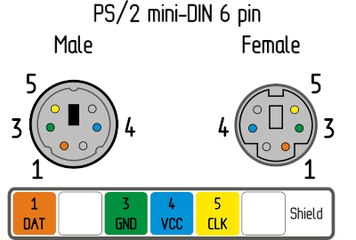
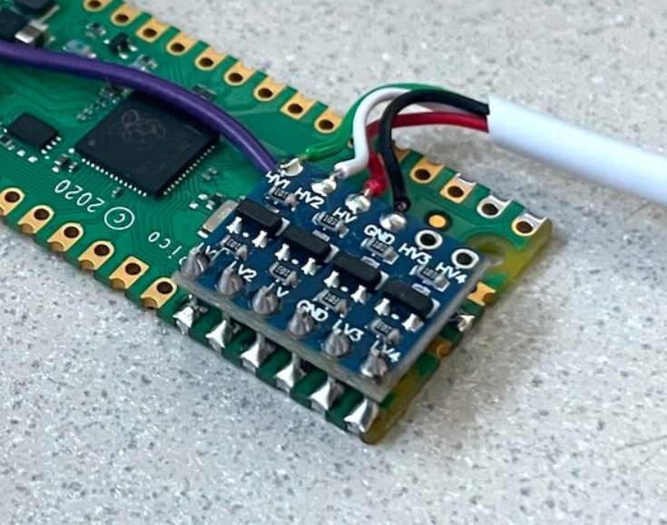

!!! note "Pico requirements"
    [Raspberri Pi Pico](https://www.raspberrypi.com/products/raspberry-pi-pico/)
    (the first model) based on RP2040 microcontroller is required.
    Pico 2 is not supported right now.

The Pico HID Bridge is a special version of the [generic Pico HID](pico_hid.md).
It is a PS/2 keyboard and mouse emulator that connects to PiKVM via USB-A.
Unlike generic [Pico HID](pico_hid.md) and legacy [Arduino HID](arduino_hid.md),
it doesn't require SPI wiring with GPIO.

It is suitable for all devices except V4 Mini and DIY based on Zero 2 W board.

At one end it connects to USB-A on PiKVM, on the other side it has two PS/2 connectors for keyboard and mouse:

<a href="pico_hid_bridge_ps2.jpg"></a>

In addition, on PiKVM V2+, the use of Pico the HID Bridge does not exclude the use of a regular USB OTG port with Mass Storage emulation.
Thus, on V2+ you will be able to use PS/2 and USB Mass Storage at the same time, and even switch between OTG HID and [Pico HID](pico_hid.md).


-----
## Making the Bridge

* *x1* [Raspberry Pi Pico board](https://www.raspberrypi.com/products/raspberry-pi-pico/) with soldered pins.
* *x1* USB-A to Micro-USB cable.
* *x1* 3.3V/5V bi-directional logic level shifter [like this](https://learn.sparkfun.com/tutorials/bi-directional-logic-level-converter-hookup-guide/).
* *x2* PS/2 cable with male connector.
* *x2* Small dip jumpers.

Make sure that the level shifter pinout matches the scheme, and connect everything according to the [Pico pinout](https://pico.pinout.xyz).

```
                                   >>> To the PC <<<
				 _________________
				|                 |
Pico GP11 ______| LV1         HV1 |______ PS/2 keyboard data
Pico GP12 ______| LV2         HV2 |______ PS/2 keyboard clock
Pico GP13 ______| LV          HV  |______ PS/2 5V
Pico  GND ______| GND         GND |______ PS/2 GND
Pico GP14 ______| LV3         HV3 |______ PS/2 mouse data
Pico GP15 ______| LV4         HV4 |______ PS/2 mouse clock
				|_________________|

```

You can take the 5V power line from one of the PS/2, for example from the keyboard,
or from both at once, but use a multimeter to make sure that both PS/2 female 
connectors have the same line.



PS/2 female socket pinout on the motherboard is the same for the keyboard and the mouse.
A purple socket usually corresponds to the keyboard, and a green one to the mouse.
If your motherboard only has one port, it's probably universal and can be used for both
the keyboard and the mouse. Most likely, it will be painted both colors.

Use a multimeter to determine the purpose of the wires in your PS/2 cables.

A good idea is to mount the level shifter on top of the Pico, as in this photo:



Finally, install DIP jumpers to soldered pins of the Pico to enable PS/2 and Bridge modes:

* `GP2 <-> GND`
* `GP5 <-> GND`

Like this:

<a href="pico_hid_bridge_ps2_jumpers.jpg"></a>


-----
## PS/2 passthrough

This optional addon allows to use a real PS/2 keyboard and mouse together with emulated by PiKVM.

These two ports work as PS/2 inputs and are passed through to the PS/2 output ports.

```
                                   >>> To the REAL keyboard and mouse <<<
				 _________________
				|                 |
Pico GP26 ______| LV1         HV1 |______ PS/2 keyboard data
Pico GP27 ______| LV2         HV2 |______ PS/2 keyboard clock
Pico GP13  _____| LV          HV  |______ PS/2 5V
Pico  GND ______| GND         GND |______ PS/2 GND
Pico GP16 ______| LV3         HV3 |______ PS/2 mouse data
Pico GP17 ______| LV4         HV4 |______ PS/2 mouse clock
				|_________________|

```


-----
## Flashing the firmware

{!_pico_hid_flashing.md!}


-----
## The final steps

Connect the Pico HID to the target host using PS/2 cable and USB to USB-A port on PiKVM.

Add following lines to the PiKVM configuration and reboot it:

* `/etc/kvmd/override.yaml`:
    ```yaml
    kvmd:
        hid:
            type: serial
            device: /dev/kvmd-hid-bridge
            reset_pin: -1
    ```
