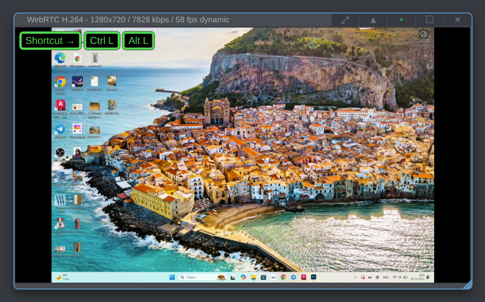
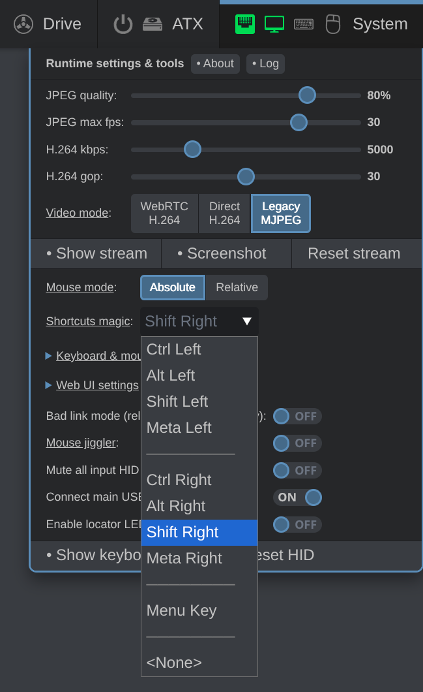

Operating systems deal with modifier keys differently, so it's difficult to get the same user experience across all possible target hosts. This is why PiKVM uses a keyboard shortcuts system built around these three concepts:

- **Magic key**. A special-purpose key, typically the one you use the least when you connect to a remote target host. A good example is the right `Shift` key for right-handed people.
-  **Modifier keys**. Typically, it's e.g. `Ctrl`, `Alt`, `Cmd`, etc.
-  **Non-modifier keys**. These are all the other keys on your keyboard: alphanumeric keys, function keys, `Backspace`, `Del`, `Esc`, and `Enter`.

## Sending a shortcut

When you press a magic key, the web UI starts accumulating a sequence of modifier keys you press, for example, `Ctrl Left` and `Alt Left` in `Ctrl+Alt+Del`, and displays a guiding overlay:

As soon as you press one non-modifier key, the web UI stop accumulating keys and sends the entire sequence of the keys you pressed to the target host system.

Let's send a `Ctrl+Alt+Del` shortcut to the target host running Windows. Here is the correct sequence of actions:

1. Press and release the magic key.
2. Press and release `Ctrl`.
3. Press and release `Alt`.
4. Press and release `Del`.

Here is another example. Let's send a shortcut to a host system running macOS to open the Force Quit Applications window:

1. Press and release the magic key.
2. Press and release `Command`.
3. Press and release `Option`.
4. Press and release `Esc`.

## Using multiple non-modifier keys in one shortcut

In some cases you may need to press a non-modifier key two or more times. A common example is cycling through the list of opened windows using `Alt+Tab`. To achieve that, use the alternative behavior where non-modifier keys are continuously sent as you press them:

1. Press and _hold_ the magic key.
2. Press and release `Alt`.
3. Press and release `Tab` ← at this point the target host system will display a list of windows to choose from.
4. Continue pressing and releasing `Tab` until you get to the right window.
5. _Release the magic key_.

## Overriding the desktop environment

Some desktop environments claim modifier keys for themselves, so those keys can't be used in a shortcut. For example, if you are trying to open the Start menu on a host Windows-based system using the `Win` key and you do it from GNOME on Linux, PiKVM web UI will not register the `Win` key press. Instead, your local GNOME environment will show an overview of locally opened windows instead.

To override that, you can use the alternative behavior outlined above. Let's say you need to minimize all windows and show the desktop on a target host running Windows. Do this:

1. Press and _hold_ the magic key.
2. Press and release `Win`.
3. Press and release `D`.
4. Release the magic key.

PiKVM will send `Win+D` to the target host system which will minimize all windows.

## Using shortcuts with just the modifier keys

Some shortcuts don't use non-modifier keys at all. For example, `Ctrl+Shift` and `Alt+Shift` commonly change the keyboard layout, and `Win` opens the Start menu on Windows. This means you need to tell the web UI to stop accumulating modifiers and send what you have already pressed to the target host. To do that, simply press the magic key twice without a pause.

For example, to open the Start menu on Windows:

1. Press and hold the magic key.
2. Press and release `Win`.
3. Release the magic key.
4. Quickly press and release the magic key twice.

PiKVM will send `Win` to the target host system which open the Start menu.

## Setting up a magic key

You can define which key to use as the magic key. Follow these steps:

1. In the web UI, open the **System** menu.

2. Click on the drop-down list next to **Shortcuts magic**.

3. Select the key the you will use as the magic key.

{ width="250" }

PiKVM defaults to `Ctrl Right` on all major desktop systems, but the list of available keys is platform-specific:

- **Windows**: `Ctrl`, `Alt`, `Shift` and `Menu`.
- **macOS**: `Ctrl`, `Option`, `Shift` and `Menu`.
- **Linux**: `Ctrl`, `Alt`, `Shift`, `Meta` and `Menu`.
