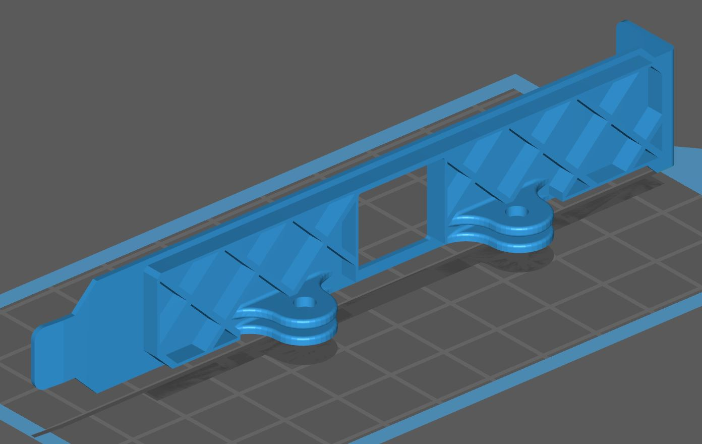
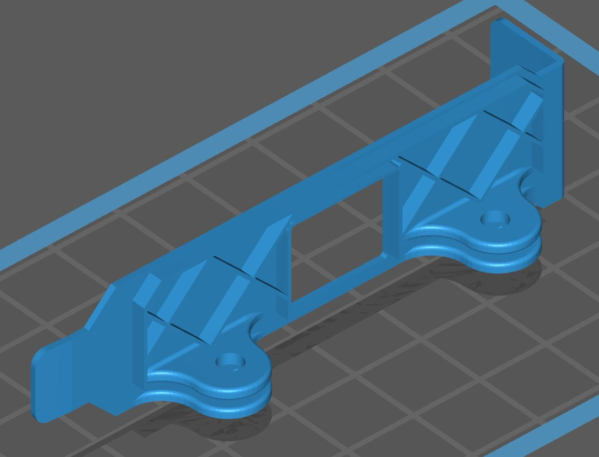

# PiKVM v3 ATX mounting brackets for 3D printing

A good way to mount an ATX adapter in a computer case is to place it in a PCI slot.
Here you can get drawings of PCI brackets for 3D printing.

| Variant | Description |
|---------|-------------|
|  | [This is a standard bracket of common length](pci_long.stl), which will fit most personal computers |
|  | [The short bracket (low profile)](pci_short.stl), for compact PCs or rack servers |
