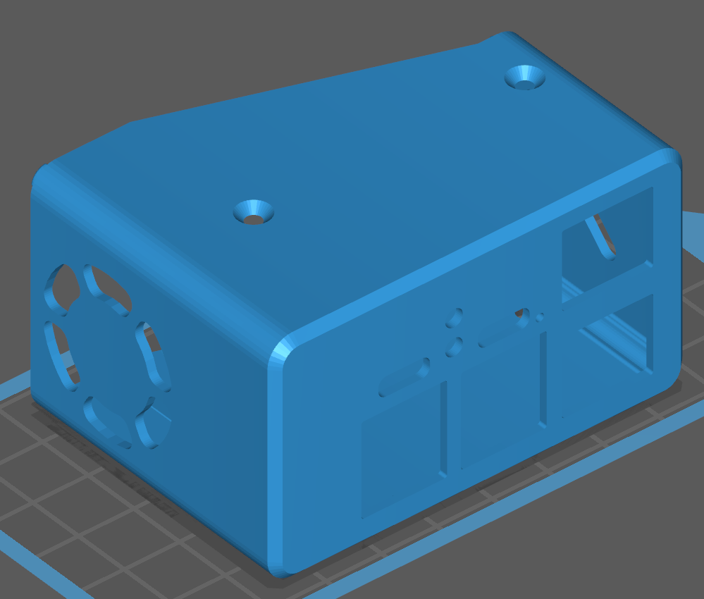
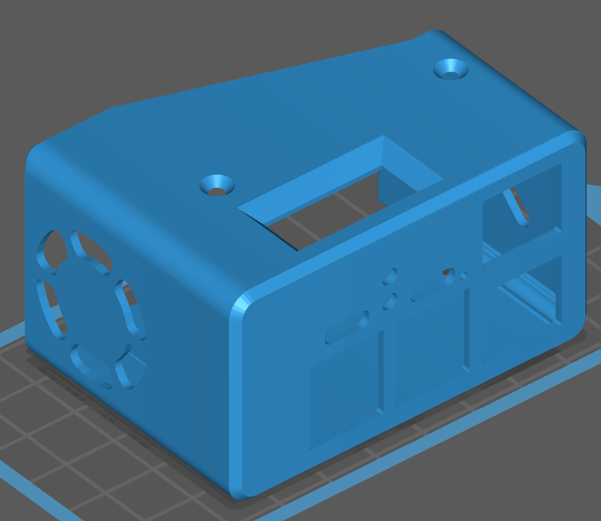
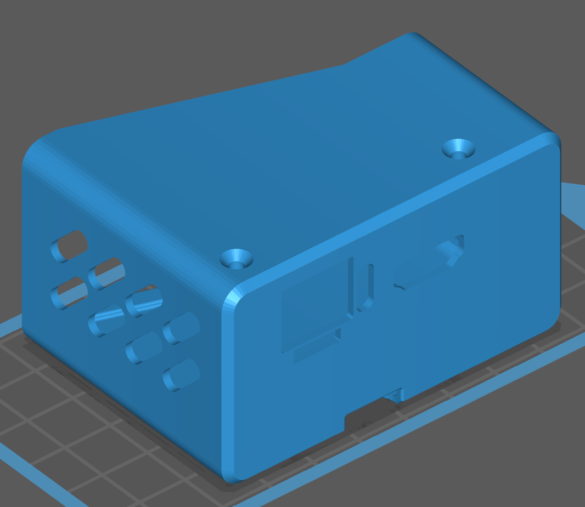
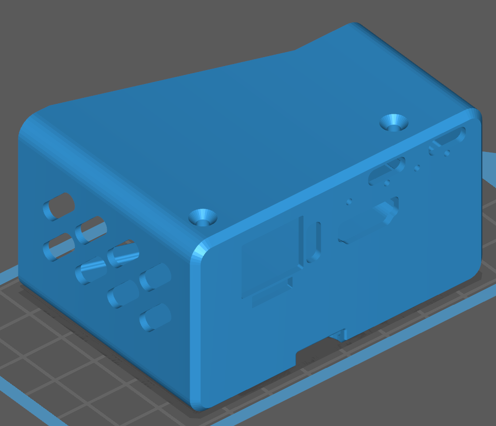
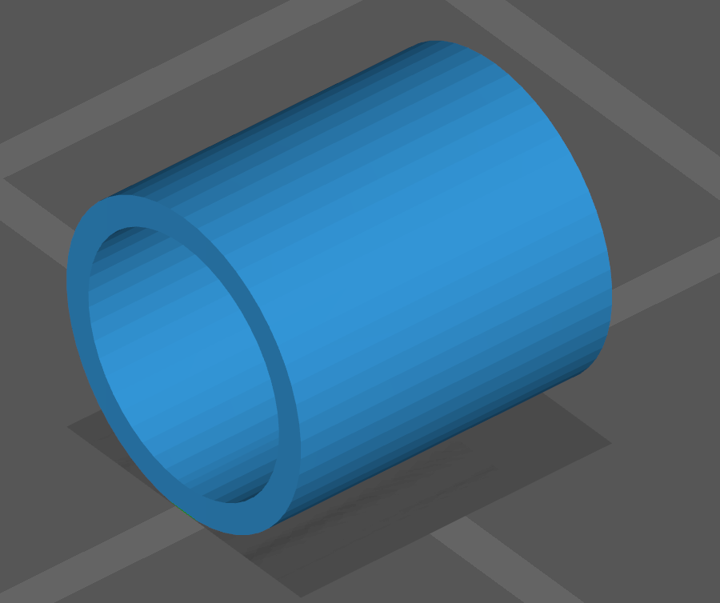
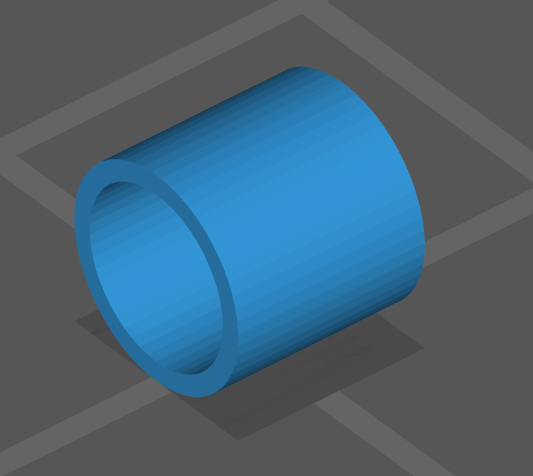
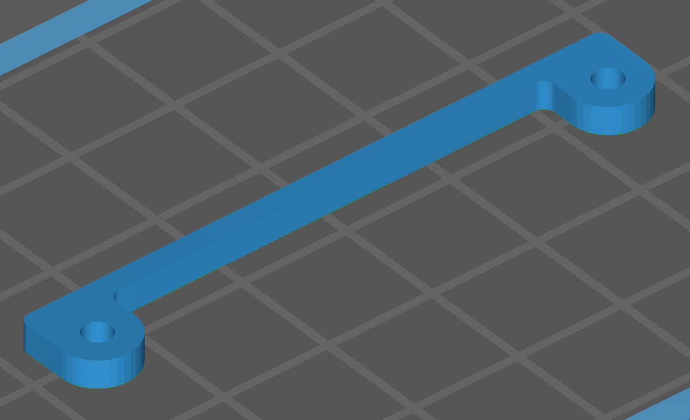

# 3D printable case for PiKVM v3.2 HAT

When printing the case, you can choose the following options:

* The presence or absence of an OLED screen (used to display the IP address and other information).
* The presence or absence of holes for the AUM v3.3 (Advanced USB Module, most likely you don't have it).

Also take a look at the [PCI bracket for ATX adapter board](../atx).

## Buy options

* [Small 5v fan](https://www.amazon.com/GeeekPi-Raspberry-30x30x7mm-Brushless-Retroflag/dp/B07C9C99RM) **strongly recommended** to avoid overheating in the case.
* [I2C OLED screen](https://www.amazon.com/Pieces-Display-Module-SSD1306-Screen/dp/B08TLXYKS6).

## Building

## Parts

### The front part

**Choose ONE of them.**

| Variant | Description |
|---------|-------------|
|  | [The front part](case_a_no_oled.stl) of the case **WITHOUT a hole** for the OLED |
|  | [The front part](case_a.stl) of the case with a hole **for installing the OLED** |

### The back part

**Choose ONE of them.**

| Variant | Description |
|---------|-------------|
|  | [The back part](case_b_no_aum.stl) of the case **WITHOUT AUM holes** |
|  | [The back part](case_b.stl) of the case **for installing the AUM** |

### Spacers

| Type | Description |
|------|-------------|
|  | [6.2mm spacer](spacer_6.2mm.stl), required **TWO** pieces |
|  | [2mm spacer](spacer_2mm.stl) required **TWO without AUM** or **ONE for AUM** |
|  | [1mm spacer](spacer_1mm.stl) required **ONE for AUM only** |
|  | [Low spacer](low_spacer.stl) required **ONE** |
