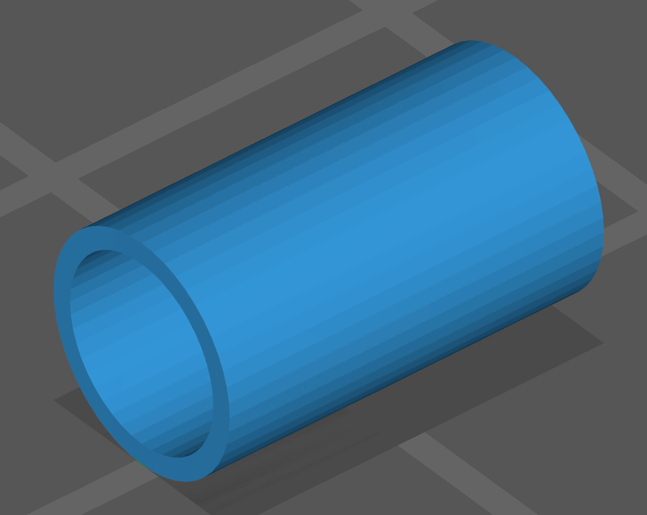
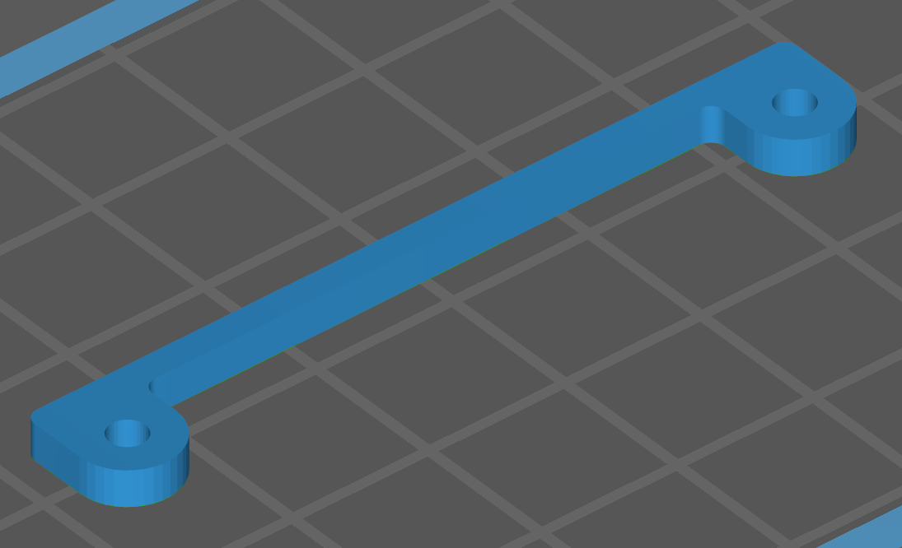
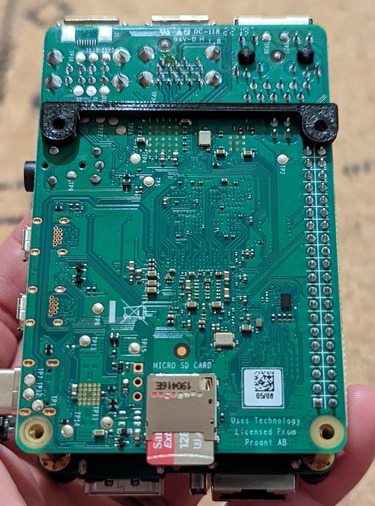

# PiKVM v3.3 Plastic Case for 3D printing

When printing the case, you can choose the following options:

* The presence or absence of an OLED screen (used to display the IP address and other information).

Also take a look at the [PCI bracket for ATX adapter board](../atx) and [great unofficial case mod for Noctua fans](https://www.printables.com/model/218724-pikvm-case-mod-for-silent-noctua-40mm-fan)

## Buy options

* [Small 5v fan](https://www.amazon.com/GeeekPi-Raspberry-30x30x7mm-Brushless-Retroflag/dp/B07C9C99RM) **strongly recommended** to avoid overheating in the case.
* [I2C OLED screen](https://www.amazon.com/Pieces-Display-Module-SSD1306-Screen/dp/B08TLXYKS6).

## Parts

### The front part

**Choose ONE of them.**

| Variant | Description |
|---------|-------------|
|  | [The front part](case_a_no_oled.stl) of the case **WITHOUT a hole** for the OLED |
|  | [The front part](case_a.stl) of the case with a hole **for installing the OLED** |

### The back part

| Variant | Description |
|---------|-------------|
|  | [The back part](case_b.stl) of the case |

### Spacers

| Type | Description |
|------|-------------|
|  | [6.2mm spacer](spacer_6.2mm.stl), required **TWO** pieces |
|  | [1mm spacer](spacer_1mm.stl) required **TWO** pieces |
|  | [Low spacer](low_spacer.stl) required **ONE** piece |

### Fasteners (screws)

The official PiKVM v3.3 hat came with eight M2.5 x 12mm screws for countersunk holes. You can use these with the case.

## Assembly

Note: the spacers slide over the (short) hexagonal standoffs included in the official v3.3 hat:

To assemble:

1. Ensure the hexagonal standoffs are all attached to the top side of the v3.3 hat. Tip: if you need to remove the case in the future, you don't want these hexagonal standoffs spinning while you loosen the screws - be sure to tighten the standoffs _more_ than you tighten the screws in step 17. You could even use some thread-locking fluid on the standoffs now.
2. Ensure the bottom side of the Pi has no screws present
3. Ensure you have eight M2.5 x 12mm screws free for later use.
4. Slide the two short spacers over the two standoffs on the side of the hat which contains the ATX, keyboard/mouse emulation, and HDMI connector. See Figure 1.

| Figure 1: 1mm spacer placement                                                  |
|---------------------------------------------------------------------------------|
|  |

5. Slide the two long spacers over the two standoffs on the opposite side of the HAT - near the LEDs, power input, and console-over-ethernet connector. See Figure 2.

| Figure 2: Placement of 6.2mm spacers.                                    |
|--------------------------------------------------------------------------|
|  |

6. Attach the fan to the two headers labeled "fan" located next to the CSI ribbon cable and large capacitor.
7. Slide the fan into the slot on the front part of the case. The fan should move fan from outside to inside the case. For the fan in Figure 3, this means mounting with the label facing the inside of the case and the black lead connected to the negative (-) terminal on the PCB. Ensure the fan leads don't bind as you slide the fan in. See Figure 3.

| Figure 3: Fan placement                                          |
|------------------------------------------------------------------|
|  |

8. If you still have foam covering the GPI pins on the top side of the hat, now is a good time to remove them. Leaving this in place will restrict airflow. 
9. Flip the PiKVM over and set the low spacer bracket you printed on the bottomside of the Pi with the straight edge facing away from the SD card. See Figure 4.

| Figure 4: Low spacer placement                                               |
|------------------------------------------------------------------------------|
|  |

10. While allowing the low spacer to continue resting on the Pi, gently slide the PiKVM into the front part of the case. Ensure the spacers clear the top of the case (likely facing away from you) and that the fan leads don't bind on anything. The low spacer should remain mostly in place thanks to the solder joints on the Pi.
11. If successful, the low spacer should be fairly close to aligning with the holes in the case. Use a small screwdriver or tweezers to fix the alignment. You may need to insert the screwdriver into the case along the inner face to push the low spacer towards the holes. See video for reference.
12. Insert 4 screws into the holes of the case and tighten enough so things don't fall out, but leave plenty of slack - you might need to push the electronics around slightly to align the holes in the next steps.
13. Now is a good time to power on the PiKVM and ensure the fan spins. It should come on automatically unless you explicitly disabled it yourself.
14. Slide the back part over the PiKVM and align with the front part you assembled in previous steps.
15. Ensure the case seats properly around the connectors.
16. Insert the remaining four screws into the case and tighten. If the holes don't line up, you can hold the case while pushing on some of the PiKVM connectors to shift the electronics inside the case.
17. Tighten all screws.
18. Tip your bartender.
