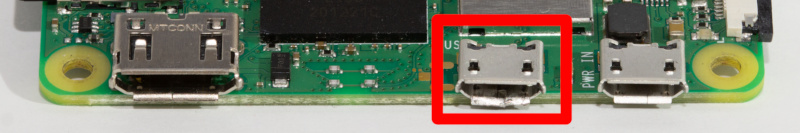
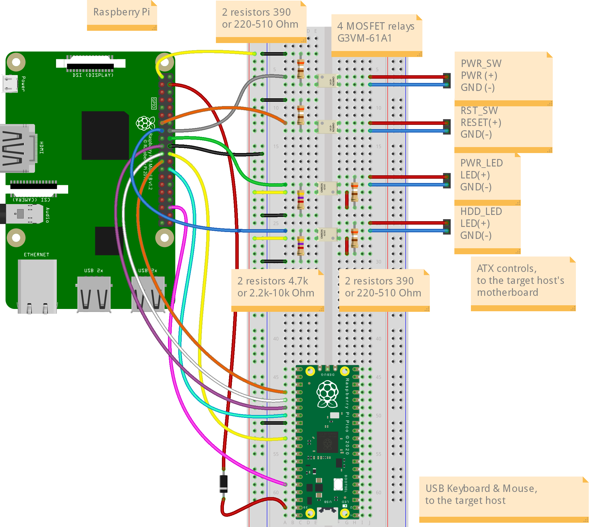
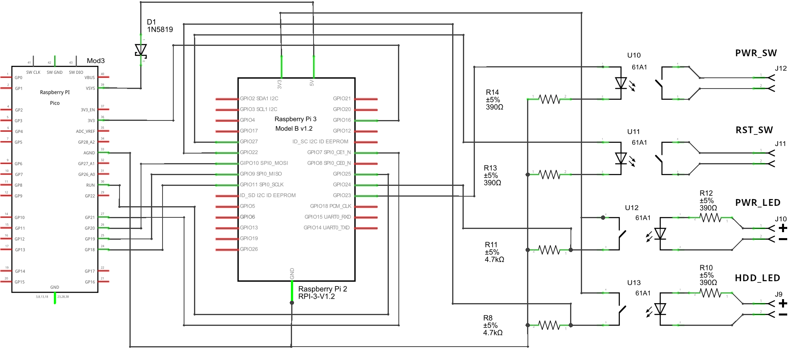
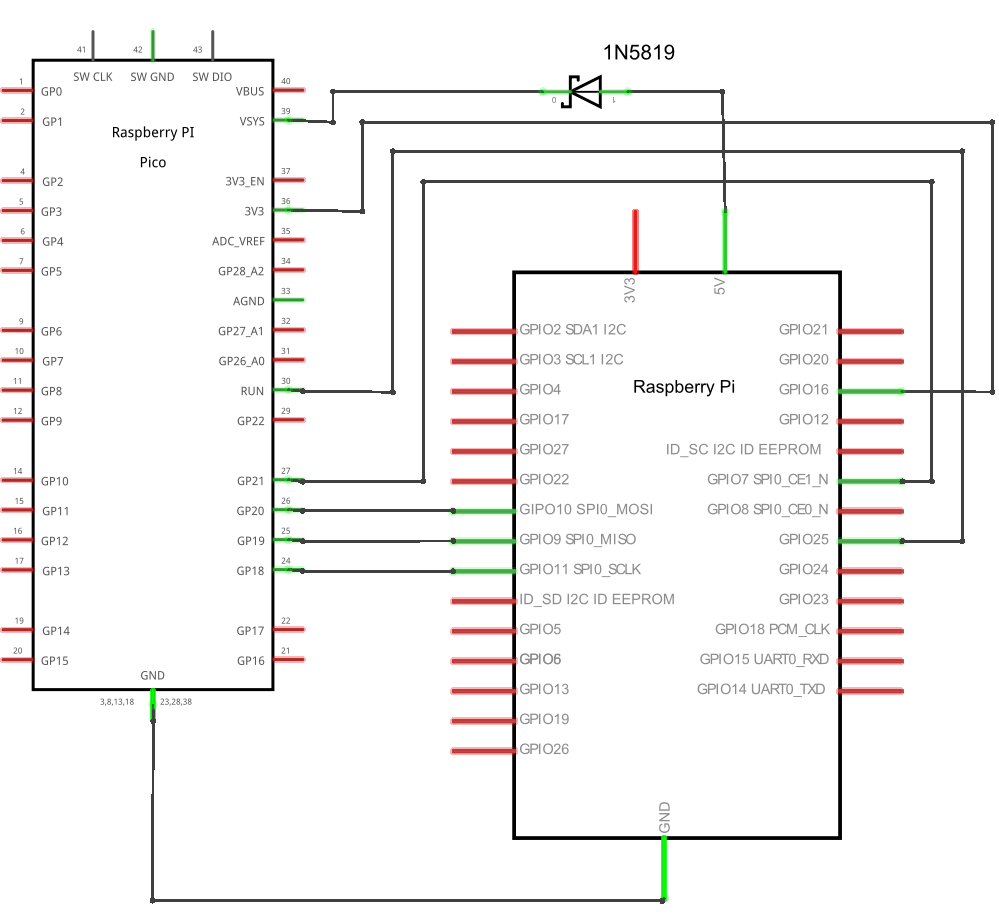

# DIY PiKVM V1 Instructions

!!! tip "So many choices!"
    There are many different options with sub-items, so you can choose what will suit you. 
    However, we marked the recommended way by sign **`✮ ✮ ✮`**

-----
## Required parts

1. **MicroSD card minimum 8Gb class 10.**

2. **[Official USB-Micro Power Supply](https://www.amazon.com/Capture-Streaming-Broadcasting-Conference-Teaching/dp/B09FLN63B3)**.

3. **Raspberry Pi board:**
    * **[✮ ✮ ✮ Raspberry Pi 3](https://www.raspberrypi.com/products/raspberry-pi-3-model-b/)**. 
    * ... or [Raspberry Pi 2](https://www.raspberrypi.com/products/raspberry-pi-3-model-b/). 
      *Does not support H.264 even with HDMI-CSI bridge.*
    * ... or [Raspberry Pi Zero 2 W](https://www.raspberrypi.com/products/raspberry-pi-zero-2-w/). 
      *Compact and cheap, but not so reliable solution because of lack of the wired Ethernet.
      Note that the better way to use Pi Zero is making [PiKVM V2](v2.md) - it supports more USB features.*

4. **Video capture device:**
    * **[✮ ✮ ✮ HDMI-CSI bridge based on TC358743 chip](https://www.amazon.de/Waveshare-Raspberry-Supports-Backward-Compatible/dp/B092HVP926/)**. 
      *Supports H.264 video encoding on Raspberry Pi 3, automatic resolution selection and the lowest possible latency.*
    * ... or [HDMI-USB dongle](https://www.amazon.com/Capture-Streaming-Broadcasting-Conference-Teaching/dp/B09FLN63B3). 
      *Only heavy MJPEG video, no resolution detection, big latency compared to HDMI-CSI.
      Some users report hardware problems: the dongle may not work in the BIOS or simply stop working after a while.
      It's a black box, and no one knows what's inside it. If you have problems with it, it will not be possible to fix them.*

5. **The Pico HID Keyboard & mouse emulator:**

    {!_pico_hid_parts.md!}

6. **Board-specific parts:**

    !!! success "✮ ✮ ✮ "Nothing special for Raspberry Pi 2 or 3"

    ??? note "Raspberry Pi Zero 2 W"

        ??? note "✮ ✮ ✮ HDMI-CSI bridge"

            * *x1* [Raspberry Pi Zero Camera Cable](https://www.amazon.com/Arducam-Raspberry-Camera-Ribbon-Extension/dp/B085RW9K13). *Not compatible with Auvidea B101*.

        ??? note "... or HDMI-USB dongle"

            * *x1* USB-A socket to USB-Micro adapter (female-male).

7. **Optional features:**

    ??? success "✮ ✮ ✮ ATX controller to manage the target host's power"

        {!_diy_parts_atx.md!}

    ??? note "PS/2 Keyboard & mouse"

        The use of PS/2 is intended for advanced users. Check out the additional list of details in advance
        in the [corresponding paragraph](pico_hid.md#ps2-keyboard-mouse) of the Pico HID manual.

    ??? note "VGA video capture"

        If you want to capture VGA from your server instead of HDMI,
        buy the [VGA-to-HDMI converter](https://aliexpress.com/item/3256801728005613.html).
        Some converters have issues with not supporting all resolutions and refresh rates.

-----
## Setting up the hardware

1. **Video capture device:**

    ??? success "✮ ✮ ✮ HDMI-CSI bridge"

        {!_diy_setup_video_csi.md!}

    ??? note "... or HDMI-USB dongle"

        ??? note "Raspberry Pi 2 & 3"

            {!_diy_setup_video_usb.md!}

        ??? note "Raspberry Pi Zero 2 W"

            Connect the USB dongle to USB-to-Micro adapter, and connect it to the USB port marked as `USB` (not `PWR`)
            on the Pi Zero board:

            

2. **The Pico HID and ATX controller:**

    Connect all the parts according to this scheme:

    ??? success "✮ ✮ ✮ With ATX controller"

        ??? example "Simple wiring diagram"
            

        ??? example "Electrical schematic diagram for advanced users"
            

    ??? note "... or without ATX controller"

        ??? example "Simple wiring diagram"
            

        ??? example "Electrical schematic diagram for advanced users"
            

3. **[Flash firmware to the Pico HID.](pico_hid.md)**

-----
## Wiring with the target host

!!! warning "Under construction"

-----
## First launch and usage

{!_diy_first_launch.md!}
