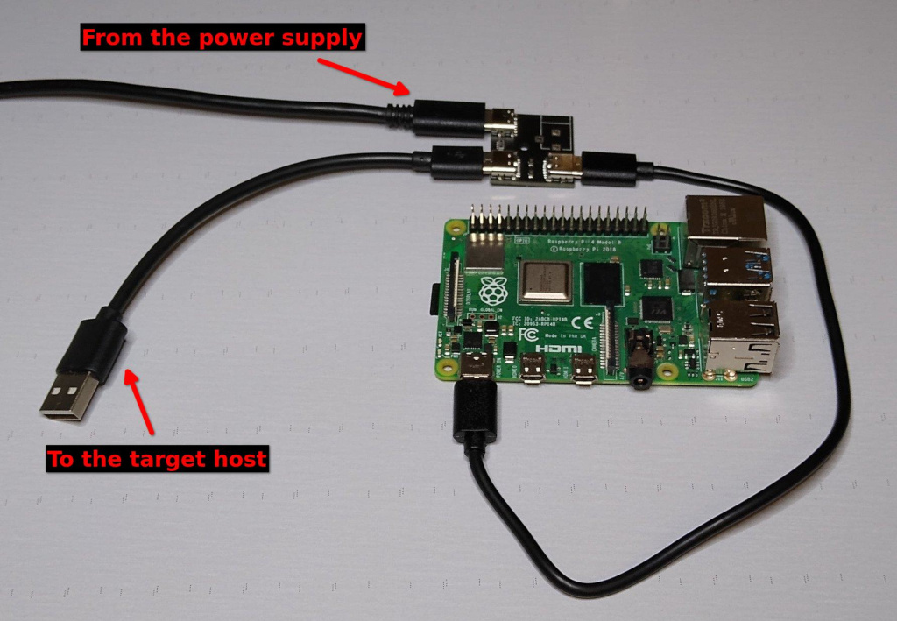
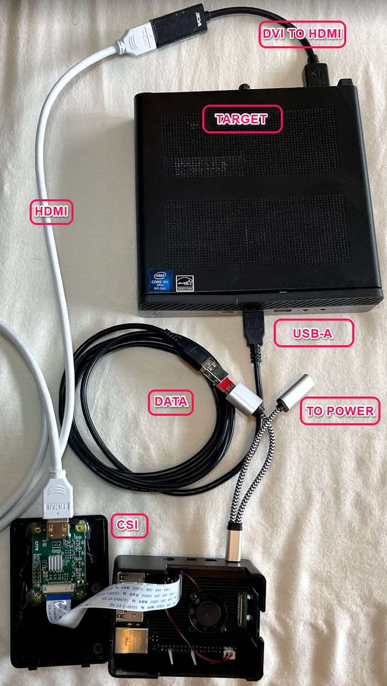
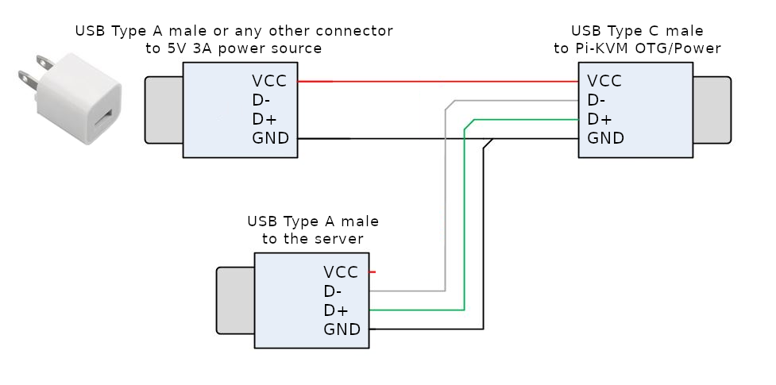
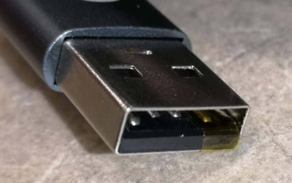
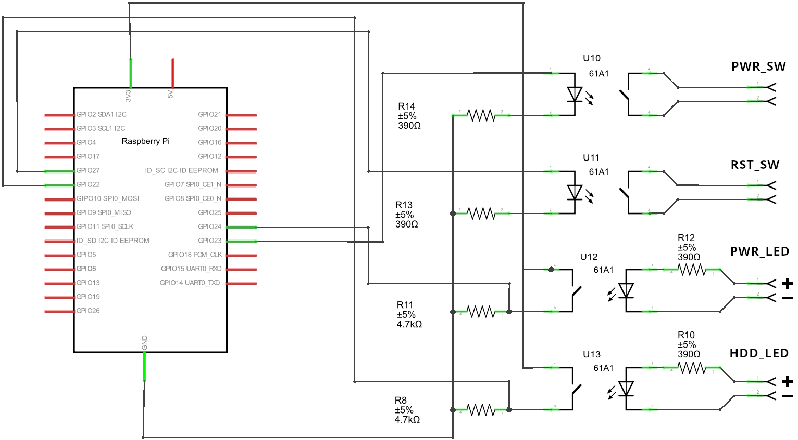

# DIY PiKVM V2 quickstart guide

!!! tip "So many choices!"
    There are many different options with sub-items, so you can choose what will suit you.<br>
    However, we marked the recommended way by sign **`✮ ✮ ✮`**

-----
## Required parts

1. **MicroSD card minimum 16Gb class 10.**

2. **Raspberry Pi board:**
    * **[✮ ✮ ✮ Raspberry Pi 4 2Gb](https://www.raspberrypi.com/products/raspberry-pi-4-model-b/)**.<br>
      *It makes no sense to buy a Pi 4 with more memory than 2Gb, since PiKVM software uses very few resources.*
    * ... or [Raspberry Pi Zero 2 W](https://www.raspberrypi.com/products/raspberry-pi-zero-2-w/).<br>
      *Compact and cheap, but not so reliable solution because of lack of the wired Ethernet.*
    * *... Raspberry Pi 5 is not supported right now. It doesn't have GPU video encoders, therefore,
      there is no point in using it for PiKVM, it will not give any performance boost for this case.
      The Pi 5 is a great device, just not suitable for PiKVM.*

3. **Video capture device:**
    * **[✮ ✮ ✮ HDMI-CSI bridge based on TC358743 chip](https://www.amazon.com/waveshare-HDMI-CSI-Camera-Adapter/dp/B08TR7R6RL).<br>
      *Supports H.264 video encoding, automatic resolution selection and the lowest possible latency.*
    * ... or [HDMI-USB dongle](https://www.amazon.com/Capture-Streaming-Broadcasting-Conference-Teaching/dp/B09FLN63B3) (not available for Pi Zero 2).<br>
      *Only heavy MJPEG video, no resolution detection, big latency compared to HDMI-CSI.
      Some users report hardware problems: the dongle may not work in the BIOS or simply stop working after a while.
      It's a black box, and no one knows what's inside it. If you have problems with it, it will not be possible to fix them.*

4. **Board-specific: Power supply, USB connectivity, etc.**

    ??? success "✮ ✮ ✮ Raspberry Pi 4"

        On a Raspberry Pi 4 only the USB-C port that receives power is capable of acting as a USB Device.
        The other USB ports are capable only of acting as USB Hosts.
        Therefore a special cable must be used on the USB power port that it can simultaneously act as USB Device
        for the target host and receive external power from an power supply.

        ??? success "✮ ✮ ✮ Variant #1: Power supply + ready-made Y-splitter module"

            * *x1* USB-C/Power Splitter Module ([US](https://www.pishop.us/product/usb-c-pwr-splitter/)/[UK](https://www.tindie.com/products/8086net/usb-cpwr-splitter)/[CA](https://www.buyapi.ca/product/usb-c-pwr-splitter/)).
            * *x1* USB-C to USB-C cable (male-male) for connecting the Raspberry Pi to the splitter.
            * *x1* USB-A to USB-C cable (male-male) for connecting the target host to the splitter.
            * *x1* [Official USB-C Power Supply](https://www.raspberrypi.com/products/type-c-power-supply/).

        ??? note "... or Variant #2: Power supply + Y-splitter based on power blocker"

            * *x1* USB-A to USB-C cable (male-male).
            * *x1* [USB splitter](https://www.amazon.com/dp/B08C5FWQND).
            * *x1* [USB Power Blocker](https://www.amazon.com/gp/product/B092MLT2J3) - Will go into the USB-A end towards the target host.
            * *x1* [Raspberry Pi Official USB-C Power Supply](https://www.raspberrypi.com/products/type-c-power-supply/).

        ??? note "... or Variant #3: Power supply + DIY Y-splitter for soldering"

            * *x1* USB-A to USB-C cable (male-male).
            * *x1* Another cable USB-A to *any* (male-*any*).
            * *x1* Any 5V 3A power supply with USB-A socket.

    ??? note "... or Raspberry Pi Zero 2 W"

        * *x1* USB-A to USB-Micro cable (male-male).
        * *x1* [Raspberry Pi Zero Camera Cable](https://www.amazon.com/Arducam-Raspberry-Camera-Ribbon-Extension/dp/B085RW9K13). *Not compatible with Auvidea B101*.
        * *x1* [Raspberry Pi Official USB-Micro Power Supply](https://www.raspberrypi.com/products/micro-usb-power-supply/).

5. **Optional features:**

    ??? success "✮ ✮ ✮ ATX controller to manage the target host's power"

        {!_diy_parts_atx.md!}

    ??? note "VGA video capture"

        If you want to capture VGA from your server instead of HDMI,
        buy the [VGA-to-HDMI converter](https://aliexpress.com/item/3256801728005613.html).
        Some converters have issues with not supporting all resolutions and refresh rates.

*Kit parts suitable for assembly are also on [sale in Poland](https://3mdeb.com/shop/open-source-hardware/pikvm/).*


-----
## Setting up the hardware

1. **Video capture device:**

    ??? success "✮ ✮ ✮ HDMI-CSI bridge"

        {!_diy_setup_video_csi.md!}

    ??? note "... or HDMI-USB dongle"

        {!_diy_setup_video_usb.md!}

2. **USB cable and power supply**

    ??? success "✮ ✮ ✮ Raspberry Pi 4"

        ??? success "✮ ✮ ✮ Variant #1: Power supply + ready-made Y-splitter module"

            

        ??? note "... or Variant #2: Power supply + Y-splitter based on power blocker"

            

        ??? note "... or Variant #3: Power supply + DIY Y-splitter for soldering"

            It is assumed that if you have followed this path, you know how to handle a soldering iron and a multimeter.

            The Y-splitter can be soldered from two suitable USB cables. Check the attached diagram.
            The appropriate USB pinout(s) can easily be found on Google.

            Please note that if you make a Y-cable from two no-name cables, the colors of the wires may not match those shown.
            Use a multimeter to make sure the connections are correct.

            

            **Video How-To: [Making a USB Y-splitter cable](https://www.youtube.com/watch?v=uLuBuQUF61o)**

    ??? note "... or Raspberry Pi Zero 2 W"

        This board has two USB micro connectors: one for power supply (marked as `PWR`) and the second for emulating
        a USB gadget (marked as `USB`). Both connectors have a common power line, so to prevent Raspberry power from entering
        the USB port of the target host, it is required to make a special USB A-to-Micro cable without power line.

        One way is to physically cut the power wire inside the USB cable.

        An easier way is to stick a piece of duct tape, as shown in this picture:

        

        Connect the power supply to the `PWR`, and your magic cable to the `USB`. The magic cable will be used
        to connect the device to the target host.

3. **✮ ✮ ✮ Optional feature: ATX controller**

    Connect all the parts according to this scheme:

    ??? example "Simple wiring diagram"
        

    ??? example "Electrical schematic diagram for advanced users"
        

4. **[Flash the memory card with PiKVM OS](https://docs.pikvm.org/flashing_os){target=_blank}** and insert it to Raspberry Pi.


-----
## Wiring

!!! warning
	Double check that the circuit is assembled correctly to avoid any damage of the hardware.

PiKVM V2 requires several items available separately:

- Ethernet cable **(Raspberry Pi 4 only)**
- HDMI cable

Let's connect all the wires before you power up the device.

1. Connect the HDMI video capture device to the video output port on the target host.

2. Using the Y-cable, connect the Pi's OTG port to the USB on the target host.

3. **Raspberry Pi 4**: connect **Ethernet** to the network, e.g., to the WiFI router.

4. ??? example "Connect the ATX controller if you built it"

        {!_diy_wiring_atx.md!}


-----
## Power up

If everything is assembled correctly, attach the power supply to the Raspberry Pi.

After turning on the power, PiKVM OS generates unique SSH keys and certificates and performs all necessary operations on the memory card. It takes a few minutes.

**Do not turn off the device until it's fully booted for the first time.**


-----
## Configure the display

The operating system on your remote computer will treat PiKVM as an additional display and use it in the Extend mode by default. That's why you will see an empty desktop when you first connect.

To avoid that, go to the display settings in your remote computer's operating system and enable the mirror mode for the external screen that you operating system identifies as PiKVM. Refer to your operating system's documentation on that.


-----
## Access PiKVM

You need to know PiKVM's IP address in the network to be able to access it. Unlike V3 and V4, PiKVM V2 doesn't have an OLED to display the IP address it receives automatically. You need to discover it manually. There are several ways to do that.

* **Common way:** Open the web interface of your router and find the list of issued IP addresses there.
* **Linux-only:** Use the `arp-scan --localnet` command.
* **Linux, MacOS, Windows:** Download and run [Angry IP Scanner](https://angryip.org).
* **Windows PowerShell:** Use the `arp -a` command.

Let's assume that PiKVM has received the address `192.168.0.26` and has also been assigned a hostname `pikvm`.

Type the URL in the browser's address bar and press **Enter**: https://192.168.0.26/ or https://pikvm/.

{ width="450" }

Submit the default credentials and click **Login**:

- Username: `admin`
- Password: `admin`
- 2FA Code: disabled by default, skip this field

You will see the initial dashboard screen of the PiKVM where you can access the remote host, connect to the PiKVM command line, or log out:

{ width="450" }

### Change the default passwords

For security's sake, it's best to change the default passwords immediately after running PiKVM for the first time.

!!! danger "Passwords are important!"
    Please ensure that you change **both** passwords: for Web UI access and for the Linux superuser (root).

To do that:

1. On the initial dashboard screen, click the **Terminal** button to open the web terminal. You will see this command line interface:

    { width="450" }

2. Gain Linux superuser privileges:

    ```console
    $ su -
    ```

    When prompted for password, use `root`.

3. Run `rw` to change the access to the SD card to the write mode:

    ```console
    [root@pikvm ~]# rw
    ```

4. Change the password for the Linux superuser:

    ```console
    [root@pikvm ~]# passwd root
    ```

    Submit the new password, retype it the second time to confirm, press **Enter**, and you should see this:

    ```console
    passwd: password updated successfully
    ```

5. Change the password for web access:

    ```console
    [root@pikvm ~]# kvmd-htpasswd set admin
    ```

    Submit the new password, retype it the second time to confirm, and press **Enter**.

6. Run `ro` to change the access to the SD card back to the read-only mode:

    ```console
    [root@pikvm ~]# ro
    ```

7. Press **Ctrl+D** or type "exit" and press **Enter** to drop the root privileges.

8. Go back one page in the browser. You should be back to the initial dashboard screen.

### Access the remote system

1. On the initial dashboard screen, click the **KVM** button to access the remote host.

2. You should now see the host system's display and interact with it remotely using a keyboard and a mouse.

    { width="450" }


-----
## Important next steps

- **We strongly recommend to update the PiKVM OS** after the first launch:

    {!_update_os.md!}

- Learn about basics of **PiKVM OS Configuration**: where to find configs, how to edit the, etc.

    {!_config.md!}

- **Get to know PiKVM Web UI**: read [this help section](webui.md) to better understand all the possibilities of the web user interface.

- **Configure the magic key**: define which key to use to start [sending shortcuts](shortcuts.md) to the target host system.

- Tune the HDMI dongle capture device if you're using it:

    ??? note "Persistent HDMI cable connection with USB dongle"

        Many USB video capture devices tell the server's video card that the HDMI cable is supposedly disconnected.
        This may lead to the fact that if you boot the server without an active stream, the server will not detect
        your capture card. This is easy to fix:

        * Switch filesystem to RW-mode:
            ```console
            [root@pikvm ~]# rw
            ```

        * Edit file `/etc/kvmd/override.yaml` and add these lines:
            ```yaml
            kvmd:
                streamer:
                    forever: true
                    cmd_append: [--slowdown]
            ```

        * Finish:
            ```console
            [root@pikvm ~]# ro
            [root@pikvm ~]# systemctl restart kvmd
            ```

        * Check that everything is working.


-----
## Further recommendations

- [Harden the remote access](auth.md) by enabling 2FA.
- Configure access to PiKVM from the Internet using [port forwarding](port_forwarding.md) or [Tailscale VPN](tailscale.md).
- [Learn](config.md) how configuration files are structured.
- Read how PiKVM is [identified](id.md) on the target host.


-----
## Known issues and limitations

* **Max resolution**.<br>PiKVM V2 with CSI bridge can only handle the maximum resolution 1920x1080@50Hz, 60Hz is not supported due hardware limitation. You can use any other resolution less than the specified one, for example 1280x720@60Hz. If you have any problems with video on CSI bridge, follow [this guide](edid.md).

* **Motherboards compatibility**.<br>There may be compatibility issues with some motherboards, such as HP or DELL. If there is no image from the BIOS, you can fine-tune the HDMI settings, but it is possible that the mass storage devices will not be available in the BIOS. In the latter case, [USB dynamic configuration](usb.md) will solve the problem.


-----
## Basic troubleshooting

{!_basic_troubleshooting.md!}


-----
## Getting user support

If something doesn't work, check out our [FAQ](faq.md). Otherwise, head straight to our [Support](https://pikvm.org/support/).
