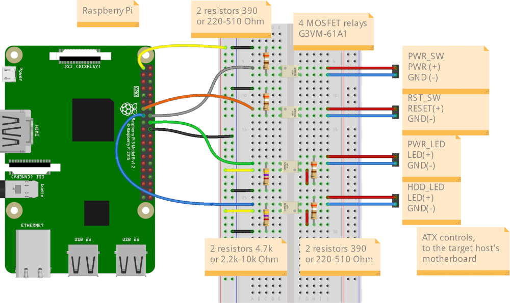
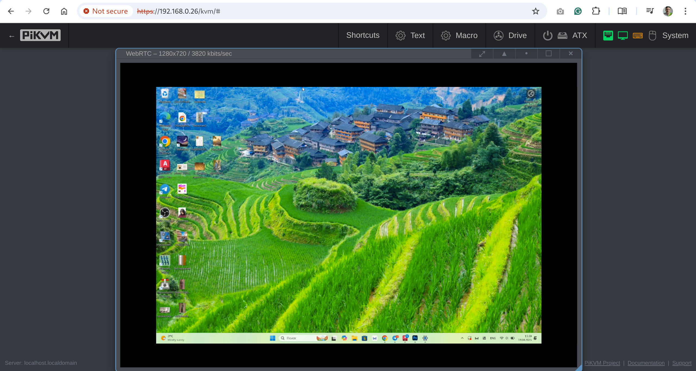

# DIY PiKVM V2 quick start guide

!!! tip "So many choices!"
    There are many different options with sub-items, so you can choose what will suit you.<br>
    However, we marked the recommended way by sign **`✮ ✮ ✮`**


-----
## Required parts

1. **MicroSD card minimum 16Gb class 10.**

2. **Raspberry Pi board:**
    * **[✮ ✮ ✮ Raspberry Pi 4 2Gb](https://www.raspberrypi.com/products/raspberry-pi-4-model-b/)**.<br>
      *It makes no sense to buy a Pi 4 with more memory than 2Gb, since PiKVM software uses very few resources.*
    * ... or [Raspberry Pi Zero 2 W](https://www.raspberrypi.com/products/raspberry-pi-zero-2-w/).<br>
      *Compact and cheap, but not so reliable solution because of lack of the wired Ethernet.*
    * *... Raspberry Pi 5 is not supported right now. It doesn't have GPU video encoders, therefore,
      there is no point in using it for PiKVM, it will not give any performance boost for this case.
      The Pi 5 is a great device, just not suitable for PiKVM.*

3. **Video capture device:**
    * **[✮ ✮ ✮ HDMI-CSI bridge based on TC358743 chip](https://www.amazon.com/waveshare-HDMI-CSI-Camera-Adapter/dp/B08TR7R6RL).<br>
      *Supports H.264 video encoding, automatic resolution selection and the lowest possible latency.*
    * ... or [HDMI-USB dongle](https://www.amazon.com/Capture-Streaming-Broadcasting-Conference-Teaching/dp/B09FLN63B3) (not available for Pi Zero 2).<br>
      *Only heavy MJPEG video, no resolution detection, big latency compared to HDMI-CSI.
      Some users report hardware problems: the dongle may not work in the BIOS or simply stop working after a while.
      It's a black box, and no one knows what's inside it. If you have problems with it, it will not be possible to fix them.*

4. **Board-specific: Power supply, USB connectivity, etc.**

    ??? success "✮ ✮ ✮ Raspberry Pi 4"

        On a Raspberry Pi 4 only the USB-C port that receives power is capable of acting as a USB Device.
        The other USB ports are capable only of acting as USB Hosts.
        Therefore a special cable must be used on the USB power port that it can simultanously act as USB Device
        for the target host and receive external power from an power supply.

        ??? success "✮ ✮ ✮ Variant #1: Power supply + ready-made Y-splitter module"

            * *x1* USB-C/Power Splitter Module ([US](https://www.pishop.us/product/usb-c-pwr-splitter/)/[UK](https://www.tindie.com/products/8086net/usb-cpwr-splitter)/[CA](https://www.buyapi.ca/product/usb-c-pwr-splitter/)).
            * *x1* USB-C to USB-C cable (male-male) for connecting the Raspberry Pi to the splitter.
            * *x1* USB-A to USB-C cable (male-male) for connecting the target host to the splitter.
            * *x1* [Official USB-C Power Supply](https://www.raspberrypi.com/products/type-c-power-supply/).

        ??? note "... or Variant #2: Power supply + Y-splitter based on power blocker"

            * *x1* USB-A to USB-C cable (male-male).
            * *x1* [USB splitter](https://www.amazon.com/dp/B08C5FWQND).
            * *x1* [USB Power Blocker](https://www.amazon.com/gp/product/B092MLT2J3) - Will go into the USB-A end towards the target host.
            * *x1* [Raspberry Pi Official USB-C Power Supply](https://www.raspberrypi.com/products/type-c-power-supply/).

        ??? note "... or Variant #3: Power supply + DIY Y-splitter for soldering"

            * *x1* USB-A to USB-C cable (male-male).
            * *x1* Another cable USB-A to *any* (male-*any*).
            * *x1* Any 5V 3A power supply with USB-A socket.

    ??? note "... or Raspberry Pi Zero 2 W"

        * *x1* USB-A to USB-Micro cable (male-male).
        * *x1* [Raspberry Pi Zero Camera Cable](https://www.amazon.com/Arducam-Raspberry-Camera-Ribbon-Extension/dp/B085RW9K13). *Not compatible with Auvidea B101*.
        * *x1* [Raspberry Pi Official USB-Micro Power Supply](https://www.raspberrypi.com/products/micro-usb-power-supply/).

5. **Optional features:**

    ??? success "✮ ✮ ✮ ATX controller to manage the target host's power"

        {!_diy_parts_atx.md!}

    ??? note "VGA video capture"

        If you want to capture VGA from your server instead of HDMI,
        buy the [VGA-to-HDMI converter](https://aliexpress.com/item/3256801728005613.html).
        Some converters have issues with not supporting all resolutions and refresh rates.

*Kit parts suitable for assembly are also on [sale in Poland](https://3mdeb.com/shop/open-source-hardware/pikvm/).*


-----
## Setting up the hardware

1. **Video capture device:**

    ??? success "✮ ✮ ✮ HDMI-CSI bridge"

        {!_diy_setup_video_csi.md!}

    ??? note "... or HDMI-USB dongle"

        {!_diy_setup_video_usb.md!}

2. **USB cable and power supply**

    ??? success "✮ ✮ ✮ Raspberry Pi 4"

        ??? success "✮ ✮ ✮ Variant #1: Power supply + ready-made Y-splitter module"

            

        ??? note "... or Variant #2: Power supply + Y-splitter based on power blocker"

            

        ??? note "... or Variant #3: Power supply + DIY Y-splitter for soldering"

            It is assumed that if you have followed this path, you know how to handle a soldering iron and a multimeter.

            The Y-splitter can be soldered from two suitable USB cables. Check the attached diagram.
            The appropriate USB pinout(s) can easily be found on Google.

            Please note that if you make a Y-cable from two no-name cables, the colors of the wires may not match those shown.
            Use a multimeter to make sure the connections are correct.

            

            **Video How-To: [Making a USB Y-splitter cable](https://www.youtube.com/watch?v=uLuBuQUF61o)**

    ??? note "... or Raspberry Pi Zero 2 W"

        This board has two USB micro connectors: one for power supply (marked as `PWR`) and the second for emulating
        a USB gadget (marked as `USB`). Both connectors have a common power line, so to prevent Raspberry power from entering
        the USB port of the target host, it is required to make a special USB A-to-Micro cable without power line.

        One way is to physically cut the power wire inside the USB cable.

        An easier way is to stick a piece of duct tape, as shown in this picture:

        

        Connect the power supply to the `PWR`, and your magic cable to the `USB`. The magic cable will be used
        to connect the device to the target host.

3. **✮ ✮ ✮ Optional feature: ATX controller**

    Connect all the parts according to this scheme:

    ??? example "Simple wiring diagram"
        

    ??? example "Electrical schematic diagram for advanced users"
        

4. !!! warning "Double check that the circuit is assembled correctly to avoid any damage of the hardware."

## Wiring

Both the HAT and the pre-assembled version require several items available separately:

- Ethernet cable
- Optional RJ-45 cable for ATX
- USB-C cable
- HDMI cable
- USB power adapter

Let's connect all the wires before you power up the device.

| Back side | Front side |
|-----------|------------|
|  |  |

Connect **Ethernet** (**bottom right** on the **front** side) to the network, e.g., to the WiFI router.

**HDMI input** (the **top right** on the **back** side) and **OTG** port (USB emulation) should be connected to the computer.

Optionally, the **[ATX port](atx_board.md)** can be connected to control the power. There should be no USB hub between PiKVM and the computer, as some UEFI/BIOS cannot detect them at the boot stage.

## Power up


V3 comes has a USB-C 5V power supply. Attach the appropriate connector on the **front** side (**top left**). Do **not** block the ventilation holes on the sides of the device.

After turning on the power, PiKVM OS generates unique SSH keys and certificates and performs all necessary operations on the memory card. It takes a few minutes. Do **not** turn off the device until it's fully booted for the first time. Once it's done, the PiKVM will show a greeting on the built-in display.


## Connect and set up

### Configure the display

The operating system on your remote computer will treat PiKVM as an additional display and use it in the Extend mode by default. That's why you will see an empty desktop when you first connect.

To avoid that, go to the display settings in your remote computer's operating system and enable the mirror mode for the external screen that you operating system identifies as PiKVM. Refer to your operating system's documentation on that.

### Access PiKVM

By default, PiKVM receives a dynamic IP address via DHCP and shows it in the top row of the OLED display:

```console
192.168.0.26
(|) iface: eth0
cpu: 1% mem: 13%
```

Let's assume that PiKVM has received the address `192.168.0.26` and has also been assigned a hostname `pikvm`.

Type the URL in the browser's address bar and press **Enter**: https://192.168.0.26/ or https://pikvm/.


Submit the default credentials and click **Login**:

- Username: `admin`
- Password: `admin`
- 2FA Code: disabled by default, skip this field

You will see the initial dashboard screen of the PiKVM where you can access the remote desktop, connect to the PiKVM over SSH, or log out:


### Change the default passwords

For security's sake, it's best to change the default passwords immediately after running PiKVM for the first time. To do that:

1. On the initial dashboard screen, click the **Terminal** button to open the web terminal. You will see this command line interface:

    

2. Gain superuser privileges:

    ```console
    $ su -
    ```

    When prompted for password, use `root`.

3. Run `rw` to change the access to the SD card to the write mode:

    ```console
    [root@pikvm ~]# rw
    ```

4. Change the password for the superuser:

    ```console
    [root@pikvm ~]# passwd root
    ```

    Submit the new password, retype it the second time to confirm, press **Enter**, and you should see this:

    ```console
    passwd: password updated successfully
    ```

5. Change the password for web access:

    ```console
    [root@pikvm ~]# kvmd-htpasswd set admin
    ```

    Submit the new password, retype it the second time to confirm, and press **Enter**.

6. Run `ro` to change the access to the SD card back to the read-only mode:

    ```console
    [root@pikvm ~]# ro
    ```

7. Press **Ctrl+D** or type "exit" and press **Enter** to drop the root privileges.

8. Go back one page in the browser. You should be back to the initial dashboard screen.

### Access the remote system

1. On the initial dashboard screen, click the **KVM** button to access the remote desktop.

2. You should now see the host system's display and interact with it remotely using a keyboard and a mouse.

    

## Additional setting up

??? note "If your kit includes the OLED display and/or the fan, you'll need to turn them on (this is only needed for the older V3 image for the HAT, in the box image everything is enabled by default)"

        Log in to PiKVM and run these commands:

        ```console
        [root@pikvm ~]# rw
        [root@pikvm ~]# systemctl enable --now kvmd-oled kvmd-oled-reboot kvmd-oled-shutdown
        [root@pikvm ~]# systemctl enable --now kvmd-fan
        [root@pikvm ~]# ro
        ```
    
??? note "Using Fahrenheit instead of Celsius on the OLED"

        ```console
        [root@pikvm ~]# mkdir -p /etc/systemd/system/kvmd-oled.service.d
        ```

        Create file `/etc/systemd/system/kvmd-oled.service.d/override.conf`:

        ```ini
        [Service]
        ExecStart=
        ExecStart=/usr/bin/kvmd-oled --clear-on-exit --fahrenheit
        ```

        Then run `systemctl restart kvmd-oled`. In some cases, if you still do not see Fahrenheit being displayed, reboot the device.

## Further steps

1. **Get to know PiKVM OS**: read [this help section](webui.md) to better understand all the possibilities of the web user interface.

2. **Update and customize the system**:

    - [Update](_update_os.md) the PiKVM operating system.
    - [Harden the remote access](auth.md) by enabling 2FA and setting session expiration time.
    - Configure access to PiKVM from the Internet using [port forwarding](port_forwarding.md) or [Tailscale VPN](tailscale.md).
    - Enable a microphone for [two-way audio](audio.md).

3. **Configure hardware**:

    - Set up [ATX connection](atx_board.md).
    - Set up [USB 3.0](usb3v4.md)

-----
## Known issues and limitations

* **Max resolution**. PiKVM V3 supports maximum resolution 1920x1080@50Hz, 60Hz will not work. You can use any other resolution less than the specified one, for example: 1600x1200@60Hz, 1280x720@60Hz, etc. If you have problems with the video, follow [this guide](edid.md).
* **Motherboards compatibility**. There may be compatibility issues with some motherboards, such as HP or DELL. If there is no image from the BIOS, you can fine-tune the HDMI settings, but it is possible that the mass storage devices will not be available in the BIOS. In the latter case, [USB dynamic configuration](usb.md) will solve the problem.
* **HDMI backpowering**. Under specific circumstances, PiKVM may hang during the boot. Turn off the PiKVM, disconnect all cables from it, take a close look at the diagram of its ports and jumpers below, and **remove jumper #14** (it is to the right of the CSI connector, **not available on the V3.2 board**). Then you can connect and power up PiKVM again. (Technical background s described [here](https://www.kickstarter.com/projects/mdevaev/pikvm-v3-hat/posts/3296343).)
* **IO ports**. **Before using GPIO** pins to control a relay, KVM switch, or anything else, be sure to check the HAT pinout below. Many ports are busy with internal functions. Before using them for your own use, you must disable them, otherwise you may damage the device.

??? note "The ports and jumpers diagram"
    

    1. [**ATX controller** interface](atx_board.md) (power on/off, reboot control, PWR and HDD ACT LEDs).
    2. **HDMI reset** jumper. Connects GPIO 17 and RESET pin to HDMI capture chip. Currently not used, don't touch it.
    3. **SPI and GPIO** for the custom extension boards.
    4. **Audio capture** jumpers. Connects I2S pins 18, 19, 20 to HDMI capture chip.
    5. **UART access** jumpers. Connects GPIO 14 and 15 to the RJ-45 and USB console ports.
    6. **Serial console port** (default: /dev/ttyAMA0, RS232 input, outputs +6V/-6V, for the Raspberry Pi or server console access, use the [Cisco/Mikrotik-style](https://wiki.mikrotik.com/wiki/File:Rj45-pinout.gif.png) cable).
    7. **USB-C console port** (shared with #6 above, takes priority over RJ45).
    8. **Power** and **activity LEDs**. On the left of the LEDs the watchdog jumper is located. Don't touch it.
    9. **USB-C power input**.
    10. **I2C display connector**.
    11. **Alternate +5V power input/output** header pins.
    12. **RTC clock** supercapacitor (rechargeable).
    13. **FAN connector** - PWM controlled.
    14. **CSI-2 interface** and **HDMI backpowering** jumper, see [Step 9 of the Basic Setup](#basic-setup). Open: (jumper removed) diode will stop current from HDMI input (backpower will be fixed), closed: (jumper connected to both pins) will allow current from HDMI device. 
    15. Built-in **power splitter** port.
    16. **HDMI capture port** (max 1080p @ 50Hz) with **sound capture** support.
    17. **USB emulation pins** for alternative access.
    18. **USB-C emulation port** - this port is doing the emulation of a USB keyboard, mouse, Virtual CD-ROM or USB Flash Drive, USB-Ethernet, USB-Serial port and a lot of other Linux-supported features.
    19. **1-Wire** & **Neo-pixel** interface (under, advanced user feature).

??? note "The GPIO pinout"

    !!! warning
        Before proceeding, make sure that the mb you are using has normal ATX headers

    * **ATX control**
      - `power led = GPIO 24` - Used for reading the host power state.
      - `hdd led = 22` - Same for the HDD activity.
      - `power switch = 23` - Used for pressing the power button of the host.
      - `reset switch = 27` - Same for the reset button.

      These pins can't be used for any other purposes even if ATX function is disabled.

    * **I2C bus** - `GPIO 2, 3` - Can be used as I2C ONLY (OLED/RTC).

    * **1-Wire [19]** - `GPIO 4` - Also available under ATX RJ-45 port (point [19] on the above) as bi-directional buffered open-drain 5V for regular 1-Wire usage.

    * **UART** - `GPIO 14, 15` - Can be used as UART only for the serial console. When jumpers [5] are removed, you can connect to pins 14 and 15 directly using GPIO header. Also you can remove jumper [5] and disable UART console in the `/boot/config.txt` and `/boot/cmdline.txt` to use this pins for any purpose. But it's not recommended.

    * **Red activity led on the front [8]** - `GPIO 13` - Can be disabled in `/boot/config.txt` and available on the Neo-pixel port [19].

    * **PWM fan controller** - `GPIO 12`. Can be used for custom purposes if the fan disconnected and `kvmd-fan` service is stopped.

    * **I2S HDMI sound** - `GPIO 18, 19, 20, 21`. Can be used for custom purposes if the `tc358743-audio` overlay in `/boot/config.txt` is disabled **AND** jumpers [4] are removed.

    * **USB breaker** - `GPIO 5` - Can't be used for any other purposes.

The standard Raspberry Pi HDMI output (marked as `VIDEO OUT` on the PiKVM case) displays its own PiKVM OS console.

## Basic troubleshooting

{!_basic_troubleshooting.md!}

-----
## Getting user support

If something doesn't work, check out our [FAQ](faq.md). Otherwise, head straight to our [Discord chat](https://discord.gg/bpmXfz5).