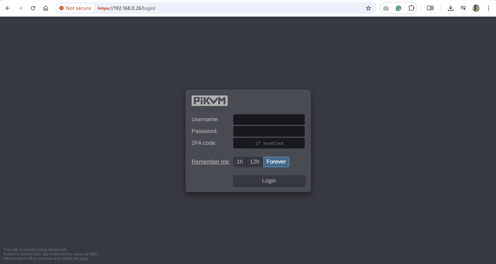
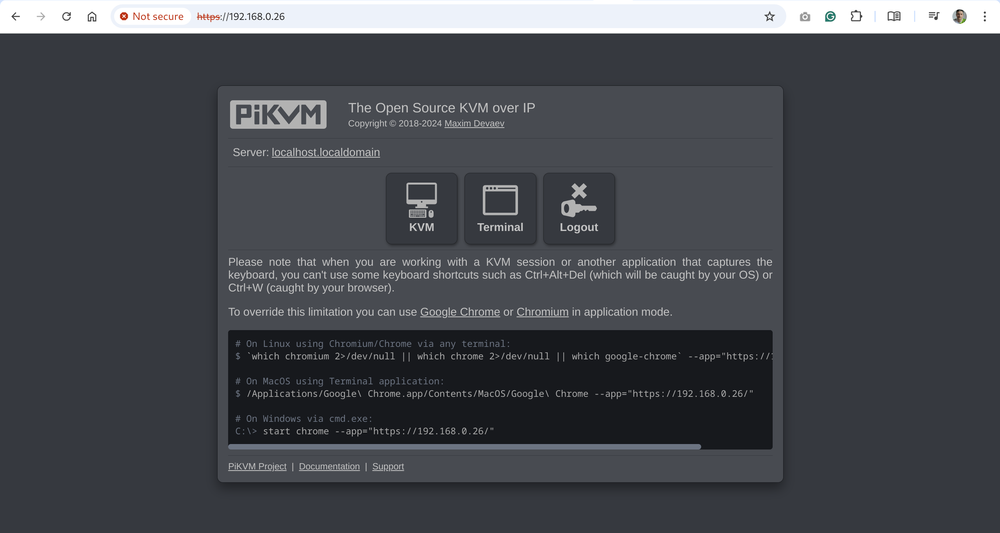
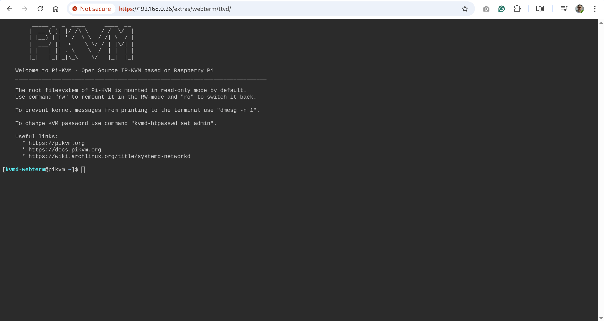
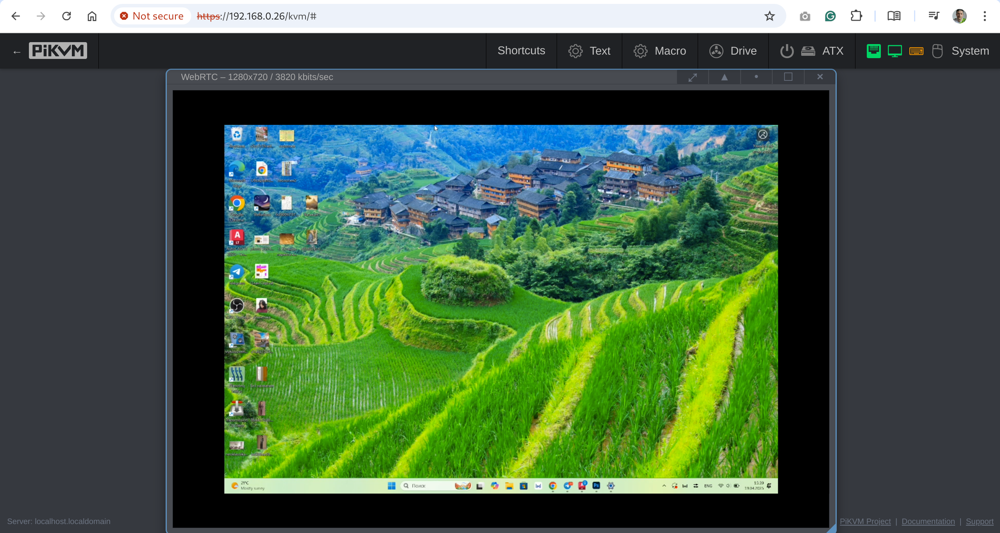

# PiKVM V3 HAT & pre-assembled quickstart guide

{ width="450" }

PiKVM is a feature-rich, production-grade, open-source, Raspberry Pi based KVM-over-IP device. It allows you to turn your computer on or off, restart it, configure the UEFI/BIOS, and even reinstall the OS using the Virtual CD-ROM or flash drive.

PiKVM uses your remote keyboard and mouse to simulate a local keyboard, mouse, and monitor, which are then presented in a web browser as if you were working on a remote system directly.

PiKVM V3 is available in two version:

- An assembly kit (HAT).
- A pre-assembled unit in a metallic box.

The two versions have the same ports and functionality.


-----
## What's in the box

=== "HAT"

    - The PiKVM V3 HAT for Raspberry Pi 4
    - USB-C bridge board
    - ATX adapter board with mounting brackets and motherboard interface wiring
    - 2x Flat CSI-2 cables
    - 7x jumpers
    - 8x brass standoffs
    - 8x screws

=== "Pre-Assembled"

    - PiKVM V3.3 pre-assembled
    - ATX adapter board with mounting brackets and motherboard interface wiring 
    - A 32 GB MicroSD card pre-imaged with the PiKVM OS


-----
## HAT setup

If you have an assembly kit without a metal case, you can use our free 3D printing case drawing:

- [V3.2](stl/v3.2/index.md){target=_blank} is the pre-release model.
- [V3.3](stl/v3.3/index.md){target=_blank} is the Kickstarter/Store model.

Once you have that, do the following:

1. **[Flash the memory card](flashing_os.md){target=_blank}**. Please use the V3 image, V2 image is not compatible.

2. **Build PiKVM** according to the [illustrated instructions](v3_illustrated_install_instructions.md).


-----
## Interface

=== "Front view"

    { height="250" }

    1. 2x USB 2.0 
    2. 2x USB 3.0 
    3. RJ45 1Gb Ethernet port
    4. RJ45 Serial console port
    5. Serial console active LED / Beacon LED (Green)
    6. USB 2.0 Serial console port 
    7. Activity LED (Red)
    8. Power LED (Green)
    9. Power Input 5.1V 3A 

=== "Rear view"

    { height="250" }

    1. Micro SD card slot
    2. HDMI video input port
    3. USB 2.0 OTG connector
    4. RJ45 ATX control port

=== "Left view"

    { height="250" }

    1. Mini-HDMI output port

=== "Top view"

    { height="250" }

    1. Display


-----
## Flashing the OS

Most of the time, this step is not necessary. However, if there is a possibility that your device had a previous owner (e.g. "Used - Like New" on Amazon), we recommend reflashing the OS to ensure a clean start. Please follow [this guide](flashing_os.md).

-----
## Wiring

Both the HAT and the pre-assembled V3 require several items available separately:

- Ethernet cable
- RJ-45 cable for ATX (optional)
- USB-C cable
- HDMI cable
- 5V USB power adapter

Let's connect all the wires before you power up the device.

### Network


Connect **Ethernet** (**bottom right** on the **front** side) to the network, e.g., to the WiFI router.

### HDMI and USB-C


**HDMI input** (the **top right** on the **rear** side) and **OTG** port (USB emulation) should be connected to the computer.

Optionally, the **[ATX port](atx_board.md)** can be connected to control the power. There should be no USB hub between PiKVM and the computer, as some UEFI/BIOS cannot detect them at the boot stage.


-----
## Power up


V3 comes has a USB-C 5V power supply. Attach the appropriate connector on the **front** side (**top left**). Do **not** block the ventilation holes on the sides of the device.

After turning on the power, PiKVM OS generates unique SSH keys and certificates and performs all necessary operations on the memory card. It takes a few minutes. Do **not** turn off the device until it's fully booted for the first time. Once it's done, the PiKVM will show a greeting on the built-in display.


-----
## Connect and set up

### Configure the display

The operating system on your remote computer will treat PiKVM as an additional display and use it in the Extend mode by default. That's why you will see an empty desktop when you first connect.

To avoid that, go to the display settings in your remote computer's operating system and enable the mirror mode for the external screen that you operating system identifies as PiKVM. Refer to your operating system's documentation on that.

### Access PiKVM

By default, PiKVM receives a dynamic IP address via DHCP and shows it in the top row of the OLED display:

```console
192.168.0.26
(|) iface: eth0
cpu: 1% mem: 13%
```

Let's assume that PiKVM has received the address `192.168.0.26` and has also been assigned a hostname `pikvm`.

Type the URL in the browser's address bar and press **Enter**: https://192.168.0.26/ or https://pikvm/.

{ width="450" }

Submit the default credentials and click **Login**:

- Username: `admin`
- Password: `admin`
- 2FA Code: disabled by default, skip this field

You will see the initial dashboard screen of the PiKVM where you can access the remote host, connect to the PiKVM command line, or log out:

{ width="450" }

### Change the default passwords

For security's sake, it's best to change the default passwords immediately after running PiKVM for the first time.

!!! danger "Passwords are important!"
    Please ensure that you change **both** passwords: for Web UI access and for the Linux superuser (root).

To do that:

1. On the initial dashboard screen, click the **Terminal** button to open the web terminal. You will see this command line interface:

    { width="450" }

2. Gain Linux superuser privileges:

    ```console
    $ su -
    ```

    When prompted for password, use `root`.

3. Run `rw` to change the access to the SD card to the write mode:

    ```console
    [root@pikvm ~]# rw
    ```

4. Change the password for the Linux superuser:

    ```console
    [root@pikvm ~]# passwd root
    ```

    Submit the new password, retype it the second time to confirm, press **Enter**, and you should see this:

    ```console
    passwd: password updated successfully
    ```

5. Change the password for web access:

    ```console
    [root@pikvm ~]# kvmd-htpasswd set admin
    ```

    Submit the new password, retype it the second time to confirm, and press **Enter**.

6. Run `ro` to change the access to the SD card back to the read-only mode:

    ```console
    [root@pikvm ~]# ro
    ```

7. Press **Ctrl+D** or type "exit" and press **Enter** to drop the root privileges.

8. Go back one page in the browser. You should be back to the initial dashboard screen.

### Access the remote system

1. On the initial dashboard screen, click the **KVM** button to access the remote host.

2. You should now see the host system's display and interact with it remotely using a keyboard and a mouse.

    { width="450" }


-----
## Important next steps

- **We strongly recommend to update the PiKVM OS** after the first launch:

    {!_update_os.md!}

- Learn about basics of **PiKVM OS Configuration**: where to find configs, how to edit the, etc.

    {!_config.md!}

- **Get to know PiKVM Web UI**: read [this help section](webui.md) to better understand all the possibilities of the web user interface.

- **Configure the magic key**: define which key to use to start [sending shortcuts](shortcuts.md) to the target host system.

- **Set up [ATX connection](atx_board.md)** if you need to control the power of the remote system.


-----
## Further recommendations

1. **Customize the system**:

    - [Harden the remote access](auth.md) by enabling 2FA.
    - Configure access to PiKVM from the Internet using [port forwarding](port_forwarding.md) or [Tailscale VPN](tailscale.md).
    - Enable a microphone for [two-way audio](audio.md).
    - [Learn](config.md) how configuration files are structured.
    - Read how PiKVM is [identified](id.md) on the target host.

2. **Configure hardware**:

    - If you bought V3 HAT Assembly Kit and it includes the OLED display and/or the fan, you'll need to turn them on. Note this is only needed for the older V3 image for the HAT, in the box image everything is enabled by default:

        ??? note "Enabling the OLED and the fan"

            Log in to PiKVM and run these commands:

            ```console
            [root@pikvm ~]# rw
            [root@pikvm ~]# systemctl enable --now kvmd-oled kvmd-oled-reboot kvmd-oled-shutdown
            [root@pikvm ~]# systemctl enable --now kvmd-fan
            [root@pikvm ~]# ro
            ```


    - Choose Fahrenheit over Celsius to display on the OLED:

        {!_fahrenheit.md!}


-----
## Known issues and limitations

* **Max resolution**.<br>PiKVM V3 supports maximum resolution 1920x1080@50Hz, 60Hz will not work. You can use any other resolution less than the specified one, for example: 1600x1200@60Hz, 1280x720@60Hz, etc. If you have problems with the video, follow [this guide](edid.md).

* **Motherboards compatibility**.<br>There may be compatibility issues with some motherboards, such as HP or DELL. If there is no image from the BIOS, you can fine-tune the HDMI settings, but it is possible that the mass storage devices will not be available in the BIOS. In the latter case, [USB dynamic configuration](usb.md) will solve the problem.

* **HDMI backpowering**.<br>Under specific circumstances, PiKVM may hang during the boot. Turn off the PiKVM, disconnect all cables from it, take a close look at the diagram of its ports and jumpers below, and **remove jumper #14** (it is to the right of the CSI connector, **not available on the V3.2 board**). Then you can connect and power up PiKVM again. (Technical background s described [here](https://www.kickstarter.com/projects/mdevaev/pikvm-v3-hat/posts/3296343).)

* **IO ports**.<br>Before using GPIO pins to control a relay, KVM switch, or anything else, be sure to check the HAT pinout below. Many ports are busy with internal functions. Before using them for your own use, you must disable them, otherwise you may damage the PiKVM WebTerm
??? note "The ports and jumpers diagram"
    

    1. [**ATX controller** interface](atx_board.md) (power on/off, reboot control, PWR and HDD ACT LEDs).
    2. **HDMI reset** jumper. Connects GPIO 17 and RESET pin to HDMI capture chip. Currently not used, don't touch it.
    3. **SPI and GPIO** for the custom extension boards.
    4. **Audio capture** jumpers. Connects I2S pins 18, 19, 20 to HDMI capture chip.
    5. **UART access** jumpers. Connects GPIO 14 and 15 to the RJ-45 and USB console ports.
    6. **Serial console port** (default: /dev/ttyAMA0, RS232 input, outputs +6V/-6V, for the Raspberry Pi or server console access, use the [Cisco/Mikrotik-style](https://wiki.mikrotik.com/wiki/File:Rj45-pinout.gif.png) cable).
    7. **USB-C console port** (shared with #6 above, takes priority over RJ45).
    8. **Power** and **activity LEDs**. On the left of the LEDs the watchdog jumper is located. Don't touch it.
    9. **USB-C power input**.
    10. **I2C display connector**.
    11. **Alternate +5V power input/output** header pins.
    12. **RTC clock** supercapacitor (rechargeable).
    13. **FAN connector** - PWM controlled.
    14. **CSI-2 interface** and **HDMI backpowering** jumper, see [Step 9 of the Basic Setup](#basic-setup). Open: (jumper removed) diode will stop current from HDMI input (backpower will be fixed), closed: (jumper connected to both pins) will allow current from HDMI device. 
    15. Built-in **power splitter** port.
    16. **HDMI capture port** (max 1080p @ 50Hz) with **sound capture** support.
    17. **USB emulation pins** for alternative access.
    18. **USB-C emulation port** - this port is doing the emulation of a USB keyboard, mouse, Virtual CD-ROM or USB Flash Drive, USB-Ethernet, USB-Serial port and a lot of other Linux-supported features.
    19. **1-Wire** & **Neo-pixel** interface (under, advanced user feature).

??? note "The GPIO pinout"

    !!! warning
        Before proceeding, make sure that the mb you are using has normal ATX headers

    * **ATX control**
      - `power led = GPIO 24` - Used for reading the host power state.
      - `hdd led = 22` - Same for the HDD activity.
      - `power switch = 23` - Used for pressing the power button of the host.
      - `reset switch = 27` - Same for the reset button.

      These pins can't be used for any other purposes even if ATX function is disabled.

    * **I2C bus** - `GPIO 2, 3` - Can be used as I2C ONLY (OLED/RTC).

    * **1-Wire [19]** - `GPIO 4` - Also available under ATX RJ-45 port (point [19] on the above) as bi-directional buffered open-drain 5V for regular 1-Wire usage.

    * **UART** - `GPIO 14, 15` - Can be used as UART only for the serial console. When jumpers [5] are removed, you can connect to pins 14 and 15 directly using GPIO header. Also you can remove jumper [5] and disable UART console in the `/boot/config.txt` and `/boot/cmdline.txt` to use this pins for any purpose. But it's not recommended.

    * **Red activity led on the front [8]** - `GPIO 13` - Can be disabled in `/boot/config.txt` and available on the Neo-pixel port [19].

    * **PWM fan controller** - `GPIO 12`. Can be used for custom purposes if the fan disconnected and `kvmd-fan` service is stopped.

    * **I2S HDMI sound** - `GPIO 18, 19, 20, 21`. Can be used for custom purposes if the `tc358743-audio` overlay in `/boot/config.txt` is disabled **AND** jumpers [4] are removed.

    * **USB breaker** - `GPIO 5` - Can't be used for any other purposes.

The standard Raspberry Pi HDMI output (marked as `VIDEO OUT` on the PiKVM case) displays its own PiKVM OS console.


-----
## Basic troubleshooting

* Ensure that you are using the right [OS image](flashing_os.md) for your platform
    by running the following command: `pacman -Q | grep kvmd-platform`.

* If you are not getting a display, run the two following commands:

    * `dmesg | egrep 'tc35|1-1.4|uvc'`
    * `systemctl status kvmd-tc358743`


-----
## Getting user support

If something doesn't work, check out our [FAQ](faq.md). Otherwise, head straight to our [Support](https://pikvm.org/support/).
