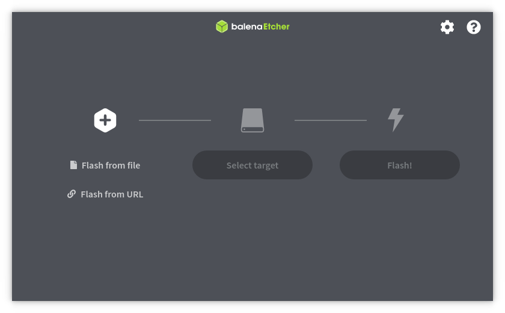
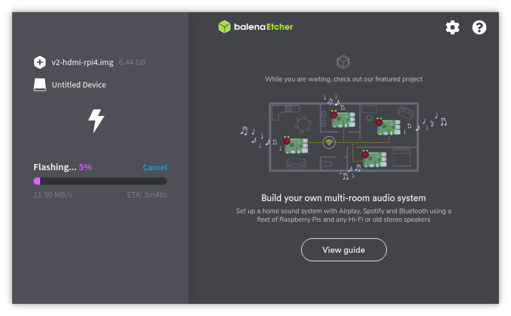

# Flashing the OS image
Download the appropriate memory card image from https://pikvm.org/download.html. Select it based on the board, platform, and the video capture device you are using. For example: choose **v2-hdmi-rpi4.img.bz2** for Raspberry Pi 4 with HDMI-to-CSI capture bridge.

Note: right now, pre-compiled images are only available for the Raspberry Pi 4. In all other cases, you will need to build the operating system yourself. But don't worry, it's [very simple](building_os.md).


## Using Linux CLI
Decompress and flash image and follow to the [final steps](#the-final-steps). Be careful when choosing your device path:
```bash
# bzip2 -d v2-hdmi-rpi4.img.bz2
# dd if=v2-hdmi-rpi4.img of=/dev/mmcblkX
```


## Using balenaEtcher (Linux, MacOS and Windows)
1. Download and install [balenaEtcher](https://www.balena.io/etcher).

2. Even on modern computers it might be faster to first extract the compressed image first. A bug in a balenaEtcher prior to version 1.5.108 caused it to use large amounts of RAM and a tediously slow flashing process. Extract the image using your favorite archive software. If you don't have one that supports .bz2 images (on Windows for example) - [7-Zip](https://www.7-zip.org) is a great (free) choice.<br><br>_Flashing the compressed image directly: ~12 minutes; extracting first (~1 minute on an SSD) and flashing afterwards only takes ~3 minutes._

3. Run Balena Etcher:

    

4. Press **Flash from file** and select the image:

    

5. Insert the memory card into the card reader. Press **Select target** and choose your memory card:

    

6. Press **Flash!** button.

    

7. Wait for the process to finish. Get yourself a coffee or do some stretching. :wink: If an error occurs during flashing, repeat the process:

    


## The final steps
1. When the process is complete, pull out the memory card and insert it into the Raspberry Pi. Connect the Raspberry Pi to the power supply. Your device will obtain the IP address via DHCP automatically. <br>:exclamation:Windows users: balenaEtcher will automatically safely remove the memory card. If you are using a Windows version prior to Windows 10 1809 and a different flashing software, you should do the safe remove manually.

2. After power-up, Pi-KVM OS generates unique SSH keys and certificates. Do not turn off the Raspberry Pi until it's fully booted.

3. Congratulations! Your Pi-KVM will be available via SSH (`ssh root@<ip-address>` with the password `root` by default) and HTTPS. In most networks you should be able to reach Pi-KVM via any browser with the URL `https://pikvm/`. If that doesn't work you'll need to find the IP address manually in your router and try it via `https://<ip-address>`. The default login username is `admin` with `admin` as the password). For HTTPS a self-signed certificate is used by default. Your browser will give you a warning about an invalid SSL certificate which you can safely ignore.

4. To change the root password use command `passwd` via SSH or webterm. To change Pi-KVM web password use `kvmd-htpasswd set admin`. As indicated on the login screen, you need to use `rw` to make the root filesystem writable before issuing these commands. After making changes, make sure to run the command `ro` to switch the filesystem back to read-only.

5. After installation, we recommend you to update your operating system:
    ```shell
    # rw
    # pacman -Syu
    # reboot
    ```
6. Important **note for HDMI-USB dongle** users only. Because of this, many video capture devices tell the server's video card that the HDMI cable is supposedly disconnected. This may lead to the fact that if you boot the server without an active stream, the server will not detect your capture card. This is easy to fix:
    * Switch filesystem to RW-mode:
      ```
      # rw
      ```
    * Edit file `/etc/kvmd/override.yaml` and add these lines:
      ```yaml
      kvmd:
          streamer:
              forever: true
      ```
    * Perform reboot:
      ```
      # reboot
      ```

7. **27.08.2020 note about systemd**: the latest version of Arch Linux has a slightly broken systemd. The problem is that SSH to the Pi-KVM host may not work the first time, but the second or third. The Pi-KVM build environment contains a workaround for this problem: in the file `/etc/pam.d/system-login` line `-session   optional   pam_systemd.so` is commented. This does not have any negative impact on the PI-KVM functionality, but if you want to, after fixing the systemd (in a couple of months with the next update), you can uncomment this line.

If you have any problems or questions, contact us using Discord: https://discord.gg/bpmXfz5

Subscribe to our Subreddit to follow news and releases: https://www.reddit.com/r/pikvm
