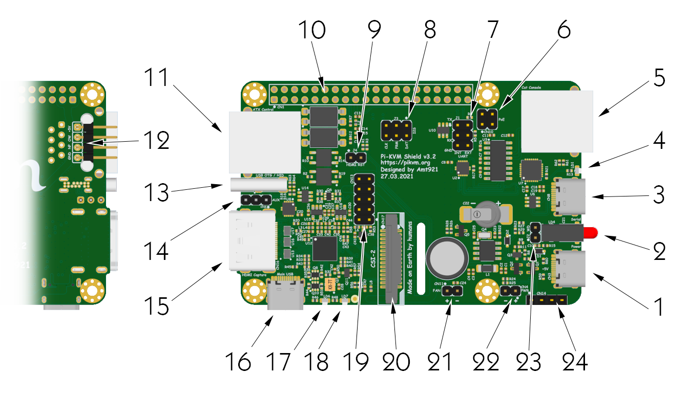

# Pi-KVM v3 Tech info

# Installation
1. [Build the device](https://www.youtube.com/watch?v=-SRL92VJ870).
2. [Install the operatiog system](flashing_os.md) (choose the v3 image).
3. Power it up
4. If your kit includes the display and/or the fan, you'll need to turn them on after installation:
   ```bash
   rw
   systemctl enable --now kvmd-oled # For the display
   systemctl enable --now kvmd-fan  # For the fan
   ro
   ```
   
# V3 Shield ports


### Description
1. **USB for the power**  
  5.1v 3A is strongly recommended. The official Raspberry Pi 4 power supply is perfect for this.
2. **Power (green) and activity (red) LEDs**  
  Show the device status. The red LED lights up when there is disk activity.
3. **USB serial console**  
  Hardware serial console to login and configure the Raspberry Pi via a terminal emulator. It operates at a speed of 115200 baud. Just plug in the USB and you will see a USB-TTL device on your host.
4. **USB serial console status LED**  
  The console has independent power from the USB connected host, so you can reboot the Pi and not lose the connection to the console. The LED indicates the presence of power via USB.
5. **COM serial console**  
  For connection, the so-called CISCO-style serial cable is used (on the one hand, RJ45, on the other, COM port). You can buy any suitable cable or [make your own](https://wiki.mikrotik.com/wiki/Manual:System/Serial_Console). If you do not need console access to the Pi-KVM, this port can be used to access the server.
6. **PoE pins**  
  Pi-KVM is compatible with PoE hats. These pins are used for power supply.
7. **UART jumpers**  
  The two jumpers installed here provide communication between the console ports (3, 5) and the UART of Raspberry. By removing them, you will get access to the UART.
8. **Audio capture jumpers**  
  The Pi-KVM can capture audio. Although this is not yet implemented in the software, the hardware capability is already present and you can use the `arecord` command to record audio. These pins are used for this purpose. If you need additional GPIO pins, you can remove these jumpers, comment line `dtoverlay=tc358743-audio` in `/boot/config.txt`, and use the [GPIO 19, 20 and 21](https://pinout.xyz/pinout/pin35_gpio19) as you see fit.
9. **HDMI reset jumper**  
  Currently unused. In the future, it will be used for hardware resetting of the video capture chip. If you remove it, you will be able to use the [GPIO 17]( 
  https://pinout.xyz/pinout/pin11_gpio17)
10. **GPIO pins**  
  With the exception of the used pins, the rest are at your service.
11. **ATX controller interface**  
  Use the ethernet straight cable to connect the ATX adapter (included). Connect the wires of the power button, reset button, and the power and HDD LEDs inside your server enclosure to the adapter.
12. **1-Wire & Neo-pixel interface**  
  Unused right now. For neopixel used [GPIO 13](https://pinout.xyz/pinout/pin33_gpio13) (same as for the red status LED).
13. **OTG USB**  
  The port to connect to the server. Here, the keyboard, mouse, disk, and so on are emulated.
14. **OTG USB AUX**  
  For fans of soldering. You can use these pins to connect OTG if you have installed Pi-KVM inside the server case.
15. **HDMI input**  
  From 640x480 to 1920x1080 50Hz (max).
16. **Service USB**  
  Use the dual USB-C bridge (included) to connect the Rspberry and v3 shield with this port.
17. **HDMI 5v LED**  
18. **HDMI 3.3v LED**  
19. **AUM socket**  
  To connect an Advanced USB Module that provides an alternative way to emulate the keyboard and mouse and mass storage.
20. **CSI socket**  
  Use a wide flat cable to connect to the Raspberry Pi.
21. **5v fan connector**  
  Connector for controlling a 5v fan with PWM support.
22. **5v power pins**  
  To receive or alternatively supply power to the Pi-KVM.
23. **Top secret**  
  Currently unused.
24. **I2C for the display**  
